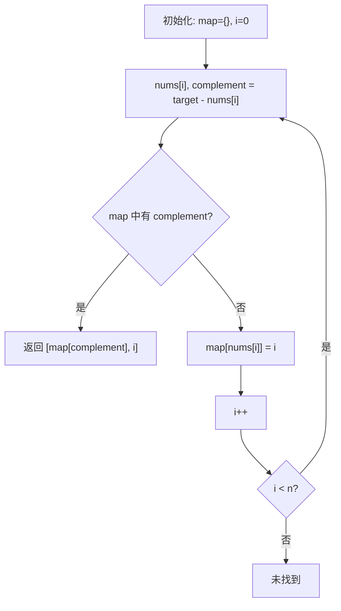

# LeetCode 1. Two Sum（两数之和） — **简单**

## 考点
Array, Hash Table

## 题目描述
给定一个整数数组 `nums` 和一个整数目标值 `target`，请你在该数组中找出 **和为目标值** `target` 的那 **两个** 整数，并返回它们的数组下标。

你可以假设每种输入只会对应一个答案，并且你不能使用两次相同的元素。

你可以按任意顺序返回答案。

**示例 1：**
```
输入：nums = [2,7,11,15], target = 9
输出：[0,1]
解释：因为 nums[0] + nums[1] == 9 ，返回 [0, 1] 。
```

**示例 2：**
```
输入：nums = [3,2,4], target = 6
输出：[1,2]
```

**示例 3：**
```
输入：nums = [3,3], target = 6
输出：[0,1]
```

**提示：**
- `2 <= nums.length <= 10^4`
- `-10^9 <= nums[i] <= 10^9`
- `-10^9 <= target <= 10^9`
- 只会存在一个有效答案

## 图解



## 解题思路

### 核心思路
利用哈希表将"查找补数"的操作从 O(n) 优化到 O(1)。一次遍历就能找到答案：对于每个元素，不是寻找"两个数的和等于 target"，而是检查"当前数的补数是否已经见过"。

### 算法步骤

**方法一：暴力枚举**

1. 使用两层循环遍历所有可能的数对 (i, j)，其中 i < j
2. 检查 `nums[i] + nums[j] == target`，找到答案立即返回
3. 两层循环遍历所有 n*(n-1)/2 个组合

**方法二：哈希表（最优解）**

1. 创建一个空的哈希表 `map`，用于存储 `值 → 索引` 的映射
2. 遍历数组，对于每个元素 `nums[i]`：
   - 计算补数 `complement = target - nums[i]`
   - 在哈希表中查找 `complement`：
     - 如果存在：说明之前已经见过补数，直接返回 `[map.get(complement), i]`
     - 如果不存在：将当前元素 `{nums[i]: i}` 存入哈希表，继续遍历
3. 由于题目保证有唯一解，循环结束前必返回

### 图解示例

以输入 `nums = [2, 7, 11, 15], target = 9` 为例：

```
初始状态：map = {} (空哈希表)

Step 1: i=0, nums[0]=2
  complement = 9 - 2 = 7
  在 map 中查找 7 → 未找到
  将 {2: 0} 存入 map
  map = {2: 0}

  索引:     0   1   2   3
  数组:   [ 2,  7, 11, 15 ]
            ↑
           当前

Step 2: i=1, nums[1]=7
  complement = 9 - 7 = 2
  在 map 中查找 2 → 找到了！索引为 0
  返回 [0, 1]

  索引:     0   1   2   3
  数组:   [ 2,  7, 11, 15 ]
            ✓   ↑
          已在 当前
          map中
```

### 逐步追踪

以输入 `nums = [3, 2, 4], target = 6` 为例：

| 步骤 | i | nums[i] | complement | map 查找结果 | map 当前内容 | 操作 |
|------|---|---------|------------|-------------|-------------|------|
| 1    | 0 | 3       | 3          | 未找到       | {3: 0}      | 存入 3 |
| 2    | 1 | 2       | 4          | 未找到       | {3: 0, 2: 1} | 存入 2 |
| 3    | 2 | 4       | 2          | 找到，索引=1  | —           | 返回 [1, 2] |

### 边界情况

1. **数组中存在重复元素**（如 `nums = [3, 3], target = 6`）
   - 遍历到第一个 3 时，complement=3，map 中没有，存入 {3: 0}
   - 遍历到第二个 3 时，complement=3，map 中找到索引 0，返回 [0, 1]
   - 因为不允许使用同一元素两次，这正确：两个 3 是不同的元素

2. **数组长度正好为 2**：直接返回 [0, 1]（题保证有解），哈希表方法同样适用
3. **target 和数组元素都是负数**：哈希表对负数同样有效
4. **大数组（n=10^4）**：哈希表方法 O(n) 高效处理

### 复杂度和方法对比

| 方法 | 时间复杂度 | 空间复杂度 | 优点 | 缺点 |
|------|-----------|-----------|------|------|
| 暴力枚举 | O(n²) | O(1) | 实现简单，无额外空间 | 大数组太慢 |
| 哈希表 | O(n) | O(n) | 一次遍历，最优解 | 需要额外空间 |

时间复杂度：O(n) — 只需一次遍历数组，每次哈希查找为 O(1)
空间复杂度：O(n) — 最坏情况下需要存储 n-1 个元素在哈希表中
