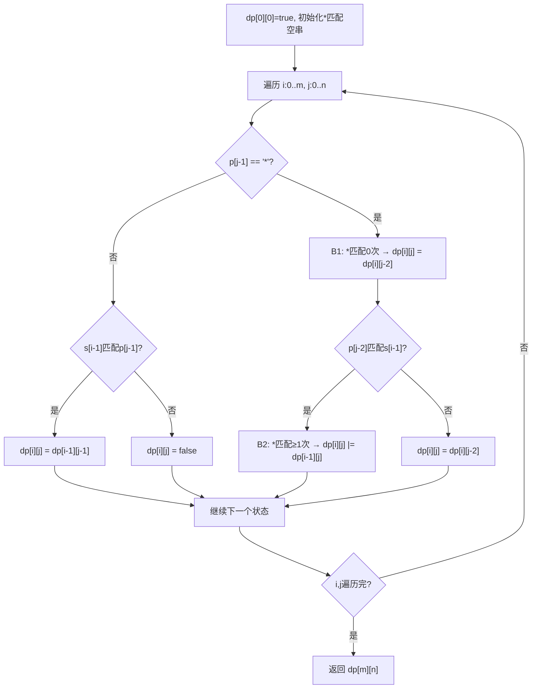

# LeetCode 10. Regular Expression Matching（正则表达式匹配） — **困难**

## 考点
String, Dynamic Programming, Recursion

## 题目描述
给你一个字符串 `s` 和一个字符规律 `p`，请你来实现一个支持 `'.'` 和 `'*'` 的正则表达式匹配。

- `'.'` 匹配任意单个字符
- `'*'` 匹配零个或多个前面的那一个元素

所谓匹配，是要涵盖 **整个** 字符串 `s` 的，而不是部分字符串。

**示例 1：**
```
输入：s = "aa", p = "a"
输出：false
解释："a" 无法匹配 "aa" 整个字符串。
```

**示例 2：**
```
输入：s = "aa", p = "a*"
输出：true
解释：因为 '*' 代表可以匹配零个或多个前面的那一个元素, 在这里前面的元素就是 'a'。因此，字符串 "aa" 可被视为 'a' 重复了一次。
```

**示例 3：**
```
输入：s = "ab", p = ".*"
输出：true
解释：".*" 表示可匹配零个或多个（'*'）任意字符（'.'）。
```

**提示：**
- `1 <= s.length <= 20`
- `1 <= p.length <= 20`
- `s` 只包含小写英文字母
- `p` 只包含小写英文字母，以及字符 `'.'` 和 `'*'`
- 保证每次出现字符 `'*'` 时，前面都匹配到有效的字符

## 图解



## 解题思路

### 核心思路
使用动态规划，定义 `dp[i][j]` 表示字符串 `s` 的前 i 个字符与模式 `p` 的前 j 个字符是否匹配。关键在于处理 `*`：由于 `*` 必须与前面的字符配合使用，可以代表"匹配前一个字符 0 次"或"匹配前一个字符 1 次以上"。

### 算法步骤

1. 定义 `dp[i][j]`：`s[0..i-1]` 与 `p[0..j-1]` 是否匹配，i 和 j 表示长度（不是索引）
2. 初始化：
   - `dp[0][0] = true`：两个空串匹配
   - 处理模式 `p` 能匹配空串的情况：当 `p[j-1] == '*'` 时，`dp[0][j] = dp[0][j-2]`（`*` 前面的字符出现 0 次）
3. 填充 DP 表，遍历 i 从 1 到 m，j 从 1 到 n：
   - **情况 A**：当前模式字符 `p[j-1]` 不是 `*`
     - 如果 `s[i-1]` 与 `p[j-1]` 匹配（相等或 `p[j-1]=='.'`）：`dp[i][j] = dp[i-1][j-1]`
     - 否则：`dp[i][j] = false`
   - **情况 B**：当前模式字符 `p[j-1]` 是 `*`
     - 子情况 B1（匹配 0 次）：`dp[i][j] = dp[i][j-2]`（忽略 `x*` 这个组合）
     - 子情况 B2（匹配 1 次以上）：如果 `p[j-2]` 与 `s[i-1]` 匹配（相等或 `p[j-2]=='.'`），则 `dp[i][j] = dp[i-1][j]`（让 `*` 再多匹配一个字符）
     - 综合：`dp[i][j] = dp[i][j-2] || (match(s[i-1], p[j-2]) && dp[i-1][j])`
4. 返回 `dp[m][n]`

### 图解示例（DP 表）

以输入 `s = "aa", p = "a*"` 为例：

```
DP 表定义：dp[i][j] 表示 s[0..i-1] 与 p[0..j-1] 匹配否

初始化：
  dp[0][0] = true (空对空)
  j=1: p[0]='a', 不是'*' → dp[0][1] = false
  j=2: p[1]='*' → dp[0][2] = dp[0][0] = true (a* 匹配空串)

填充过程：
  i=1 (s[0]='a'):
    j=1: p[0]='a', s[0]匹配p[0] → dp[1][1] = dp[0][0] = true
    j=2: p[1]='*'
      B2: p[0]='a'匹配s[0] → dp[1][2] = dp[0][2] = true ✓

  i=2 (s[1]='a'):
    j=1: p[0]='a', 匹配 → dp[2][1] = dp[1][0] = false
    j=2: p[1]='*'
      B1: dp[2][2] = dp[2][0] = false
      B2: p[0]匹配s[1] → dp[2][2] |= dp[1][2] = true ✓

最终 DP 表：
         ""   "a"   "a*"
          0    1     2
  "" 0   T    F     T
  "a"1   F    T     T
  "aa"2  F    F     T

结果：dp[2][2] = true → 匹配 ✓
```

以输入 `s = "ab", p = ".*"` 为例：

```
DP 表：
         ""   "."   ".*"
          0    1     2
  "" 0   T    F     T        ← dp[0][2]: .* 匹配空串 (0次)
  "a"1   F    T     T        ← dp[1][1]: '.'匹配'a'
                              ← dp[1][2]: .*匹配"a" (1次)
  "ab"2  F    F     T        ← dp[2][2]: .*先匹配"a", 再匹配"b"

结果：dp[2][2] = true → 匹配 ✓
```

### 逐步追踪

以输入 `s = "aab", p = "c*a*b"` 为例：

```
初始化 dp 表：
         ""  "c"  "c*"  "c*a"  "c*a*"  "c*a*b"
          0    1    2     3      4       5
  "" 0   T    F    T     F      T       F
  "a"1  F    -    -     -      -       -
  "aa"2 F    -    -     -      -       -
  "aab"3 F   -    -     -      -       -

逐步填充：

i=1, s="a":
  j=1, p='c': 'a'!='c' → dp[1][1]=F
  j=2, p='*': B1:dp[1][0]=F, B2:'c'!='a' → dp[1][2]=F
  j=3, p='a': 'a'=='a' → dp[1][3]=dp[0][2]=T ✓
  j=4, p='*': B1:dp[1][2]=F, B2:'a'=='a' → dp[1][4]=dp[0][4]=T ✓
  j=5, p='b': 'a'!='b' → dp[1][5]=F

i=2, s="aa":
  j=1, p='c': dp[2][1]=F
  j=2, p='*': dp[2][2]=F (c*匹配0次也没用, dp[1][1]=F)
  j=3, p='a': dp[2][3]=dp[1][2]=F
  j=4, p='*': B2:'a'=='a' → dp[2][4]=dp[1][4]=T ✓
  j=5, p='b': dp[2][5]=F

i=3, s="aab":
  j=1, p='c': F
  j=2, p='*': F
  j=3, p='a': F
  j=4, p='*': B2:'a'并不匹配'b' → F, B1:dp[3][2]=F → dp[3][4]=F
  j=5, p='b': 'b'=='b' → dp[3][5]=dp[2][4]=T ✓

最终 DP 表：
         ""  "c"  "c*"  "c*a"  "c*a*"  "c*a*b"
          0    1    2     3      4       5
  "" 0   T    F    T     F      T       F
  "a"1   F    F    F     T      T       F
  "aa"2  F    F    F     F      T       F
  "aab"3 F    F    F     F      F       T

结果：dp[3][5] = true → 匹配 ✓
```

### 边界情况

1. **空字符串与空模式**：`dp[0][0] = true`
2. **空字符串与非空模式**（如 s="", p="a*"）：通过 `*` 的 0 次匹配处理
3. **模式以 `*` 开头**：题目保证不会出现（`*` 前必有有效字符）
4. **连续多个 `*`**（如 p="a*b*c*"）：每个 `*` 独立处理，DP 自然支持
5. **s 和 p 完全不匹配**：DP 表最终为 false

### 复杂度分析

时间复杂度：O(m × n) — 需要填充 m+1 行、n+1 列的 DP 表，每个状态 O(1) 计算
空间复杂度：O(m × n) — DP 表大小，可优化为 O(n) 使用滚动数组

### 方法对比

| 方法 | 时间复杂度 | 空间复杂度 | 说明 |
|------|-----------|-----------|------|
| 递归 + 记忆化 | O(m×n) | O(m×n) | 自顶向下，直观 |
| 动态规划 | O(m×n) | O(m×n) | 自底向上，标准解法 ✓ |
| DP + 滚动数组 | O(m×n) | O(n) | 空间优化版 |
