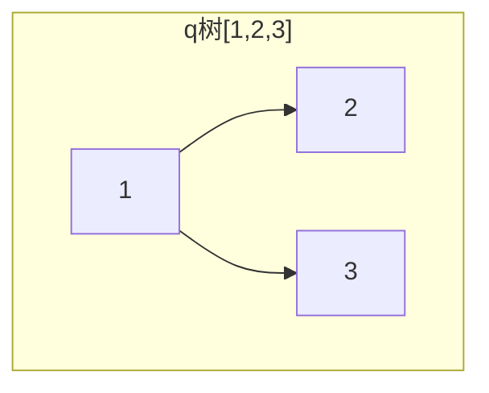
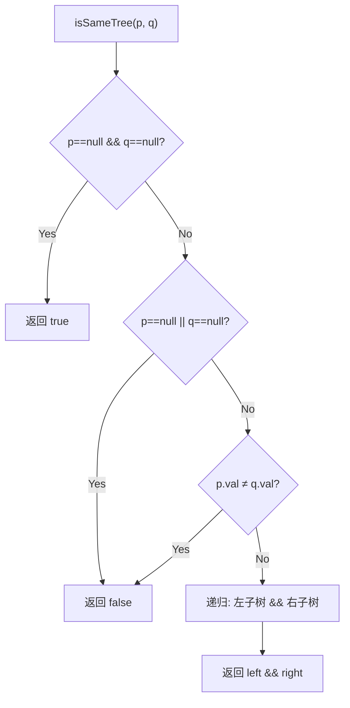

# LeetCode 100. Same Tree（相同的树） — **简单**

## 考点
Tree, DFS, BFS, Binary Tree

## 题目描述
给你两棵二叉树的根节点 `p` 和 `q`，编写一个函数来检验这两棵树是否相同。

如果两个树在结构上相同，并且节点具有相同的值，则认为它们是相同的。

### 示例 1
```
输入：p = [1,2,3], q = [1,2,3]
输出：true
```

### 示例 2
```
输入：p = [1,2], q = [1,null,2]
输出：false
```

### 示例 3
```
输入：p = [1,2,1], q = [1,1,2]
输出：false
```

### 约束
- 两棵树上的节点数目都在范围 `[0, 100]` 内
- `-10^4 <= Node.val <= 10^4`

## 图解






## 解题思路

### 核心思路

判断两棵树是否相同，需要同时满足两个条件：**结构相同**（每个节点的左右子树同时存在或同时为空）和**值相同**（对应位置的节点值相等）。同步遍历两棵树，逐一比较即可。

这是二叉树比较问题中最基础的一题，后续的「对称二叉树」(101) 和「子树判断」(572) 都是它的变种。

### 方法一：DFS 递归

**算法步骤：**

1. 若 `p == null && q == null`，返回 true（两个空树相同）。
2. 若 `p == null || q == null`，返回 false（一个空一个不空，结构不同）。
3. 若 `p.val != q.val`，返回 false（值不同）。
4. 递归比较：`isSameTree(p.left, q.left) && isSameTree(p.right, q.right)`。
5. 返回递归结果。

**图解示例：**

```
相同: p=[1,2,3], q=[1,2,3]

  p:  1       q:  1
     / \         / \
    2   3       2   3

调用 isSameTree(1,1):
  val相同 ✅
  isSameTree(2,2):
    val相同 ✅, leaf ✅ → true
  isSameTree(3,3):
    val相同 ✅, leaf ✅ → true
  return true && true = true

结构不同: p=[1,2], q=[1,null,2]

  p:  1       q:  1
     /            \
    2              2

调用 isSameTree(1,1):
  val相同 ✅
  isSameTree(2, null):    ← p.left=2, q.left=null
    q==null 但 p!=null → false
  return false && ... = false

值不同:  p=[1,2,1], q=[1,1,2]

  p:  1       q:  1
     / \         / \
    2   1       1   2

调用 isSameTree(1,1):
  val相同 ✅
  isSameTree(2, 1):
    val不同! 2≠1 → false
  return false
```

**逐步追踪：**

```
p = [1,2,3,4,5], q = [1,2,3,4,5]

       1         1
      / \       / \
     2   3     2   3
    / \       / \
   4   5     4   5

递归调用栈:
  same(1,1):
    same(2,2):
      same(4,4): null,null → true
      same(5,5): null,null → true
      return true
    same(3,3):
      null,null → true
    return true

结果: true
```

**边界情况：**

| 情况 | 处理方式 |
|------|---------|
| 两棵树都为空 | 返回 true |
| 一棵为空另一棵不为空 | 返回 false（第一个条件） |
| 两棵树都是单节点且值相同 | 返回 true |
| 两棵树都是单节点但值不同 | 返回 false |
| 结构相同但值不同 | 递归到底层发现值不同 |
| 值排列相同但结构不同 | 递归时发现 null 不匹配 |

### 方法二：BFS 迭代

**算法步骤：**

1. 使用两个队列（或一个队列存 pair），同步入队。
2. 每次同时出队一对节点进行比较。
3. 值不同或结构不匹配时返回 false。
4. 子节点入队同样要同步（左右分别成对）。

**复杂度分析：**

| 方法 | 时间复杂度 | 空间复杂度 |
|------|-----------|-----------|
| DFS 递归 | O(min(n₁, n₂)) | O(min(h₁, h₂)) |
| BFS 迭代 | O(min(n₁, n₂)) | O(min(w₁, w₂)) |

**关键点：**

- 递归的基准情形顺序很重要：先判「都空」再判「一方空」，否则 NPE。
- 这里的 `&&` 短路计算很关键：一旦任何一个子树比较返回 false，整个结果就是 false。
- 这题是二叉树比较的母题，很多变种都是在这个框架上微调（对称树交换左右子树比较、子树比较需要考虑位置匹配等）。
