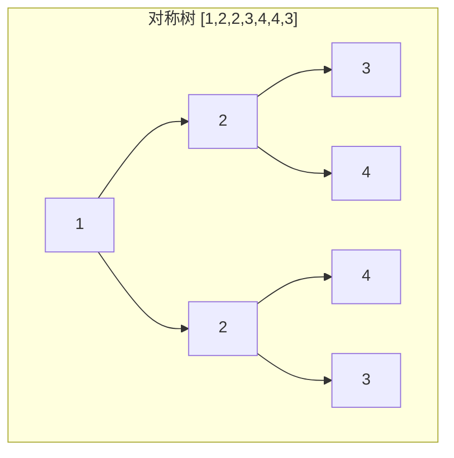
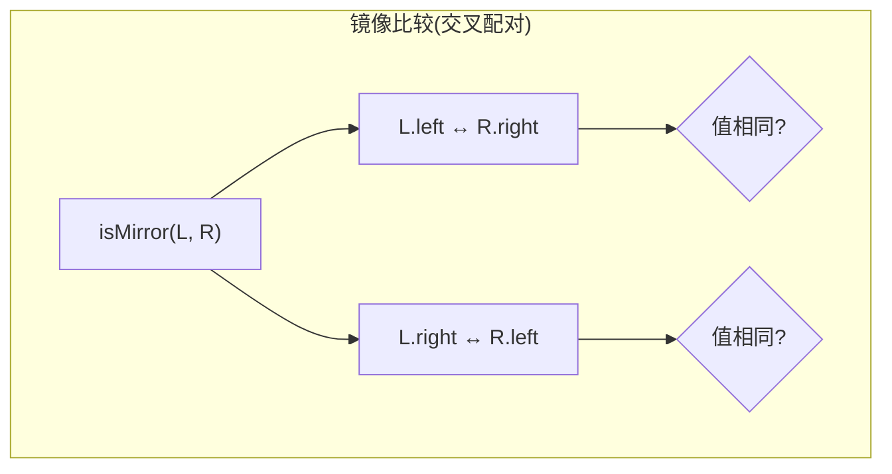
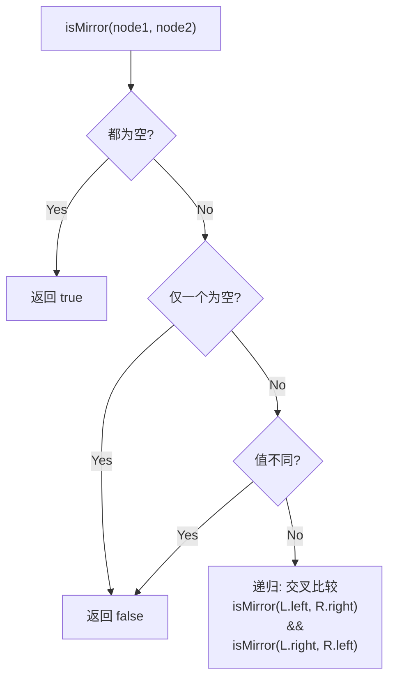

# LeetCode 101. Symmetric Tree（对称二叉树） — **简单**

## 考点
Tree, DFS, BFS, Binary Tree

## 题目描述
给你一个二叉树的根节点 `root`，检查它是否轴对称。

### 示例 1
```
输入：root = [1,2,2,3,4,4,3]
输出：true
```

### 示例 2
```
输入：root = [1,2,2,null,3,null,3]
输出：false
```

### 约束
- 树中节点数目在范围 `[1, 1000]` 内
- `-100 <= Node.val <= 100`

## 图解







## 解题思路

### 核心思路

对称二叉树的本质是将一棵树从根节点「对折」，左子树的左半边应等于右子树的右半边，左子树的右半边应等于右子树的左半边。因此可以将问题转化为：左右两棵子树是否互为**镜像**。

对称 = 镜像比较。这和 LeetCode 100 (Same Tree) 的区别仅在于：比较时**交叉配对**（左 vs 右的右，右 vs 右的左）。

### 方法一：DFS 递归

**算法步骤：**

1. 定义 `isMirror(node1, node2)`：
   - 若两者都为空 → true。
   - 若仅一个为空 → false。
   - 若 `node1.val != node2.val` → false。
   - 递归：`isMirror(node1.left, node2.right) && isMirror(node1.right, node2.left)`。
2. 调用 `isMirror(root.left, root.right)`。

**图解示例：**

```
对称例: root = [1,2,2,3,4,4,3]

        1
       / \
      2   2
     / \ / \
    3  4 4  3

初始: isMirror(左2, 右2)

左树的左(3) vs 右树的右(3):
  值相等 ✅, 同空 ✅

左树的右(4) vs 右树的左(4):
  值相等 ✅, 同空 ✅

两个比较都 ✅ → 对称

---

不对称例: root = [1,2,2,null,3,null,3]

        1
       / \
      2   2
       \   \
       3    3

初始: isMirror(左2, 右2)

左树的左(null) vs 右树的右(3):
  一个空一个非空 → false ❌

所以不对称。

---

镜像比较 vs 相同比较:
  Same Tree (100):    left.left ↔ right.left,  left.right ↔ right.right   (parallel)
  Symmetric (101):    left.left ↔ right.right, left.right ↔ right.left    (crossed)
```

**逐步追踪（对称树 `[1,2,2,3,4,4,3]`）：**

```
        1
       / \
  L:  2   2  :R
     / \ / \
    3  4 4  3

isMirror(L=2, R=2):
  val 相同 ✅

  isMirror(L.left=3, R.right=3):   ← 交叉!
    val 相同 ✅, 都无子 ✅ → true

  isMirror(L.right=4, R.left=4):    ← 交叉!
    val 相同 ✅, 都无子 ✅ → true

  return true

结果: true
```

**边界情况：**

| 情况 | 处理方式 |
|------|---------|
| 空树（root=null） | 返回 true |
| 单节点 | root.left 和 root.right 均为 null → true |
| 只有左子树 | 左右不匹配 → false |
| 只有右子树 | 左右不匹配 → false |
| 值对称但结构不对称 | 递归到 null 不匹配 → false |
| 值为 INT_MIN 等极值 | 不影响比较 |

### 方法二：BFS 迭代

**算法步骤：**

1. 使用队列，初始时将 `root.left` 和 `root.right` 成对入队。
2. 每次出队两个节点 `u` 和 `v`：
   - 都空则跳过（继续）。
   - 只有一个空或值不同 → false。
   - 将 `u.left` 与 `v.right` 入队（交叉）。
   - 将 `u.right` 与 `v.left` 入队（交叉）。
3. 队列为空后返回 true。

**复杂度分析：**

| 方法 | 时间复杂度 | 空间复杂度 |
|------|-----------|-----------|
| DFS 递归 | O(n) | O(h) |
| BFS 迭代 | O(n) | O(w)，w 为最大层宽 |
| 递归比较（错误做法） | O(n) | — |

**关键点：**

- 对称的核心是「镜像」，不是「相同」。和 100 题的比较方向是相反的。
- 递归调用时的参数配对是关键：`isMirror(l.left, r.right)` 和 `isMirror(l.right, r.left)`。
- 这个问题可以看作是 LeetCode 100 的镜像版，两题放在一起学习效果最好。
