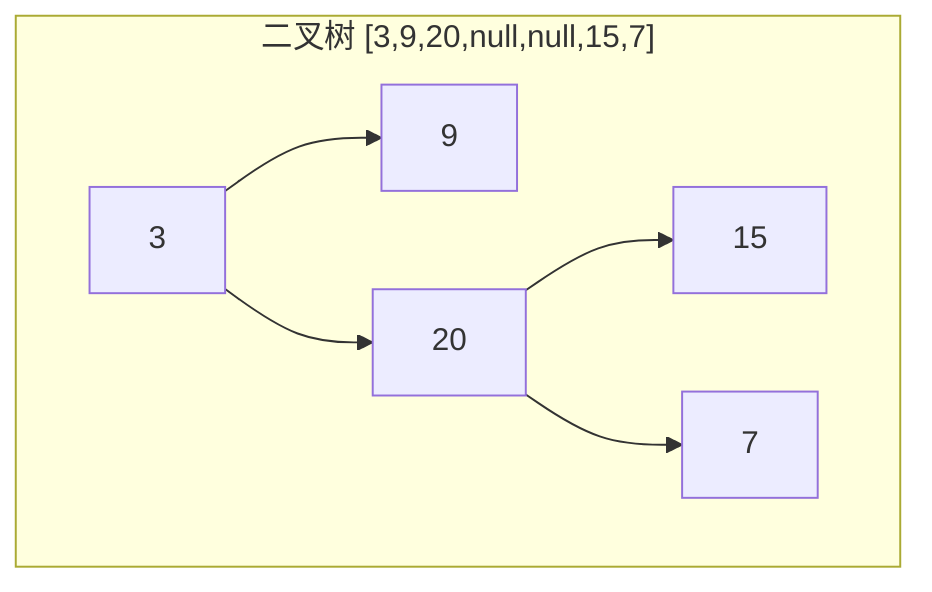
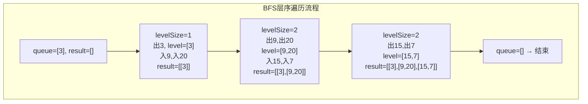

# LeetCode 102. Binary Tree Level Order Traversal（二叉树的层序遍历） — **中等**

## 考点
Tree, BFS, Binary Tree

## 题目描述
给你二叉树的根节点 `root`，返回其节点值的 **层序遍历**。（即逐层地，从左到右访问所有节点）。

### 示例 1
```
输入：root = [3,9,20,null,null,15,7]
输出：[[3],[9,20],[15,7]]
```

### 示例 2
```
输入：root = [1]
输出：[[1]]
```

### 示例 3
```
输入：root = []
输出：[]
```

### 约束
- 树中节点数目在范围 `[0, 2000]` 内
- `-1000 <= Node.val <= 1000`

## 图解





## 解题思路

### 核心思路

层序遍历需要**按层分组**输出。普通的 BFS 可以按顺序访问节点，但不能区分属于哪一层。解决方法是：在处理每一层之前，先记录当前队列的大小 `levelSize`，然后只处理这 `levelSize` 个节点——它们是当前层的全部节点。处理完这层后再看队列，里面是下一层的全部节点。

### 方法一：BFS + 层大小控制（队列）

**算法步骤：**

1. 若 `root == null`，返回 `[]`。
2. `queue = [root]`，`result = []`。
3. 当 `queue` 非空：
   - `levelSize = queue.length`（当前层节点数）。
   - 创建 `level = []`。
   - 循环 `levelSize` 次：
     - `node = queue.shift()`（队首出队）。
     - `level.push(node.val)`。
     - 若 `node.left` 非空，入队。
     - 若 `node.right` 非空，入队。
   - `result.push(level)`。
4. 返回 `result`。

**图解示例：**

```
二叉树:
         3
       /   \
      9     20
            /  \
          15    7

BFS 按层过程:

初始 queue = [3], result = []

--- 第 0 层 ---
levelSize = 1
  出队 3 → level = [3]
  3.left(9) 入队, 3.right(20) 入队
  queue = [9, 20]
  result = [[3]]

--- 第 1 层 ---
levelSize = 2
  出队 9 → level = [9]
    9.left = null, 9.right = null (不入队)
  出队 20 → level = [9, 20]
    20.left(15) 入队, 20.right(7) 入队
  queue = [15, 7]
  result = [[3], [9, 20]]

--- 第 2 层 ---
levelSize = 2
  出队 15 → level = [15]
  出队 7 → level = [15, 7]
  queue = []
  result = [[3], [9, 20], [15, 7]]

返回: [[3], [9, 20], [15, 7]]
```

**逐步追踪（完全二叉树 `[1,2,3,4,5,6,7]`）：**

```
        1
      /   \
     2     3
    / \   / \
   4   5 6   7

初始化: queue = [1], result = []

层0: levelSize=1
  出1, level=[1]
  入2, 入3
  queue = [2,3]
  result = [[1]]

层1: levelSize=2
  出2, level=[2], 入4,入5
  出3, level=[2,3], 入6,入7
  queue = [4,5,6,7]
  result = [[1],[2,3]]

层2: levelSize=4
  出4,5,6,7, level=[4,5,6,7]
  queue = []
  result = [[1],[2,3],[4,5,6,7]]

返回: [[1],[2,3],[4,5,6,7]]
```

**边界情况：**

| 情况 | 处理方式 |
|------|---------|
| 空树 | 返回 [] |
| 单节点 | result = [[root.val]] |
| 左斜链 | 每层只有一个节点，共 n 层 |
| 右斜链 | 同上 |
| 完全二叉树 | 最底层节点最多 n/2 个 |
| 非常大的树（2000 节点） | 队列最大接近 1024 |

### 方法二：DFS 递归（带深度标记）

**算法步骤：**

1. 递归函数 `dfs(node, depth)`：
   - 若 `node == null`，返回。
   - 若 `result.length == depth`，追加一个空数组 `result.push([])`。
   - `result[depth].push(node.val)`。
   - `dfs(node.left, depth + 1)`。
   - `dfs(node.right, depth + 1)`。
2. 调用 `dfs(root, 0)`。

**复杂度分析：**

| 方法 | 时间复杂度 | 空间复杂度 |
|------|-----------|-----------|
| BFS 队列 | O(n) | O(w)，w 为最大层宽 |
| DFS 递归 | O(n) | O(h)，h 为树高 |

**关键点：**

- `levelSize = queue.length` 是 BFS 做层序遍历的核心技巧。
- BFS 的队列空间在最底层能达到 n/2（完全二叉树），而 DFS 用递归栈，空间取决于高度。
- 这题是许多树问题的基础（锯齿形遍历、每层最大值、右视图等）。
