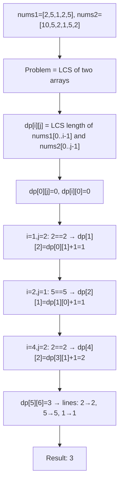
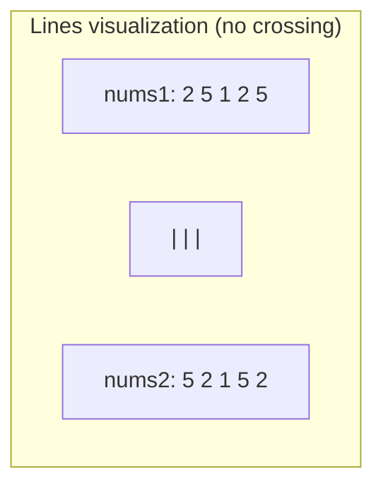
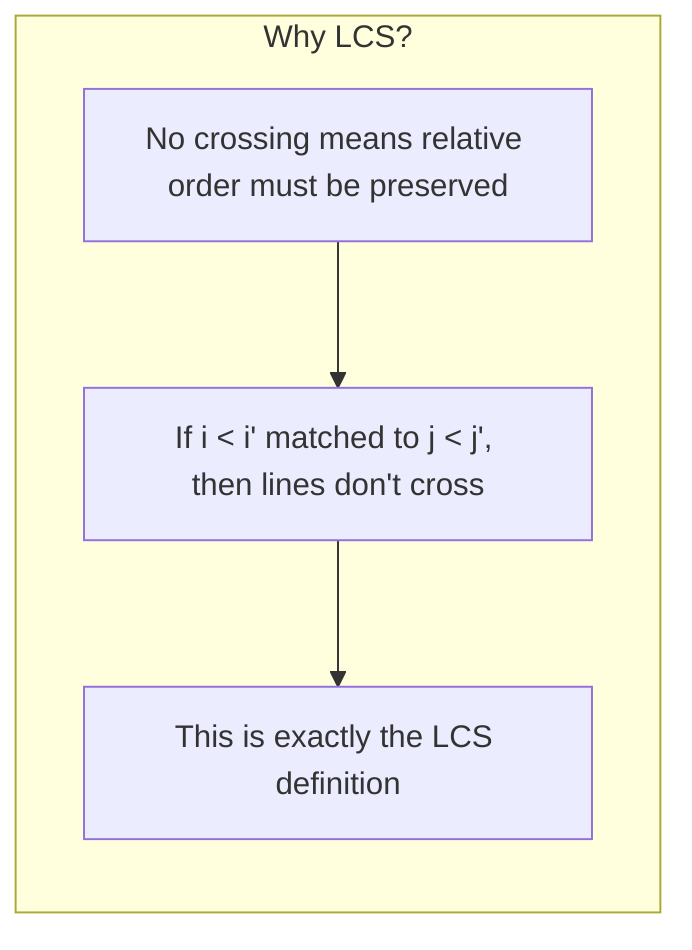

# LeetCode 1035. Uncrossed Lines（不相交的线） — **中等**

## 考点
数组, 动态规划

## 题目描述
在两条独立的水平线上按给定的顺序写下 nums1 和 nums2 中的整数。

现在，可以绘制一些连接两个数字 nums1[i] 和 nums2[j] 的直线，这些直线需要同时满足：
- nums1[i] == nums2[j]
- 且绘制的直线不与任何其他连线（非水平线）相交。

请注意，连线即使在端点也不能相交：每个数字只能属于一条连线。

以这种方法绘制线条，并返回可以绘制的最大连线数。

**示例 1:**
```
输入：nums1 = [1,4,2], nums2 = [1,2,4]
输出：2
解释：可以画出两条不交叉的线，如上图所示。
但无法画出第三条不相交的直线，因为从 nums1[1]=4 到 nums2[2]=4 的直线将与从 nums1[2]=2 到 nums2[1]=2 的直线相交。
```

**示例 2:**
```
输入：nums1 = [2,5,1,2,5], nums2 = [10,5,2,1,5,2]
输出：3
```

**示例 3:**
```
输入：nums1 = [1,3,7,1,7,5], nums2 = [1,9,2,5,1]
输出：2
```

**约束条件:**
- 1 <= nums1.length, nums2.length <= 500
- 1 <= nums1[i], nums2[j] <= 2000

## 图解







## 解题思路

### 核心思路

问题等价于求两个数组的**最长公共子序列（LCS）**。连线不相交意味着匹配的相对顺序必须保持一致。若 `nums1[i] == nums2[j]` 且我们画一条线连接它们，则之后只能连接 `nums1[i+1..]` 和 `nums2[j+1..]` 中的元素。这正是 LCS 的定义。

### 算法步骤

1. 定义 `dp[i][j]`：`nums1[0..i-1]` 和 `nums2[0..j-1]` 的 LCS 长度
2. 初始化 `dp[0][j] = 0, dp[i][0] = 0`
3. 遍历 i 从 1 到 m, j 从 1 到 n：
   - 若 `nums1[i-1] == nums2[j-1]`：`dp[i][j] = dp[i-1][j-1] + 1`
   - 否则：`dp[i][j] = max(dp[i-1][j], dp[i][j-1])`
4. 返回 `dp[m][n]`

### 图解示例

```
nums1 = [1, 4, 2]
nums2 = [1, 2, 4]

dp 表:

        ""  1  2  4
  ""  [ 0, 0, 0, 0 ]
  1   [ 0, 1, 1, 1 ]    i=1,j=1: 1==1 → dp[0][0]+1=1
  4   [ 0, 1, 1, 2 ]    i=2,j=3: 4==4 → dp[1][2]+1=1+1=2
  2   [ 0, 1, 2, 2 ]    i=3,j=2: 2==2 → dp[2][1]+1=1+1=2

结果: dp[3][3] = 2

连线方案:
  nums1[0]=1 → nums2[0]=1
  nums1[2]=2 → nums2[1]=2
  
  连线不会交叉 ✓
```

```
连线不可交叉的原因:

如果 nums1[i] 连 nums2[j], nums1[i'] 连 nums2[j']:
  不交叉要求: 若 i < i', 则 j < j'
  即: 索引保持相同的相对顺序

这恰好就是子序列的定义:
  从 nums1 中取 (i₁ < i₂ < ...), 从 nums2 中取 (j₁ < j₂ < ...)
  且 nums1[ik] == nums2[jk]
```

```
nums1 = [2, 5, 1, 2, 5]
nums2 = [10, 5, 2, 1, 5, 2]

dp 表:

         ""  10  5  2  1  5  2
  ""   [ 0, 0, 0, 0, 0, 0, 0 ]
  2    [ 0, 0, 0, 1, 1, 1, 1 ]
  5    [ 0, 0, 1, 1, 1, 2, 2 ]
  1    [ 0, 0, 1, 1, 2, 2, 2 ]
  2    [ 0, 0, 1, 2, 2, 2, 3 ]
  5    [ 0, 0, 1, 2, 2, 3, 3 ]

结果: dp[5][6] = 3

连线方案: 2→2, 5→5, 1→1
  或: 2→2, 1→1, 5→5
```

### 逐步追踪

以 nums1=[1,4,2], nums2=[1,2,4] 为例：

| i | j | nums1[i-1] | nums2[j-1] | 相同? | dp[i-1][j-1]+1 | dp[i-1][j] | dp[i][j-1] | dp[i][j] |
|---|---|-----------|-----------|-------|---------------|-----------|-----------|----------|
| 1 | 1 | 1 | 1 | Y | 0+1=1 | - | - | 1 |
| 1 | 2 | 1 | 2 | N | - | 0 | 1 | 1 |
| 1 | 3 | 1 | 4 | N | - | 0 | 1 | 1 |
| 2 | 1 | 4 | 1 | N | - | 1 | 1 | 1 |
| 2 | 2 | 4 | 2 | N | - | 1 | 1 | 1 |
| 2 | 3 | 4 | 4 | Y | 1+1=2 | - | - | 2 |
| 3 | 1 | 2 | 1 | N | - | 2 | 1 | 2 |
| 3 | 2 | 2 | 2 | Y | 1+1=2 | - | - | 2 |
| 3 | 3 | 2 | 4 | N | - | 2 | 2 | 2 |

### 边界情况

- 两数组完全相同：返回数组长度
- 两数组无公共元素：返回 0
- 一个数组为空：返回 0

### 复杂度分析

- **时间复杂度**：O(m × n)
- **空间复杂度**：O(m × n)，可优化至 O(min(m,n))

### 方法对比

| 方法 | 时间复杂度 | 空间复杂度 | 说明 |
|------|-----------|-----------|------|
| LCS DP 二维 | O(mn) | O(mn) | 标准解法 |
| LCS DP 滚动 | O(mn) | O(min(m,n)) | 空间优化 |
| 转化为连线问题 | O(mn) | O(mn) | 问题本质 |
