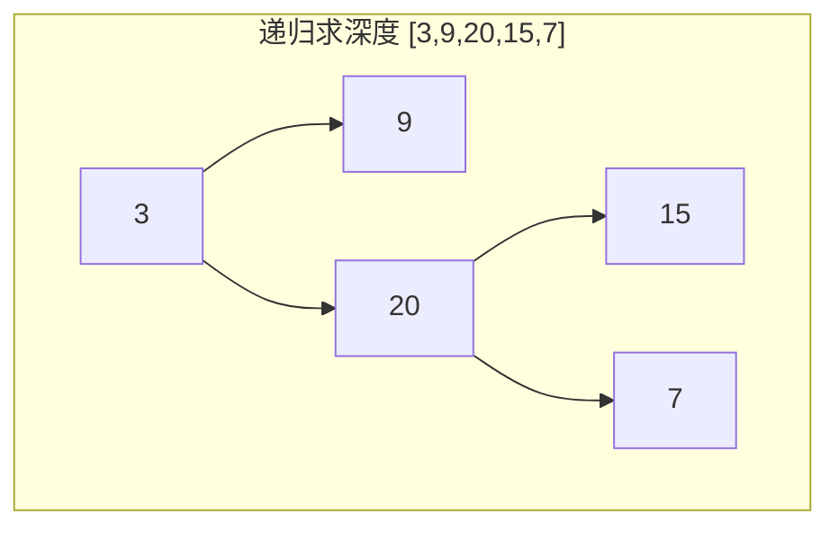
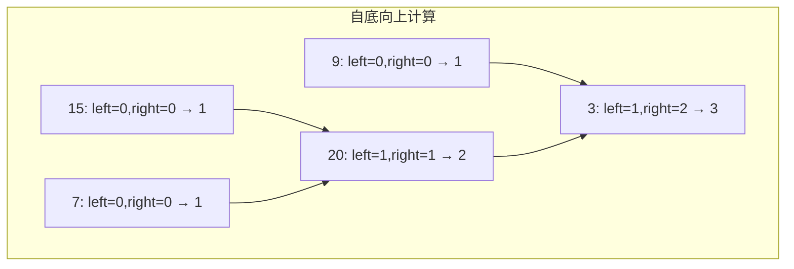
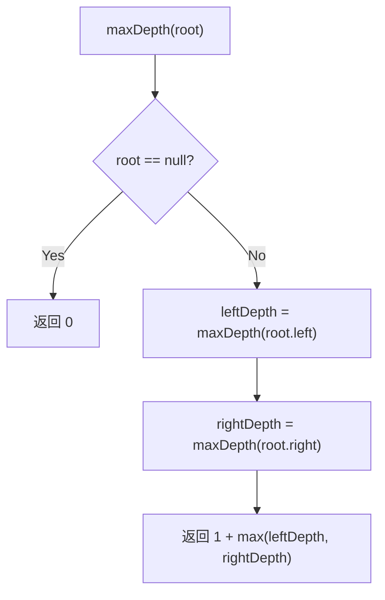

# LeetCode 104. Maximum Depth of Binary Tree（二叉树的最大深度） — **简单**

## 考点
Tree, DFS, BFS, Binary Tree

## 题目描述
给定一个二叉树 `root`，返回其最大深度。

二叉树的 **最大深度** 是指从根节点到最远叶子节点的最长路径上的节点数。

### 示例 1
```
输入：root = [3,9,20,null,null,15,7]
输出：3
```

### 示例 2
```
输入：root = [1,null,2]
输出：2
```

### 约束
- 树中节点数目在范围 `[0, 10^4]` 内
- `-100 <= Node.val <= 100`

## 图解







## 解题思路

### 核心思路

一棵树的最大深度 = 根节点自身（1）+ 左右子树中较深的那棵的深度。这是典型的**自底向上**递归：先获得子树的结果，再汇总到根节点。

深度的定义是路径上的**节点数**（不是边数），所以叶子节点深度为 1，空树深度为 0。

### 方法一：DFS 递归（自底向上）

**算法步骤：**

1. 若 `root == null`，返回 0。
2. `leftDepth = maxDepth(root.left)`。
3. `rightDepth = maxDepth(root.right)`。
4. 返回 `1 + max(leftDepth, rightDepth)`。

**图解示例：**

```
树: [3,9,20,null,null,15,7]
         3(?)                ← 深度 = 1 + max(左深, 右深) = 1+2 = 3
       /     \
     9(1)    20(?)           ← 深度 = 1 + max(1,1) = 2
             /    \
           15(1)  7(1)       ← 叶子深度 = 1

计算过程（递归返回阶段）:
  叶子 9:   left=0, right=0 → maxDepth=1
  叶子 15:  left=0, right=0 → maxDepth=1
  叶子 7:   left=0, right=0 → maxDepth=1
  节点 20:  left=1, right=1 → maxDepth=1+1=2
  节点 3:   left=1, right=2 → maxDepth=1+2=3

最大深度 = 3
```

**逐步追踪（左斜链 `[1,2,3,null,null,null,4]`）：**

```
  1
   \
    2
     \
      3
       \
        4

递归:
  maxDepth(4): 左右空, return 1
  maxDepth(3): left=0, right=1 → return 2
  maxDepth(2): left=0, right=2 → return 3
  maxDepth(1): left=0, right=3 → return 4

结果: 4
```

**边界情况：**

| 情况 | 处理方式 |
|------|---------|
| 空树 | 返回 0 |
| 单节点 | 1 + max(0,0) = 1 |
| 左斜链 | 深度 = n（递归栈深度 = n） |
| 右斜链 | 深度 = n（空间最坏 O(n)） |
| 完全二叉树 | 深度 = floor(log₂n) + 1 |
| 大量节点 (10⁴) | 递归栈可能溢出，可用 BFS 规避 |

### 方法二：BFS 层序遍历

**算法步骤：**

1. 若 `root == null`，返回 0。
2. `queue = [root]`, `depth = 0`。
3. 队列非空时：
   - `size = queue.length`。
   - 循环 `size` 次：出队，将左右子树入队。
   - `depth++`。
4. 返回 `depth`。

**图解示例（BFS 过程）：**

```
树: [3,9,20,15,7]
        3
       / \
      9  20
         / \
        15  7

层0: queue=[3] → 处理1个, depth=1
层1: queue=[9,20] → 处理2个, depth=2
层2: queue=[15,7] → 处理2个, depth=3
queue=[] → 返回 3
```

### 方法三：DFS 迭代（栈 + depth 标记）

用栈存储 `(node, depth)` 对，在入栈时记录每个节点所处的深度，维护全局最大深度。

**复杂度分析：**

| 方法 | 时间复杂度 | 空间复杂度 |
|------|-----------|-----------|
| DFS 递归 | O(n) | O(h)，最坏 O(n) |
| BFS 迭代 | O(n) | O(w)，最坏 O(n/2) |
| DFS 迭代（栈） | O(n) | O(h)，最坏 O(n) |

**关键点：**

- 递归写法的核心是一行代码 `return 1 + max(maxDepth(root.left), maxDepth(root.right))`。
- 深度定义是「节点数」而非「边数」——这是面试中容易混淆的地方。
- 当树退化为链表时（全部左偏或右偏），递归栈深度 = n，可能栈溢出。此时 BFS 更安全。
