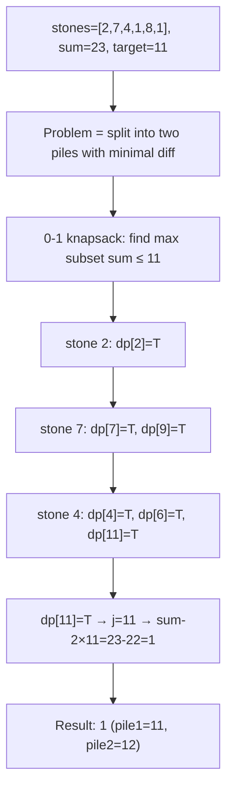
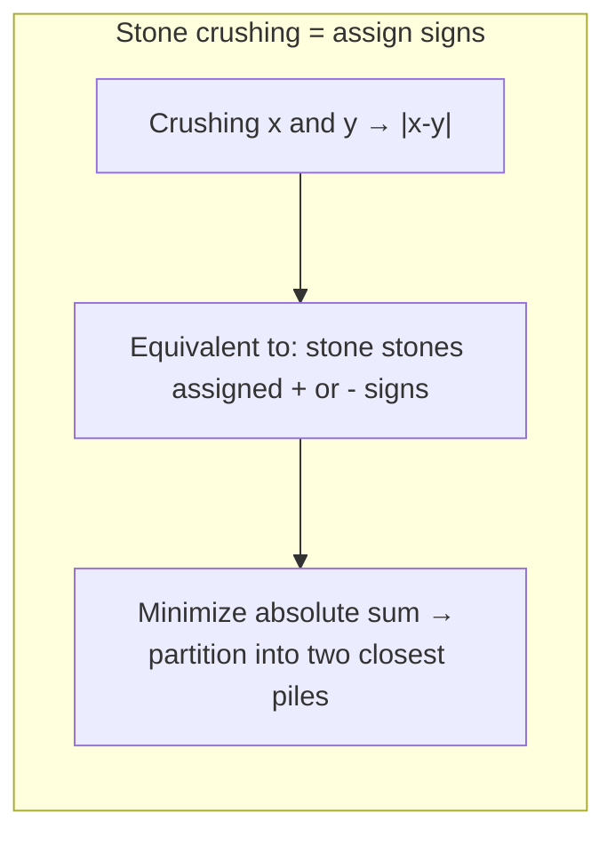
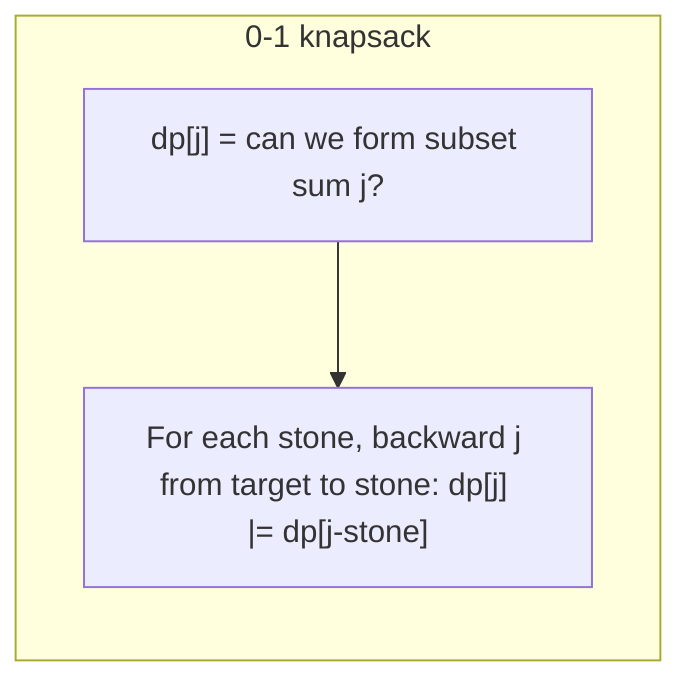

# LeetCode 1049. Last Stone Weight II（最后一块石头的重量II） — **中等**

## 考点
数组, 动态规划

## 题目描述
有一堆石头，用整数数组 stones 表示。其中 stones[i] 表示第 i 块石头的重量。

每一回合，从中选出任意两块石头，然后将它们一起粉碎。假设石头的重量分别为 x 和 y，且 x <= y。那么粉碎的可能结果如下：
- 如果 x == y，那么两块石头都会被完全粉碎；
- 如果 x != y，那么重量为 x 的石头将会完全粉碎，而重量为 y 的石头新重量为 y - x。

最后，最多只会剩下一块石头。返回此石头最小的可能重量。如果没有石头剩下，就返回 0。

**示例 1:**
```
输入：stones = [2,7,4,1,8,1]
输出：1
解释：
组合 2 和 4，得到 2，所以数组转化为 [2,7,1,8,1]，
组合 7 和 8，得到 1，所以数组转化为 [2,1,1,1]，
组合 2 和 1，得到 1，所以数组转化为 [1,1,1]，
组合 1 和 1，得到 0，所以数组转化为 [1]，这就是最优值。
```

**示例 2:**
```
输入：stones = [31,26,33,21,40]
输出：5
```

**约束条件:**
- 1 <= stones.length <= 30
- 1 <= stones[i] <= 100

## 图解







## 解题思路

### 核心思路

粉碎石头的操作等价于给每块石头分配正号或负号，求最终和的绝对值最小。这又等价于将石头分成两堆，使两堆重量之和的差最小。转化为 **0-1 背包求最接近 sum/2 的子集和**。

### 算法步骤

1. 计算 `sum = Σ stones[i]`，目标 `target = sum / 2`
2. 定义 `dp[j]`：能否选出和为 j 的子集
3. 初始化 `dp[0] = true`
4. 遍历每块石头 stone：
   - 倒序遍历 j 从 target 到 stone：
   - `dp[j] = dp[j] || dp[j - stone]`
5. 找到最大的 j 满足 `dp[j] == true`
6. 返回 `sum - 2 × j`（两堆之差）

### 图解示例

```
stones = [2, 7, 4, 1, 8, 1]
sum = 23, target = 11

dp 布尔数组演变:

初始化: dp = [T, F, F, F, F, F, F, F, F, F, F, F]
              0   1   2   3   4   5   6   7   8   9  10  11

处理 stone=2 (j=11→2):
  dp[2] = dp[2] || dp[0] = T
  dp: [T, F, T, F, F, F, F, F, F, F, F, F]

处理 stone=7 (j=11→7):
  dp[9] = dp[9] || dp[2] = T
  dp[7] = dp[7] || dp[0] = T
  dp: [T, F, T, F, F, F, F, T, F, T, F, F]

处理 stone=4 (j=11→4):
  dp[11] = dp[11] || dp[7] = T
  dp[6] = dp[6] || dp[2] = T
  dp[4] = dp[4] || dp[0] = T
  dp: [T, F, T, F, T, F, T, T, F, T, F, T]

处理 stone=1 (j=11→1):
  dp[11] = dp[11] || dp[10] = T
  dp[10] = dp[10] || dp[9] = T
  dp[8] = dp[8] || dp[7] = T
  dp[7] = dp[7] || dp[6] = T
  dp[5] = dp[5] || dp[4] = T
  dp[3] = dp[3] || dp[2] = T
  dp[1] = dp[1] || dp[0] = T
  dp: [T, T, T, T, T, T, T, T, T, T, T, T]

处理 stone=8 (j=11→8):
  dp[11] = dp[11] || dp[3] = T
  dp[10] = dp[10] || dp[2] = T
  dp[9] = dp[9] || dp[1] = T
  dp[8] = dp[8] || dp[0] = T
  dp: [...](全部为T)

处理 stone=1 (j=11→1): 全部仍为T

最大的 j ≤ 11 且 dp[j]=T 是 j=11

结果: sum - 2×11 = 23 - 22 = 1

验证: 一组石头和=11, 另一组=12, 差=1 ✓
```

```
分组示例:
  堆1: [2, 8, 1] = 11
  堆2: [7, 4, 1] = 12
  差: |11 - 12| = 1 ✓

等价于: +2 -7 +4 +1 -8 +1 = -7? 不...
  实际上是: 通过配对粉碎模拟分配正负号
```

### 逐步追踪

| 石头 | dp[11] | dp[10] | dp[9] | dp[8] | dp[7] | dp[6] | dp[5] | ... | dp[1] | dp[0] |
|------|--------|--------|-------|-------|-------|-------|-------|-----|-------|-------|
| 初始 | F | F | F | F | F | F | F | ... | F | T |
| 2 | F | F | F | F | F | F | F | ... | F | T |
| 7 | F | F | T | F | T | F | F | ... | F | T |
| 4 | T | F | T | F | T | T | F | ... | F | T |
| 1 | T | T | T | T | T | T | T | ... | T | T |
| 8 | T | T | T | T | T | T | T | ... | T | T |
| 1 | T | T | T | T | T | T | T | ... | T | T |

找到最大 j=11 使 dp[11]=T, 返回 23-22=1

### 边界情况

- 只有一块石头：返回该石头重量
- 两块相同石头：返回 0
- 所有重量为 1：可以配对消除大部分

### 复杂度分析

- **时间复杂度**：O(n × sum/2)，最大 30 × 1500 = 45000
- **空间复杂度**：O(sum/2)

### 方法对比

| 方法 | 时间复杂度 | 空间复杂度 | 说明 |
|------|-----------|-----------|------|
| 0-1 背包布尔 DP | O(n·sum) | O(sum) | 标准解法 |
| 0-1 背包整数 DP | O(n·sum) | O(sum) | dp[j] 存最大可达和 |
| DFS 枚举子集 | O(2ⁿ) | O(n) | n≤30, 勉强可行但慢 |
| 位运算 (bitset) | O(n·sum/64) | O(sum/64) | C++ bitset 优化 |
