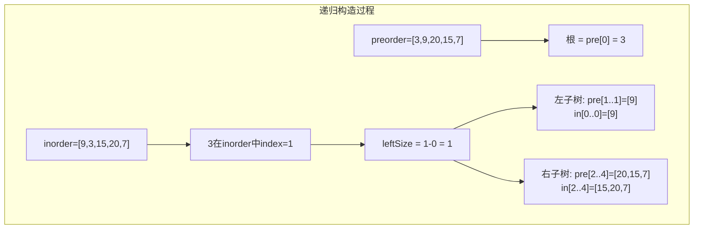
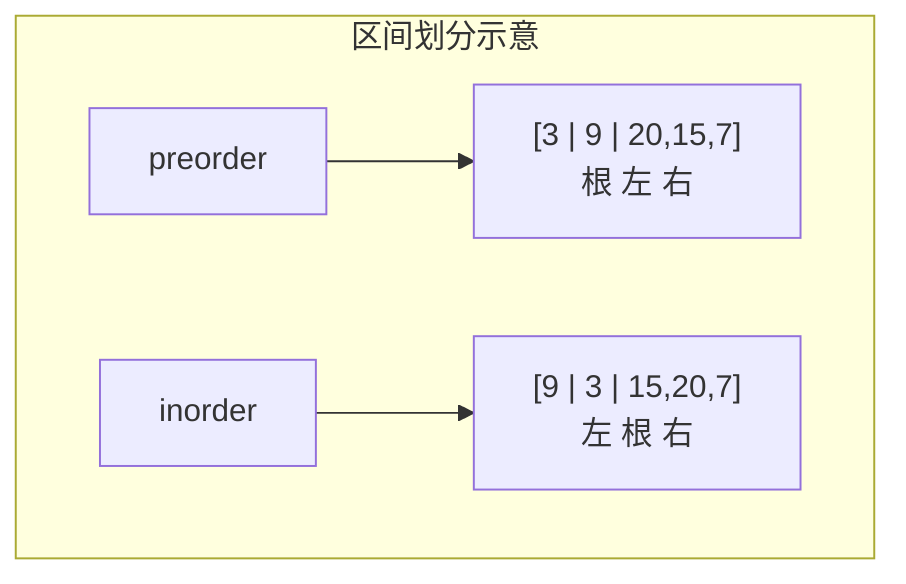
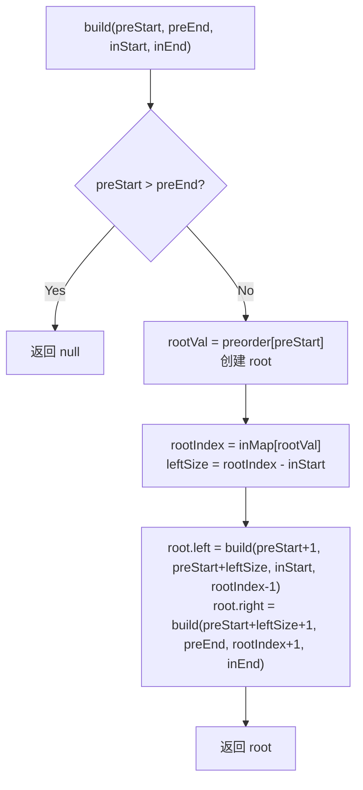

# LeetCode 105. Construct Binary Tree from Preorder and Inorder Traversal（从前序与中序遍历序列构造二叉树） — **中等**

## 考点
Tree, Array, Hash Table, Divide and Conquer, Binary Tree

## 题目描述
给定两个整数数组 `preorder` 和 `inorder`，其中 `preorder` 是二叉树的先序遍历，`inorder` 是同一棵树的中序遍历，请构造二叉树并返回其根节点。

### 示例 1
```
输入：preorder = [3,9,20,15,7], inorder = [9,3,15,20,7]
输出：[3,9,20,null,null,15,7]
```

### 示例 2
```
输入：preorder = [-1], inorder = [-1]
输出：[-1]
```

### 约束
- `1 <= preorder.length <= 3000`
- `inorder.length == preorder.length`
- `-3000 <= preorder[i], inorder[i] <= 3000`
- `preorder` 和 `inorder` 均无重复元素
- `preorder` 和 `inorder` 保证为同一棵二叉树的有效遍历序列

## 图解







## 解题思路

### 核心思路

前序遍历的顺序是 **根 → 左 → 右**，第一个元素一定是根节点。中序遍历的顺序是 **左 → 根 → 右**，在根节点左边的元素属于左子树，右边的属于右子树。

由此可得递归构造方案：
1. 从前序序序列取第一个元素作为根。
2. 在中序序列中定位根的位置，划分为左/右子树区间。
3. 根据左子树大小，从前序序列中切出左/右子树对应的子序列。
4. 递归构造左右子树。

### 方法一：递归 + 哈希表

**算法步骤：**

1. 构建哈希表 `inMap`，将 `inorder[i]` 映射到 `i`，实现 O(1) 定位根节点。
2. 定义 `build(preStart, preEnd, inStart, inEnd)`：
   - 若 `preStart > preEnd`，返回 null（区间无效）。
   - `rootVal = preorder[preStart]`，创建 `root`。
   - `rootIndex = inMap[rootVal]`（根节点在中序遍历中的位置）。
   - `leftSize = rootIndex - inStart`（左子树节点数）。
   - `root.left = build(preStart+1, preStart+leftSize, inStart, rootIndex-1)`。
   - `root.right = build(preStart+leftSize+1, preEnd, rootIndex+1, inEnd)`。
   - 返回 `root`。
3. 调用 `build(0, n-1, 0, n-1)`。

**图解示例：**

```
preorder = [3, 9, 20, 15, 7]
inorder  = [9, 3, 15, 20, 7]

第一步: 根节点
  preorder[0] = 3 是根
  在 inorder 中找到 3 的位置: index=1
  左子树 inorder: [9]     (前 1 个元素, leftSize=1)
  右子树 inorder: [15,20,7]

第二步: 左子树
  preorder 左子树区间: preorder[1..1] = [9]
  inorder  左子树区间: inorder[0..0] = [9]
  preorder[1]=9 是子根
  inorder 中 9 位置=0, leftSize=0
  左子树: null, 右子树: null
  → 叶子节点 9

第三步: 右子树
  preorder 右子树区间: preorder[2..4] = [20, 15, 7]
  inorder  右子树区间: inorder[2..4] = [15, 20, 7]
  preorder[2]=20 是子根
  inorder 中 20 位置=3, leftSize=1
  左子树 inorder: [15], 右子树 inorder: [7]

第四步: 20 的左子树
  preorder[3..3] = [15], inorder[2..2] = [15]
  → 叶子节点 15

第五步: 20 的右子树
  preorder[4..4] = [7], inorder[4..4] = [7]
  → 叶子节点 7

构建结果:
        3
       / \
      9   20
         /  \
        15   7
```

**逐步追踪（区间划分细节）：**

```
n=5, preorder=[3,9,20,15,7], inorder=[9,3,15,20,7]

build(0,4, 0,4):            preorder[0..4], inorder[0..4]
  rootVal=3, rootIndex(中序)=1
  leftSize=1-0=1
  L: build(1,1, 0,0)        preorder[1..1]=[9], inorder[0..0]=[9]
       rootVal=9, rootIndex=0
       leftSize=0
       L: build(2,1, 0,-1) → preStart>preEnd → null
       R: build(1,1, 1,0)  → preStart>preEnd → null
       return 9
  R: build(2,4, 2,4)        preorder[2..4]=[20,15,7], inorder[2..4]=[15,20,7]
       rootVal=20, rootIndex=3
       leftSize=3-2=1
       L: build(3,3, 2,2)   preorder[3..3]=[15], inorder[2..2]=[15]
            → return 15
       R: build(4,4, 4,4)   preorder[4..4]=[7], inorder[4..4]=[7]
            → return 7
       return 20(左15,右7)
  return 3(左9,右20)
```

**边界情况：**

| 情况 | 处理方式 |
|------|---------|
| 空数组 | `preStart > preEnd`，返回 null |
| 单元素 | 左右子树都返回 null |
| 全部左偏（降序） | 每次 leftSize = rootIndex - inStart = 0，右子树剩 n-1 个 |
| 全部右偏（升序） | 每次 leftSize = n-1，右子树 0 个 |
| 重复元素 | 题目保证无重复，否则哈希表无法唯一定位 |

### 方法二：迭代（栈）

不用递归，用栈模拟。每次遇到的值如果在中序遍历中的位置比栈顶小，则它是栈顶的左孩子；否则它是某个祖先的右孩子。

**复杂度分析：**

| 方法 | 时间复杂度 | 空间复杂度 |
|------|-----------|-----------|
| 递归 + 哈希 | O(n) | O(n) |
| 迭代 | O(n) | O(n) |
| 无哈希（线性查找） | O(n²) | O(h) |

**关键点：**

- 前序的第一个元素是整棵树的根，这是切入点。
- `leftSize = rootIndex - inStart` 是连接前序和中序区间划分的关键桥梁。
- 哈希表将中序查找优化到 O(1)，使整体复杂度达到 O(n)。
