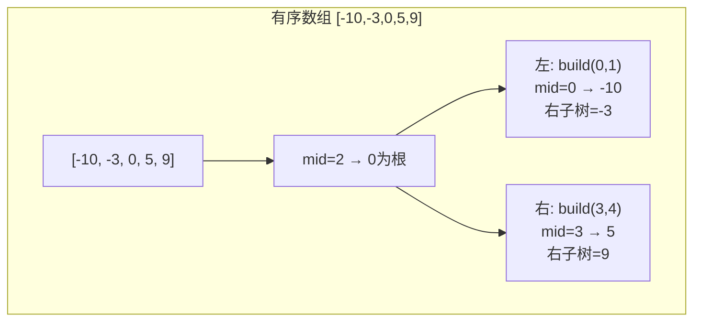
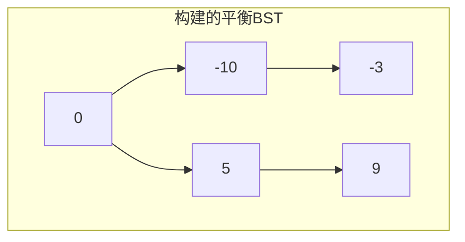
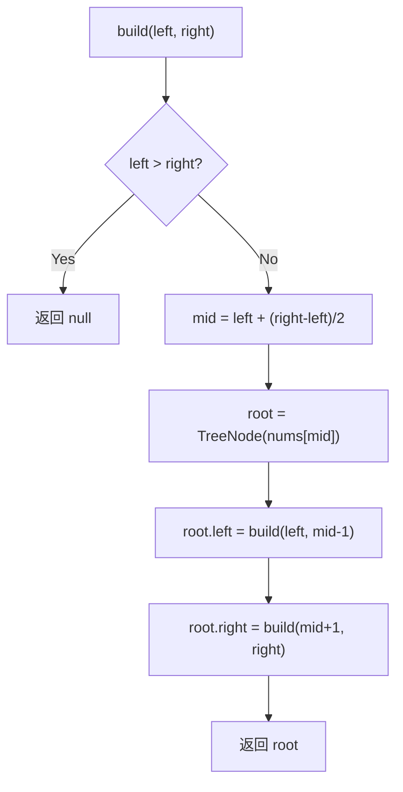

# LeetCode 108. Convert Sorted Array to Binary Search Tree（将有序数组转换为二叉搜索树） — **简单**

## 考点
Tree, BST, Divide and Conquer, Binary Tree

## 题目描述
给你一个整数数组 nums ，其中元素已经按 **升序** 排列，请你将其转换为一棵 **平衡** 二叉搜索树。

**示例 1：**

```
输入：nums = [-10,-3,0,5,9]
输出：[0,-3,9,-10,null,5]
解释：[0,-10,5,null,-3,null,9] 也将被视为正确答案。
```

**示例 2：**

```
输入：nums = [1,3]
输出：[3,1]
解释：[1,null,3] 和 [3,1] 都是高度平衡二叉搜索树。
```

**提示：**
- `1 <= nums.length <= 10^4`
- `-10^4 <= nums[i] <= 10^4`
- `nums` 按 **严格递增** 顺序排列

## 图解







## 解题思路

### 核心思路

数组已按升序排列，要建成**平衡的 BST**。由于 BST 的中序遍历正好是升序序列，所以中序遍历结果反过来就可以确定树结构：以数组中间元素为根，左半部分做左子树，右半部分做右子树，递归执行。因为每次都二分区间，树自然是高度平衡的（左右子树节点数最多差 1）。

### 方法一：递归 + 二分

**算法步骤：**

1. 定义 `build(left, right)`：
   - 若 `left > right`，返回 null。
   - `mid = left + Math.floor((right - left) / 2)`（或 `(left + right) / 2`，选择偏左的中间点）。
   - `root = new TreeNode(nums[mid])`。
   - `root.left = build(left, mid - 1)`。
   - `root.right = build(mid + 1, right)`。
   - 返回 `root`。
2. 调用 `build(0, n - 1)`。

**图解示例：**

```
nums = [-10, -3, 0, 5, 9]
n=5

第1次: build(0, 4)
  mid = 2 → nums[2] = 0 作为根
  左: build(0, 1)    右: build(3, 4)

  build(0, 1):
    mid = 0 → nums[0] = -10 作为左子
    左: build(0, -1) = null
    右: build(1, 1)
      mid = 1 → nums[1] = -3 作为 -10 的右子 ← 注意
      左: build(1, 0) = null
      右: build(2, 1) = null
      返回 -3
    返回 -10(右=-3)

  build(3, 4):
    mid = 3 → nums[3] = 5 作为右子
    左: build(3, 2) = null
    右: build(4, 4)
      mid = 4 → nums[4] = 9 作为 5 的右子
      返回 9
    返回 5(右=9)

  返回 0(左=-10, 右=5)

结果树:
        0
       / \
     -10  5
       \   \
       -3   9
```

**另一种选中间点的结果（mid = Math.ceil）：**

```
mid = left + Math.ceil((right-left)/2):
  build(0,4): mid=2 → 根=0
    build(0,1): mid=1 → -3
      build(0,0): mid=0 → -10
    build(3,4): mid=4 → 9
      build(3,3): mid=3 → 5

结果:
        0
       / \
     -3   9
     /    /
   -10   5
```

两种都合法！只要高度平衡即可。

**逐步追踪（`nums = [1,2,3,4,5,6]`）：**

```
n=6, nums=[1,2,3,4,5,6]

build(0,5): mid=2 → nums[2]=3 为根
  build(0,1): mid=0 → nums[0]=1
    build(0,-1)=null
    build(1,1): mid=1 → nums[1]=2
      → 返回 2
    → 返回 1(右=2)
  build(3,5): mid=4 → nums[4]=5
    build(3,3): mid=3 → nums[3]=4
      → 返回 4
    build(5,5): mid=5 → nums[5]=6
      → 返回 6
    → 返回 5(左=4,右=6)
  → 返回 3(左=1,右=5)

结果:
       3
      / \
     1   5
      \ / \
      2 4  6
```

**边界情况：**

| 情况 | 处理方式 |
|------|---------|
| 空数组 | 注意约束说长度 ≥ 1，不处理空数组 |
| 单元素 `[x]` | mid=0, 左右子树为 null，返回单节点 |
| 两元素 `[1,3]` | mid=0 → 1为根, 右子树为3 |
| 奇数长度 | 左右子树节点数相等，完美平衡 |
| 偶数长度 | 左右子树节点数差 1，高度差至多 1 |
| 极大数组 (10⁴) | 递归栈深度 O(log n) ≈ 14，安全 |

### 方法二：迭代（非递归）

用 3 个栈（或自定义栈结构）分别存储左右边界和父节点位置。每次弹出区间，计算 mid，创建节点并压入下一层区间。

**复杂度分析：**

| 方法 | 时间复杂度 | 空间复杂度 |
|------|-----------|-----------|
| 递归 + 二分 | O(n) | O(log n) |
| 迭代 | O(n) | O(log n) |

**关键点：**

- 升序数组 = BST 中序遍历结果，反过程就是递归选择中间点作为根。
- 选择 `mid = left + (right - left) / 2`（floor 中间）总是安全的，避免整数溢出且保证平衡。
- 这题的输出不唯一，任何高度平衡的 BST 都算正确。
