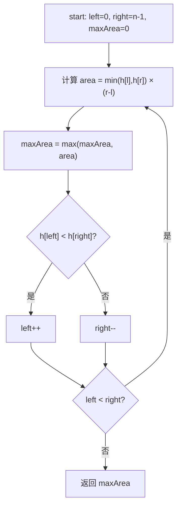

# LeetCode 11. Container With Most Water（盛最多水的容器） — **中等**

## 考点
Array, Two Pointers, Greedy

## 题目描述
给定一个长度为 `n` 的整数数组 `height`。有 `n` 条垂线，第 `i` 条线的两个端点是 `(i, 0)` 和 `(i, height[i])`。

找出其中的两条线，使得它们与 `x` 轴共同构成的容器可以容纳最多的水。

返回容器可以储存的最大水量。

说明：你不能倾斜容器。

**示例 1：**
```
输入：[1,8,6,2,5,4,8,3,7]
输出：49 
解释：图中垂直线代表输入数组 [1,8,6,2,5,4,8,3,7]。在此情况下，容器能够容纳水（表示为蓝色部分）的最大值为 49。
```

**示例 2：**
```
输入：height = [1,1]
输出：1
```

**提示：**
- `n == height.length`
- `2 <= n <= 10^5`
- `0 <= height[i] <= 10^4`

## 图解



## 解题思路

### 核心思路
面积由**较短边的高度**和**两边的距离**决定。使用双指针从两端向中间收缩，每次移动较短边的指针。虽然宽度减小了，但可能找到更高的边来弥补，从而获得更大的面积。

### 算法步骤

**方法一：暴力枚举**

1. 两层循环枚举所有数对 (i, j)，i < j
2. 计算 `area = min(height[i], height[j]) * (j - i)`
3. 更新最大值

**方法二：双指针（最优解）**

1. 初始化 `left = 0`，`right = n - 1`，`maxArea = 0`
2. 当 `left < right` 时循环：
   - 计算当前面积：`area = min(height[left], height[right]) * (right - left)`
   - 更新 `maxArea = max(maxArea, area)`
   - **关键贪心决策**：
     - 如果 `height[left] < height[right]`：`left++`（移动较短的左边界）
     - 否则：`right--`（移动较短的右边界）
3. 返回 `maxArea`

**为什么移动较短的边是正确的？**
- 容器的实际高度由较短边决定
- 如果移动较高的边，宽度减小了，但高度不可能增加（因为高度仍受限于较短的边），面积一定减小
- 如果移动较短的边，虽然宽度减小，但有可能遇到更高的边，面积可能增大
- 因此移动较短的边不会错过最优解

### 图解示例

以输入 `height = [1, 8, 6, 2, 5, 4, 8, 3, 7]` 为例：

```
数组可视化（每个数字代表柱子的高度）：

高
 8 |      ██                ██
 7 |      ██                ██    ██
 6 |      ██  ██            ██    ██
 5 |      ██  ██    ██      ██    ██
 4 |      ██  ██    ██  ██  ██    ██
 3 |      ██  ██    ██  ██  ██  ████
 2 |      ██  ██  ████  ██  ██  ████
 1 |  ██  ██  ██  ████  ██  ██  ████
 0 |__██__██__██__██__██__██__██__██__██__
     0   1   2   3   4   5   6   7   8

Step 1: left=0(h=1), right=8(h=7)
  area = min(1,7) * (8-0) = 1 * 8 = 8
  height[0] < height[8] → left++
  maxArea = 8

  [1,  8,  6,  2,  5,  4,  8,  3,  7]
   ↑L                              ↑R

Step 2: left=1(h=8), right=8(h=7)
  area = min(8,7) * (8-1) = 7 * 7 = 49
  height[1] > height[8] → right--
  maxArea = 49 ✓ (这就是答案!)

  [1,  8,  6,  2,  5,  4,  8,  3,  7]
       ↑L                          ↑R

Step 3: left=1(h=8), right=7(h=3)
  area = min(8,3) * (7-1) = 3 * 6 = 18
  height[1] > height[7] → right--
  maxArea = 49 (不变)

       [1,  8,  6,  2,  5,  4,  8,  3,  7]
            ↑L                      ↑R

Step 4: left=1(h=8), right=6(h=8)
  area = min(8,8) * (6-1) = 8 * 5 = 40
  height[1] == height[6] → right--（任选一边）
  maxArea = 49 (不变)

Step 5: left=1(h=8), right=5(h=4)
  area = min(8,4) * (5-1) = 4 * 4 = 16
  height[1] > height[5] → right--

Step 6: left=1(h=8), right=4(h=5)
  area = min(8,5) * (4-1) = 5 * 3 = 15
  height[1] > height[4] → right--

Step 7: left=1(h=8), right=3(h=2)
  area = min(8,2) * (3-1) = 2 * 2 = 4

Step 8: left=1(h=8), right=2(h=6)
  area = min(8,6) * (2-1) = 6 * 1 = 6

Step 9: left=1, right=1 → left >= right → 循环结束

最终 maxArea = 49
```

### 逐步追踪

| 步骤 | left | right | h[left] | h[right] | 宽度 | 较矮高度 | 面积 | maxArea | 操作 |
|------|------|-------|---------|----------|------|---------|------|---------|------|
| 1    | 0    | 8     | 1       | 7        | 8    | 1       | 8    | 8       | left++ |
| 2    | 1    | 8     | 8       | 7        | 7    | 7       | 49   | 49      | right-- |
| 3    | 1    | 7     | 8       | 3        | 6    | 3       | 18   | 49      | right-- |
| 4    | 1    | 6     | 8       | 8        | 5    | 8       | 40   | 49      | right-- |
| 5    | 1    | 5     | 8       | 4        | 4    | 4       | 16   | 49      | right-- |
| 6    | 1    | 4     | 8       | 5        | 3    | 5       | 15   | 49      | right-- |
| 7    | 1    | 3     | 8       | 2        | 2    | 2       | 4    | 49      | right-- |
| 8    | 1    | 2     | 8       | 6        | 1    | 6       | 6    | 49      | right-- |

### 边界情况

1. **只有两个元素**（如 [1, 1]）：一次计算得到结果，返回 min(1,1)*1 = 1
2. **所有高度相同**（如 [5, 5, 5, 5]）：无论移动哪边，面积单调递减，最优是两端
3. **高度递增/递减**：指针移动方向确定，O(n) 完成
4. **极端高度差**（如 [1, 100, 1]）：最优解是两端，面积 = min(1,1)*2 = 2

### 复杂度分析

时间复杂度：O(n) — 每个元素最多被访问一次（left 和 right 各移动 n 次，相遇时结束）
空间复杂度：O(1) — 只使用常数个变量

### 方法对比

| 方法 | 时间复杂度 | 空间复杂度 | 说明 |
|------|-----------|-----------|------|
| 暴力枚举 | O(n²) | O(1) | n=10^5 时会超时 |
| 双指针 | O(n) | O(1) | 最优解 ✓ |
