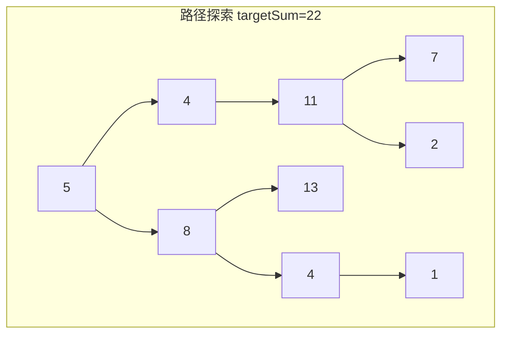
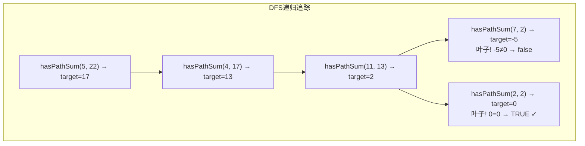
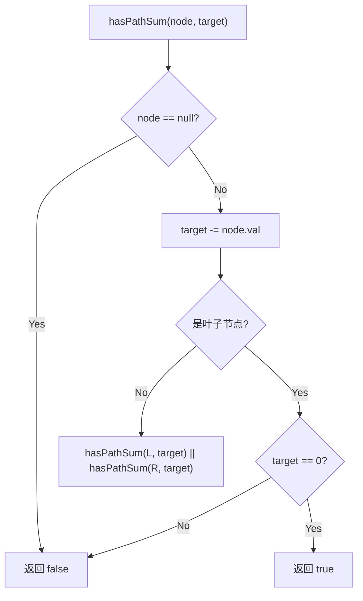

# LeetCode 112. Path Sum（路径总和） — **简单**

## 考点
Tree, DFS, BFS, Binary Tree

## 题目描述
给你二叉树的根节点 `root` 和一个表示目标和的整数 `targetSum` 。判断该树中是否存在 **根节点到叶子节点** 的路径，这条路径上所有节点值相加等于目标和 `targetSum` 。如果存在，返回 `true` ；否则，返回 `false` 。

**叶子节点** 是指没有子节点的节点。

**示例 1：**

```
输入：root = [5,4,8,11,null,13,4,7,2,null,null,null,1], targetSum = 22
输出：true
解释：等于目标和的根节点到叶节点路径如图所示。
```

**示例 2：**

```
输入：root = [1,2,3], targetSum = 5
输出：false
解释：树中存在两条根节点到叶子节点的路径：
(1 --> 2): 和为 3
(1 --> 3): 和为 4
不存在 sum = 5 的根节点到叶子节点的路径。
```

**示例 3：**

```
输入：root = [], targetSum = 0
输出：false
解释：由于树是空的，所以不存在根节点到叶子节点的路径。
```

**提示：**
- 树中节点的数目在范围 `[0, 5000]` 内
- `-1000 <= Node.val <= 1000`
- `-1000 <= targetSum <= 1000`

## 图解







## 解题思路

### 核心思路

从根到叶子的路径和 = `targetSum`。DFS 遍历时，每向下一层就减去当前节点的值。到达叶子节点时，检查剩余值是否刚好为 0。

关键约束：必须是「从根到**叶子**」的完整路径，不能是中途某段。叶子定义为左右子节点都为 null。

### 方法一：DFS 递归

**算法步骤：**

1. 定义 `hasPathSum(node, target)`：
   - 若 `node == null`，返回 false（空树无路径）。
   - `target -= node.val`。
   - 若 `node.left == null && node.right == null`（叶子），返回 `target == 0`。
   - 递归：`hasPathSum(node.left, target) || hasPathSum(node.right, target)`。
2. 调用 `hasPathSum(root, targetSum)`。

**图解示例：**

```
树: [5,4,8,11,null,13,4,7,2,null,null,null,1], targetSum=22

         5
       /   \
      4     8
     /     / \
    11    13  4
   /  \        \
  7    2        1

DFS追踪 (targetSum=22):

hasPathSum(5, 22):
  target = 22-5 = 17
  非叶子，递归左右

  hasPathSum(4, 17):
    target = 17-4 = 13
    非叶子，递归左右

    hasPathSum(11, 13):
      target = 13-11 = 2
      非叶子，递归左右

      hasPathSum(7, 2):
        target = 2-7 = -5
        叶子，-5≠0 → false

      hasPathSum(2, 2):
        target = 2-2 = 0
        叶子，0=0 → true ✅

    → 找到一条路径! 5+4+11+2 = 22

    hasPathSum(null, 17) → false

  → 返回 true (因为有一个分支 true)
```

**逐步追踪（树 `[1,2,3]`，targetSum=5）：**

```
      1
     / \
    2   3

hasPathSum(1, 5):
  target = 5-1 = 4, 非叶子

  hasPathSum(2, 4):
    target = 4-2 = 2
    叶子! 2≠0 → false

  hasPathSum(3, 4):
    target = 4-3 = 1
    叶子! 1≠0 → false

  → false || false = false

结果: false
```

**边界情况：**

| 情况 | 处理方式 |
|------|---------|
| 空树 | 返回 false |
| 根节点就是叶子 | 返回 `root.val == targetSum` |
| 负数节点值 | DFS 运算照常，target 可能 > targetSum（变大了） |
| 负 targetSum | 同样处理，不要求 targetSum 非负 |
| 多路径均可满足 | 只要有一条返回 true |
| 单侧链表（左斜/右斜） | 只检查唯一路径 |

### 方法二：BFS 迭代

使用两个队列（节点队列 + 当前路径和队列），同步进行操作。到达叶子时判断和。

**算法步骤：**

1. 若 `root == null`，返回 false。
2. `nodeQueue = [root]`，`sumQueue = [root.val]`。
3. 当队列非空：
   - `node = nodeQueue.shift()`, `curSum = sumQueue.shift()`。
   - 若是叶子且 `curSum == targetSum`，返回 true。
   - 左子入队，sum 为 `curSum + left.val`。
   - 右子入队，sum 为 `curSum + right.val`。
4. 返回 false。

### 方法三：DFS 迭代（栈）

类似于 DFS 递归，用栈代替系统调用栈，栈元素为 `(node, remaining)`，每次弹栈处理。

**复杂度分析：**

| 方法 | 时间复杂度 | 空间复杂度 |
|------|-----------|-----------|
| DFS 递归 | O(n) | O(h) |
| BFS 迭代 | O(n) | O(w) |
| DFS 迭代（栈） | O(n) | O(h) |

**关键点：**

- 路径必须到叶子——中途 `target` 变为 0 但节点不是叶子不算成功。
- 用减法（`target -= node.val`）比用加法（维护 `curSum`）更简洁。
- `||` 短路运算：一旦一条路径返回 true，就不再遍历其他分支。
