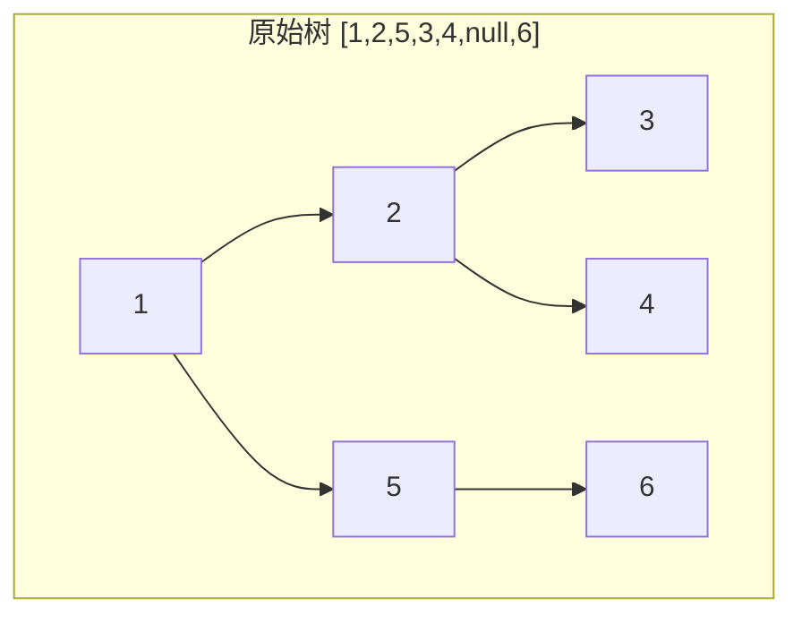
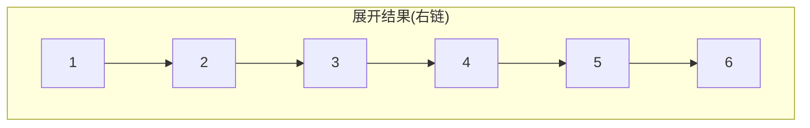
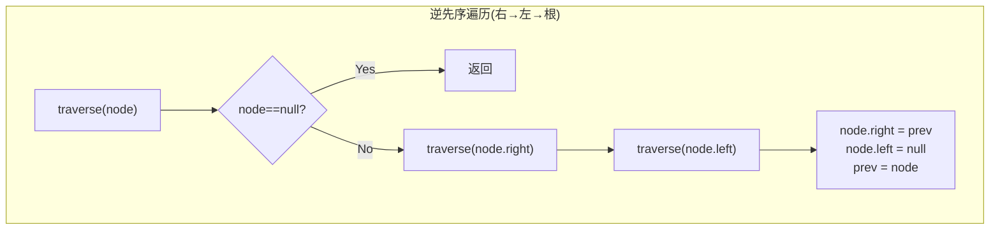
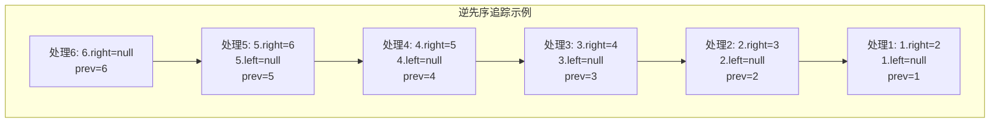

# LeetCode 114. Flatten Binary Tree to Linked List（二叉树展开为链表） — **中等**

## 考点
Stack, Tree, DFS, Linked List, Binary Tree

## 题目描述
给你二叉树的根结点 `root` ，请你将它展开为一个单链表：

- 展开后的单链表应该同样使用 `TreeNode` ，其中 `right` 子指针指向链表中下一个结点，而左子指针始终为 `null` 。
- 展开后的单链表应该与二叉树 **先序遍历** 顺序相同。

**示例 1：**

```
输入：root = [1,2,5,3,4,null,6]
输出：[1,null,2,null,3,null,4,null,5,null,6]
```

**示例 2：**

```
输入：root = []
输出：[]
```

**示例 3：**

```
输入：root = [0]
输出：[0]
```

**提示：**
- 树中结点数在范围 `[0, 2000]` 内
- `-100 <= Node.val <= 100`

## 图解









## 解题思路

### 核心思路
将二叉树按先序遍历顺序展开为链表。题目要求 **原地修改**，空间复杂度尽量低。关键洞察：先序遍历是 根→左→右，如果反过来用 右→左→根的逆先序遍历，可以从链表尾部向前构建，每个节点只需要修改其右指针即可。

### 方法一：逆先序遍历（递归）

最优雅的解法。维护一个全局 `prev` 指针指向已构建链表的头部（即上一个访问的节点）。按照 **右→左→根** 的顺序递归，每次将当前节点的 `right` 指向 `prev`，`left` 置为 `null`。

```
逆先序遍历顺序：右子树 → 左子树 → 根
正先序：1→2→3→4→5→6
逆先序：6→5→4→3→2→1
这样每次处理当前节点时，prev 已经是链表中它的后继节点
```

#### 算法步骤
1. 初始化 `prev = null`
2. 递归函数：如果当前节点为空则返回
3. 先递归处理右子树
4. 再递归处理左子树
5. 处理当前节点：`root.right = prev; root.left = null; prev = root`

#### 图解示例
以 `root = [1,2,5,3,4,null,6]` 为例：

```
原始树：              展开后的链表：
      1             1
     / \             \
    2   5      →      2
   / \   \             \
  3   4   6             3
                         \
                          4
                           \
                            5
                             \
                              6

逆先序追踪：
Step 1: 递归到节点 6 → prev=6, 6.right=null
Step 2: 回溯到节点 5 → 5.right=6, 5.left=null, prev=5
Step 3: 递归到节点 4 → 4.right=5, 4.left=null, prev=4
Step 4: 递归到节点 3 → 3.right=4, 3.left=null, prev=3
Step 5: 回溯到节点 2 → 2.right=3, 2.left=null, prev=2
Step 6: 回溯到节点 1 → 1.right=2, 1.left=null, prev=1
完成！
```

#### 逐步追踪
```
调用栈（右→左→根）：
traverse(1)
  traverse(5)        // 1的右子树
    traverse(null)   // 5的右子树为空
    traverse(null)   // 5的左子树为空
    处理5: 5→6→null, prev=5
    traverse(6)      // 5的右→回到6（实际在traverse(path)内部是从上到下）
    
实际正确的递归展开：
traverse(1) → traverse(5.right即6) → traverse(6.left空) → traverse(6.right空) → 6→null,prev=6
            → traverse(5.left空) → 5→6,prev=5
traverse(1.left即2) → traverse(2.right即4) → 4的左右空 → 4→5,prev=4
                     → traverse(2.left即3) → 3的左右空 → 3→4,prev=3
                     → 2→3,prev=2
遍历1: 1→2,prev=1
```

#### 边界情况
- 空树：直接返回
- 单节点：不需要任何操作
- 只有左子树或只有右子树：逆先序遍历仍然正确

### 方法二：迭代 + 栈

模拟先序遍历，用栈辅助。

1. 如果 `root` 为空则返回
2. 使用栈，初始压入 `root`
3. 维护 `prev = null`
4. 当栈非空：弹出节点，如果 `prev` 不为空，则 `prev.right = node`，`prev.left = null`；将右子节点、左子节点依次入栈（因为栈是后进先出）；更新 `prev = node`

### 方法三：原地展开（Morris-like 迭代）O(1) 空间

1. 对于每个节点，如果它有左子树，找到左子树的最右节点（前驱节点）
2. 将前驱节点的 `right` 指向当前节点的 `right`
3. 将当前节点的 `right` 指向当前节点的 `left`，`left` 置为 `null`
4. 移动到当前节点的 `right`

```
以 [1,2,5,3,4,null,6] 为例：
1 有左子树2，2的最右节点是4
4.right = 1.right (= 5)
1.right = 1.left (= 2), 1.left = null
树变为：[1,2,null,3,4,5,null,null,null,null,6]
继续处理 2...
```

### 复杂度分析

| 方法 | 时间复杂度 | 空间复杂度 |
|------|-----------|-----------|
| 逆先序递归 | O(n) | O(h) 递归栈 |
| 迭代栈 | O(n) | O(h) 栈空间 |
| 原地展开 | O(n) | O(1) |

最优解法：原地展开，达到 O(1) 空间复杂度。
