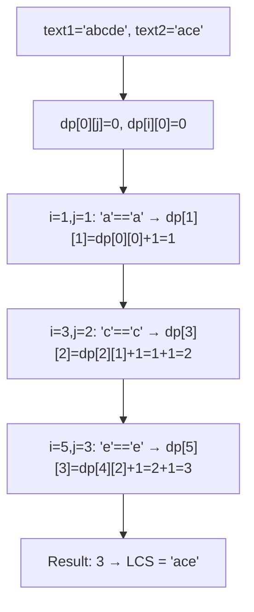
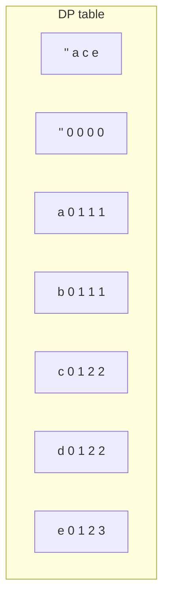
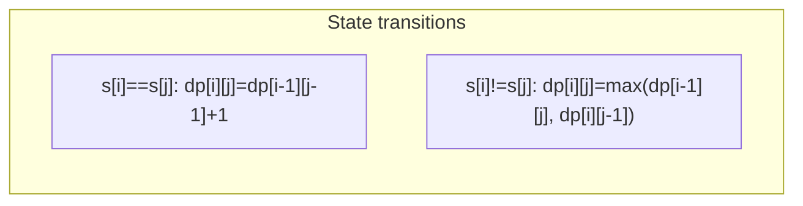

# LeetCode 1143. Longest Common Subsequence（最长公共子序列） — **中等**

## 考点
字符串, 动态规划

## 题目描述
给定两个字符串 text1 和 text2，返回这两个字符串的最长公共子序列的长度。如果不存在公共子序列，返回 0。

一个字符串的子序列是指这样一个新的字符串：它是由原字符串在不改变字符的相对顺序的情况下删除某些字符（也可以不删除任何字符）后组成的新字符串。

例如，"ace" 是 "abcde" 的子序列，但 "aec" 不是 "abcde" 的子序列。

两个字符串的公共子序列是这两个字符串所共同拥有的子序列。

**示例 1:**
```
输入：text1 = "abcde", text2 = "ace"
输出：3
解释：最长公共子序列是 "ace"，它的长度为 3。
```

**示例 2:**
```
输入：text1 = "abc", text2 = "abc"
输出：3
解释：最长公共子序列是 "abc"，它的长度为 3。
```

**示例 3:**
```
输入：text1 = "abc", text2 = "def"
输出：0
解释：两个字符串没有公共子序列，返回 0。
```

**约束条件:**
- 1 <= text1.length, text2.length <= 1000
- text1 和 text2 仅由小写英文字符组成

## 图解







## 解题思路

### 核心思路

**最长公共子序列（LCS）** 经典 DP。`dp[i][j]` 表示 `text1[0..i-1]` 和 `text2[0..j-1]` 的 LCS 长度。当前字符相同时 LCS 长度 +1，不同时取跳过一端字符的最大值。

### 算法步骤

1. 定义 `dp[i][j]`：`text1` 前 i 个字符和 `text2` 前 j 个字符的 LCS 长度
2. 初始化 `dp[0][j] = 0, dp[i][0] = 0`
3. 遍历 i 从 1 到 m, j 从 1 到 n：
   - 若 `text1[i-1] == text2[j-1]`：`dp[i][j] = dp[i-1][j-1] + 1`
   - 否则：`dp[i][j] = max(dp[i-1][j], dp[i][j-1])`
4. 返回 `dp[m][n]`

**空间优化**：`dp[i][j]` 只依赖 `dp[i-1][j-1]`、`dp[i-1][j]`、`dp[i][j-1]`，可用两行滚动（或一行 + 一个变量存左上角值）。

### 图解示例

```
text1 = "abcde", text2 = "ace"

dp 表:

        ""  a  c  e
  ""  [ 0, 0, 0, 0 ]
  a   [ 0, 1, 1, 1 ]     a==a → dp[0][0]+1=1
  b   [ 0, 1, 1, 1 ]     b≠a,c,e → 继承
  c   [ 0, 1, 2, 2 ]     c==c → dp[2][1]+1=1+1=2
  d   [ 0, 1, 2, 2 ]     d≠e → max(dp[3][2],dp[2][3])=max(2,2)=2
  e   [ 0, 1, 2, 3 ]     e==e → dp[4][2]+1=2+1=3

结果: dp[5][3] = 3, LCS = "ace"
```

```
dp 表填充方向:

  (i-1,j-1)  (i-1,j)
  (i,j-1)    (i,j)    ← 当前位置

  text1[i-1]==text2[j-1] 时: 继承左上+1
  否则: 取 max(上, 左)
```

```
text1 = "abc", text2 = "def" (无公共子序列)

        ""  d  e  f
  ""  [ 0, 0, 0, 0 ]
  a   [ 0, 0, 0, 0 ]
  b   [ 0, 0, 0, 0 ]
  c   [ 0, 0, 0, 0 ]

结果: 0
```

### 逐步追踪

| i | j | text1[i-1] | text2[j-1] | 相同? | dp[i-1][j-1]+1 | max(dp[i-1][j],dp[i][j-1]) | dp[i][j] |
|---|---|-----------|-----------|-------|---------------|--------------------------|----------|
| 1 | 1 | a | a | Y | 0+1=1 | - | 1 |
| 1 | 2 | a | c | N | - | max(0,1)=1 | 1 |
| 1 | 3 | a | e | N | - | max(0,1)=1 | 1 |
| 2 | 1 | b | a | N | - | max(1,0)=1 | 1 |
| 2 | 2 | b | c | N | - | max(1,1)=1 | 1 |
| 2 | 3 | b | e | N | - | max(1,1)=1 | 1 |
| 3 | 1 | c | a | N | - | max(1,1)=1 | 1 |
| 3 | 2 | c | c | Y | 1+1=2 | - | 2 |
| 3 | 3 | c | e | N | - | max(1,2)=2 | 2 |
| 4 | 1 | d | a | N | - | max(1,1)=1 | 1 |
| 4 | 2 | d | c | N | - | max(2,1)=2 | 2 |
| 4 | 3 | d | e | N | - | max(2,2)=2 | 2 |
| 5 | 1 | e | a | N | - | max(1,1)=1 | 1 |
| 5 | 2 | e | c | N | - | max(2,1)=2 | 2 |
| 5 | 3 | e | e | Y | 2+1=3 | - | 3 |

### 边界情况

- 一个字符串为空：返回 0
- 两字符串相同：返回字符串长度
- 两字符串无公共字符：返回 0
- 长度上限 1000：O(mn) 可达 10⁶，可接受

### 复杂度分析

- **时间复杂度**：O(m × n)
- **空间复杂度**：O(m × n)，可优化至 O(min(m,n))

### 方法对比

| 方法 | 时间复杂度 | 空间复杂度 | 说明 |
|------|-----------|-----------|------|
| 二维 DP | O(mn) | O(mn) | 标准解法 |
| 两行滚动 DP | O(mn) | O(2·min(m,n)) | 空间优化 |
| 一行 DP + prev | O(mn) | O(min(m,n)) | 最优空间 |
| 记忆化 DFS | O(mn) | O(mn) | 自顶向下 |

### LCS 应用场景

- 版本差异比较（diff 工具的基础）
- DNA 序列比对
- 本题关联题目：583（删除操作）、712（ASCII 删除和）、1035（不相交的线）
