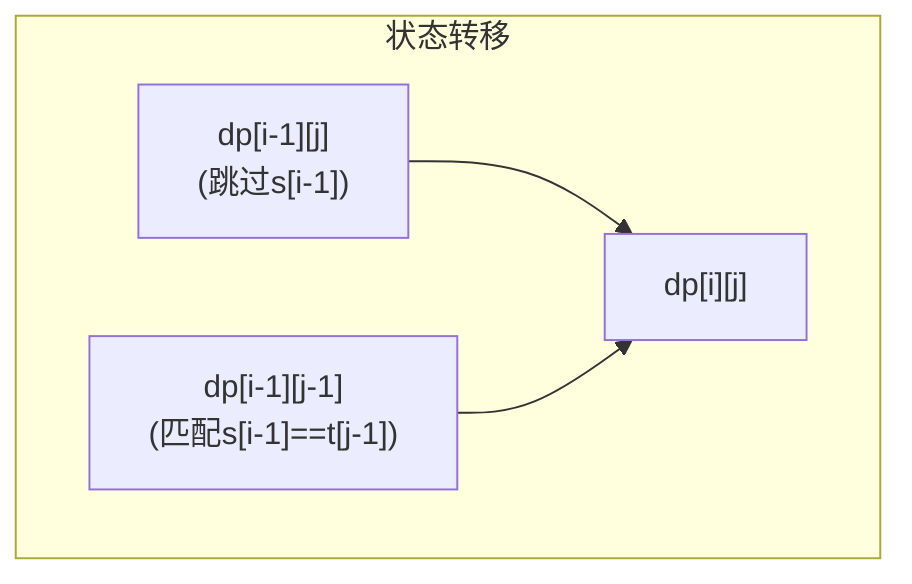
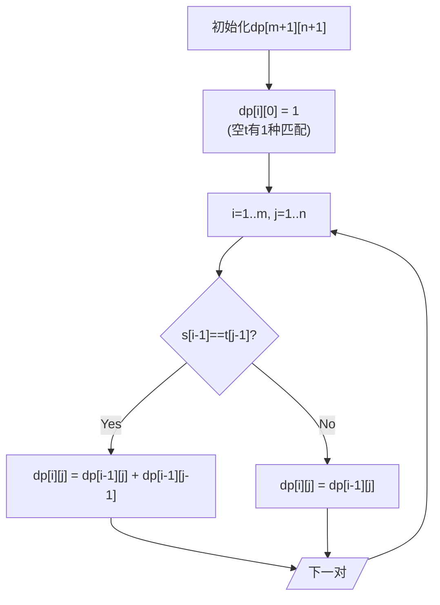

# LeetCode 115. Distinct Subsequences（不同的子序列） — **困难**

## 考点
String, Dynamic Programming

## 题目描述
给你两个字符串 `s` 和 `t` ，统计并返回在 `s` 的 **子序列** 中 `t` 出现的个数，结果需对 `10^9 + 7` 取模。

**示例 1：**

```
输入：s = "rabbbit", t = "rabbit"
输出：3
解释：
如下所示, 有 3 种可以从 s 中得到 "rabbit" 的方案。
rabbbit
rabbbit
rabbbit
```

**示例 2：**

```
输入：s = "babgbag", t = "bag"
输出：5
解释：
如下所示, 有 5 种可以从 s 中得到 "bag" 的方案。
babgbag
babgbag
babgbag
babgbag
babgbag
```

**提示：**
- `1 <= s.length, t.length <= 1000`
- `s` 和 `t` 由英文字母组成

## 图解

```mermaid
flowchart TD
    subgraph "DP表格 s=rabbbit, t=rabbit"
        G00[""] --> G10["r"]
        G00 --> G01["a"]
        G10 --> G20["b"]
        G10 --> G11["dp[1][1]=1"]
        G20 --> G30["b"]
        G20 --> G21["dp[2][2]=1"]
        G30 --> G40["b"]
        G30 --> G31["dp[3][3]=1"]
        G40 --> G50["i"]
        G40 --> G41["dp[4][3]=dp[3][3]+dp[3][2]=2"]
    end
```





## 解题思路

### 核心思路
统计字符串 `s` 的不同子序列中等于 `t` 的个数。这是一个经典的 **计数型动态规划** 问题。核心在于：遍历 `s` 的每个字符时，对于 `t` 的每个字符，我们有两个选择——用当前 `s[i]` 去匹配 `t[j]`，或者跳过 `s[i]` 不用。

### 方法一：二维 DP

定义 `dp[i][j]` = `s` 的前 `i` 个字符（`s[0..i-1]`）的子序列中，等于 `t` 的前 `j` 个字符（`t[0..j-1]`）的个数。

#### 状态转移方程

```
dp[i][j] = dp[i-1][j]                          // 不用 s[i-1] 匹配
           + (s[i-1]==t[j-1] ? dp[i-1][j-1] : 0)  // 用 s[i-1] 匹配 t[j-1]
```

**解释**：
- `dp[i-1][j]`：跳过 `s[i-1]`，用 `s` 的前 `i-1` 个字符去匹配 `t[0..j-1]`
- `dp[i-1][j-1]`：用 `s[i-1]` 去匹配 `t[j-1]`，然后用 `s` 的前 `i-1` 个字符去匹配 `t[0..j-2]`

#### 初始化
- `dp[i][0] = 1`：空字符串 `t` 在任何 `s` 的子序列中都恰好存在 1 种匹配（不选任何字符）
- `dp[0][j] = 0`（`j > 0`）：空字符串 `s` 无法匹配非空的 `t`

### 算法步骤
1. 创建 `(m+1) × (n+1)` 的 DP 表
2. 初始化第一列全为 1
3. 双层循环填充 DP 表
4. 返回 `dp[m][n]`

#### 逐步追踪
以 `s = "rabbbit"`, `t = "rabbit"` 为例：

```
DP 表（行=s[0..i-1], 列=t[0..j-1]）：

    "" r a b b i t
""   1 0 0 0 0 0 0
r    1 1 0 0 0 0 0
a    1 1 1 0 0 0 0
b    1 1 1 1 0 0 0   ← s="rab", t="rab": 有1种
b    1 1 1 2 0 0 0   ← s="rabb", t="rab": 2种 (用第1个b 或第2个b)
b    1 1 1 3 0 0 0   ← s="rabbb", t="rab": 3种 (选2个b中的1个)
i    1 1 1 3 3 0 0   ← s="rabbbi", t="rabi": dp[5][4]=dp[4][4]+dp[4][3]=0+3=3
t    1 1 1 3 3 3 3   ← s="rabbbit", t="rabbit": dp[6][5]=dp[5][5]+dp[5][4]=0+3=3
                     → 最终答案: 3
```

关键计算示例（i=4, j=3, s[3]='b', t[2]='b', 相等）：
`dp[4][3] = dp[3][3] + dp[3][2] = 1 + 1 = 2`

### 图解示例

```
s = "rabbbit", t = "rabbit"
下标:  0 1 2 3 4 5

情况分析（第3个b有3种选择）：
方案1: r a b b b i t → 跳过第1个b: rabb{1}it
方案2: r a b b b i t → 跳过第2个b: rabb{2}it  
方案3: r a b b b i t → 跳过第3个b: rabb{3}it

用 ↑ 标记选中的字符：
方案1: r a b b - i t
        ↑ ↑ ↑   ↑ ↑ ↑
方案2: r a - b b i t
        ↑ ↑   ↑ ↑ ↑ ↑
方案3: r a - - b i t  ← 不对, 必须保留a
实际上3种方案中选中的b是不同位置的
```

### 方法二：一维 DP（空间优化）

由于 `dp[i][j]` 只依赖于 `dp[i-1][j]` 和 `dp[i-1][j-1]`，可以用一维数组滚动更新。**注意 `j` 必须从右向左遍历**，因为 `dp[j]` 依赖旧的 `dp[j-1]`。

```
dp[j] = dp[j] + (s[i-1]==t[j-1] ? dp[j-1] : 0)
```

### 边界情况
- `t` 长度大于 `s`：直接返回 0
- `t` 为空字符串：返回 1（不选任何字符）
- 大数处理：结果对 `10^9 + 7` 取模，防止溢出

### 复杂度分析

| 方法 | 时间复杂度 | 空间复杂度 |
|------|-----------|-----------|
| 二维 DP | O(m × n) | O(m × n) |
| 一维 DP（优化） | O(m × n) | O(n) |

其中 `m = s.length`，`n = t.length`。
