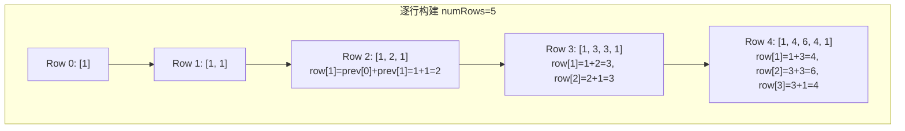
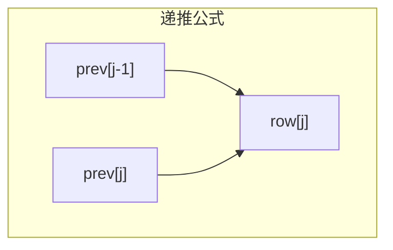
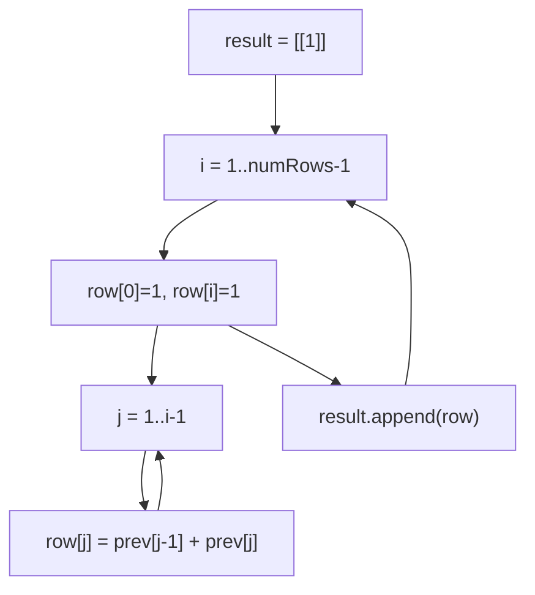

# LeetCode 118. Pascal's Triangle（杨辉三角） — **简单**

## 考点
Array, Dynamic Programming

## 题目描述
给定一个非负整数 `numRows`，生成「杨辉三角」的前 `numRows` 行。

在「杨辉三角」中，每个数是它左上方和右上方的数的和。

**示例 1：**

```
输入: numRows = 5
输出: [[1],[1,1],[1,2,1],[1,3,3,1],[1,4,6,4,1]]
```

**示例 2：**

```
输入: numRows = 1
输出: [[1]]
```

**提示：**
- `1 <= numRows <= 30`

## 图解







## 解题思路

### 核心思路
杨辉三角（Pascal's Triangle）的生成规则非常直观：每个数等于它上方两数之和。逐行构建，每一行的首尾元素固定为 1，中间元素通过上一行计算得出。

数学公式：`C(n, k) = C(n-1, k-1) + C(n-1, k)`，这正是组合数的递推关系。杨辉三角的第 `i` 行第 `j` 列的值恰好等于组合数 `C(i, j)`。

### 方法一：动态规划逐行构建

#### 算法步骤
1. 初始化结果列表 `result`，放入第一行 `[1]`
2. 遍历行号 `i` 从 1 到 `numRows-1`
3. 构建当前行：首元素为 1，中间 `j` 从 1 到 `i-1`，`row[j] = prev[j-1] + prev[j]`，尾元素为 1
4. 将当前行加入结果，更新 `prev`

#### 图解示例

```
numRows = 5 的构建过程：

Row 0:  [1]                              → C(0,0)
Row 1:  [1, 1]                           → 首尾为1，无中间元素
Row 2:  [1, 2, 1]                        → row[1]=1+1=2
Row 3:  [1, 3, 3, 1]                     → row[1]=1+2=3, row[2]=2+1=3
Row 4:  [1, 4, 6, 4, 1]                  → row[1]=1+3=4, row[2]=3+3=6, row[3]=3+1=4

计算过程图解：
Row 2:  [1,   1]
         \  / 
         [2]    + 首尾1 = [1, 2, 1]

Row 3:  [1,   2,   1]
         \  / \  /
         [3]   [3]   + 首尾1 = [1, 3, 3, 1]

Row 4:  [1,   3,   3,   1]
         \  / \  / \  /
         [4]   [6]   [4]  + 首尾1 = [1, 4, 6, 4, 1]
```

#### 逐步追踪（numRows = 5）

| 步骤 | 当前行 i | 上一行 | 构建过程 | 当前行结果 |
|------|---------|--------|---------|-----------|
| 初始 | 0 | - | 手动放 [1] | `[[1]]` |
| 1 | 1 | [1] | i=1 无中间元素，直接 [1,1] | `[[1],[1,1]]` |
| 2 | 2 | [1,1] | j=1: 1+1=2 → [1,2,1] | `[[1],[1,1],[1,2,1]]` |
| 3 | 3 | [1,2,1] | j=1:1+2=3, j=2:2+1=3 → [1,3,3,1] | + |
| 4 | 4 | [1,3,3,1] | j=1:1+3=4, j=2:3+3=6, j=3:3+1=4 → [1,4,6,4,1] | + |

### 方法二：组合数公式

第 `i` 行第 `j` 个元素 = `C(i, j) = i! / (j! * (i-j)!)`

利用递推关系可以在 O(k) 时间内生成第 k 行：
`C(n, k) = C(n, k-1) * (n - k + 1) / k`

对于本题生成所有行，此方法无优势。但对于 LeetCode 119 的单行问题，此方法更优。

### 边界情况
- `numRows = 0`：返回空列表（虽然题目约束 `numRows >= 1`）
- `numRows = 1`：返回 `[[1]]`
- `numRows = 30`（最大值）：第 30 行最大值为 `C(30, 15) ≈ 1.55 × 10^8`，在 int 范围内

### 复杂度分析

| 方法 | 时间复杂度 | 空间复杂度 |
|------|-----------|-----------|
| 逐行 DP | O(numRows²) | O(1) 不计返回值 |
| 组合数公式 | O(numRows²) | O(1) 不计返回值 |

生成 `numRows` 行共约 `numRows²/2` 个元素，每个元素 O(1) 计算，总复杂度 O(numRows²)。
