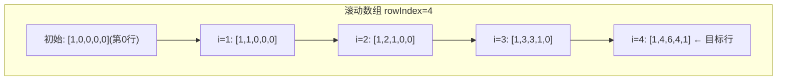
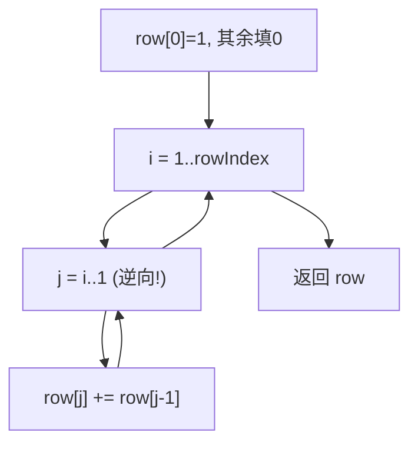

# LeetCode 119. Pascal's Triangle II（杨辉三角II） — **简单**

## 考点
Array, Dynamic Programming

## 题目描述
给定一个非负索引 `rowIndex`，返回「杨辉三角」的第 `rowIndex` 行。

在「杨辉三角」中，每个数是它左上方和右上方的数的和。

**示例 1：**

```
输入: rowIndex = 3
输出: [1,3,3,1]
```

**示例 2：**

```
输入: rowIndex = 0
输出: [1]
```

**示例 3：**

```
输入: rowIndex = 1
输出: [1,1]
```

**提示：**
- `0 <= rowIndex <= 33`

**进阶：** 你可以优化你的算法到 O(rowIndex) 空间复杂度吗？

## 图解





## 解题思路

### 核心思路
返回杨辉三角的某一特定行。与 LeetCode 118 不同，本题只要求第 `rowIndex` 行（0-indexed），且进阶要求优化到 O(k) 空间。如果先构建所有行再取最后一行，空间是 O(k²)，浪费巨大。

关键技巧：**只用一个数组，从后向前原地更新**，模拟从第 0 行逐行演进到第 `rowIndex` 行。

### 方法一：滚动数组（原地更新）

#### 算法步骤
1. 初始化长度为 `rowIndex + 1` 的数组 `row`，全部填充 0，`row[0] = 1`
2. 外层循环 `i` 从 1 到 `rowIndex`：代表正在构建第 `i` 行
3. 内层循环 `j` 从 `i` 递减到 1：`row[j] += row[j-1]`
4. 每次外层循环结束后，`row[0..i]` 即为第 `i` 行的正确值
5. 返回 `row`

**为什么必须从后向前更新？**
```
如果从前向后更新：
row[j] = row[j] + row[j-1]
当计算 row[2] 时，row[1] 已经是新值，不是上一行的旧值 → 错误！

从后向前更新：
row[2] = row[2](旧) + row[1](旧) ← row[1] 还未被更新，仍是上一行的值 → 正确！
```

#### 图解示例

```
rowIndex = 4，目标是得到第 4 行: [1, 4, 6, 4, 1]

初始: row = [1, 0, 0, 0, 0]  ← 第 0 行

i=1（构建第1行）：
  j=1: row[1] += row[0] = 0+1 = 1
  row = [1, 1, 0, 0, 0]        ← 第 1 行

i=2（构建第2行）：
  j=2: row[2] += row[1] = 0+1 = 1
  j=1: row[1] += row[0] = 1+1 = 2
  row = [1, 2, 1, 0, 0]        ← 第 2 行

i=3（构建第3行）：
  j=3: row[3] += row[2] = 0+1 = 1
  j=2: row[2] += row[1] = 1+2 = 3
  j=1: row[1] += row[0] = 2+1 = 3
  row = [1, 3, 3, 1, 0]        ← 第 3 行

i=4（构建第4行）：
  j=4: row[4] += row[3] = 0+1 = 1
  j=3: row[3] += row[2] = 1+3 = 4
  j=2: row[2] += row[1] = 3+3 = 6
  j=1: row[1] += row[0] = 3+1 = 4
  row = [1, 4, 6, 4, 1]        ← 第 4 行 ✓
```

#### 逐步追踪（rowIndex = 3）

| 外层 i | j 循环（从 i→1） | row 数组（更新后） |
|--------|------------------|-------------------|
| 初始 | - | `[1, 0, 0, 0]` |
| 1 | j=1: 0+1=1 | `[1, 1, 0, 0]` |
| 2 | j=2: 0+1=1; j=1: 1+1=2 | `[1, 2, 1, 0]` |
| 3 | j=3: 0+1=1; j=2: 1+2=3; j=1: 2+1=3 | `[1, 3, 3, 1]` |

### 方法二：组合数公式（O(k) 时间，O(1) 空间）

杨辉三角第 `n` 行第 `k` 个元素 = `C(n, k)`。

利用递推关系：
```
C(n, 0) = 1
C(n, k) = C(n, k-1) × (n - k + 1) / k
```

```
rowIndex = 4:
C(4,0) = 1
C(4,1) = 1 × 4 / 1 = 4
C(4,2) = 4 × 3 / 2 = 6
C(4,3) = 6 × 2 / 3 = 4
C(4,4) = 4 × 1 / 4 = 1
→ [1, 4, 6, 4, 1]
```

此方法每个元素 O(1) 计算，总时间 O(k)，空间 O(1)。注意使用 `long` 防止中间结果溢出。

### 边界情况
- `rowIndex = 0`：返回 `[1]`
- `rowIndex = 1`：返回 `[1, 1]`
- `rowIndex = 33`（最大值）：`C(33, 16) ≈ 1.17 × 10^9`，在 int 范围但接近边界

### 复杂度分析

| 方法 | 时间复杂度 | 空间复杂度 |
|------|-----------|-----------|
| 滚动数组 DP | O(k²) | O(k) |
| 组合数递推 | O(k) | O(1) |

**推荐**：组合数递推公式法，时间和空间都是最优。
