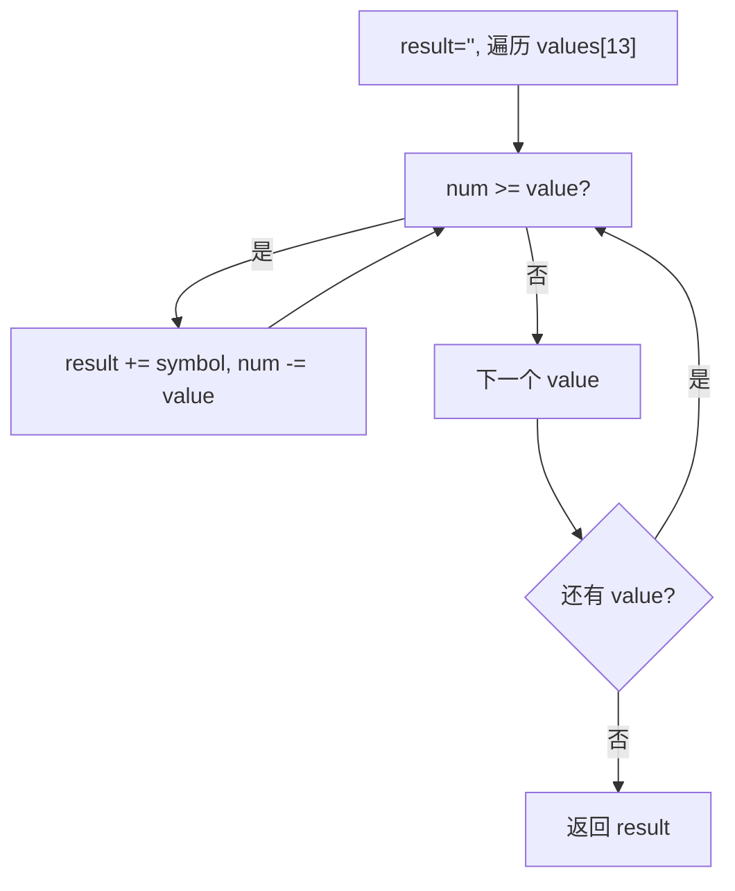

# LeetCode 12. Integer to Roman（整数转罗马数字） — **中等**

## 考点
Hash Table, Math, String

## 题目描述
罗马数字包含以下七种字符： `I`， `V`， `X`， `L`，`C`，`D` 和 `M`。

| 字符 | 数值 |
|------|------|
| I    | 1    |
| V    | 5    |
| X    | 10   |
| L    | 50   |
| C    | 100  |
| D    | 500  |
| M    | 1000 |

例如， 罗马数字 2 写做 `II`，即为两个并列的 1。12 写做 `XII`，即为 `X + II`。27 写做 `XXVII`，即为 `XX + V + II`。

通常情况下，罗马数字中小的数字在大的数字的右边。但也存在特例，例如 4 不写做 `IIII`，而是 `IV`。数字 1 在数字 5 的左边，所表示的数等于大数 5 减小数 1 得到的数值 4。同样地，数字 9 表示为 `IX`。这个特殊的规则只适用于以下六种情况：
- `I` 可以放在 `V` (5) 和 `X` (10) 的左边，来表示 4 和 9。
- `X` 可以放在 `L` (50) 和 `C` (100) 的左边，来表示 40 和 90。 
- `C` 可以放在 `D` (500) 和 `M` (1000) 的左边，来表示 400 和 900。

给你一个整数，将其转为罗马数字。

**示例 1：**
```
输入: num = 3
输出: "III"
```

**示例 2：**
```
输入: num = 4
输出: "IV"
```

**示例 3：**
```
输入: num = 9
输出: "IX"
```

**示例 4：**
```
输入: num = 58
输出: "LVIII"
解释: L = 50, V = 5, III = 3.
```

**示例 5：**
```
输入: num = 1994
输出: "MCMXCIV"
解释: M = 1000, CM = 900, XC = 90, IV = 4.
```

**提示：**
- `1 <= num <= 3999`

## 图解



## 解题思路

### 核心思路
贪心算法：从最大的罗马数字值开始，尽可能多地使用它，减去对应的值后继续处理剩余部分。类似于找零钱问题，用最少的"硬币"（罗马数字符号）表示一个数。

### 算法步骤

1. 创建两个对应的数组：
   - `values = [1000, 900, 500, 400, 100, 90, 50, 40, 10, 9, 5, 4, 1]`
   - `symbols = ["M", "CM", "D", "CD", "C", "XC", "L", "XL", "X", "IX", "V", "IV", "I"]`
2. 注意：把特殊的减法组合（900=CM, 400=CD, 90=XC, 40=XL, 9=IX, 4=IV）也加入映射表
3. 初始化结果字符串 `result = ""`
4. 遍历 values 数组（从大到小），对于每个 value/symbol 对：
   - 当 `num >= value` 时：
     - `result += symbol`
     - `num -= value`
   - 重复上述操作直到 `num < value`
5. 返回 `result`

### 图解示例

**关键设计：为什么包含 900、400、90、40、9、4？**

罗马数字的减法规则只有 6 种特殊情况。如果映射表只包含基本符号（1,5,10,50,100,500,1000），编写代码时需要额外判断：
- 数字 `900`：应该用 "CM"（1000-100），但贪心会先取 500("D")+4个100("CCCC") = "DCCCC"（错误的罗马数字表示）

因此直接把所有可能的符号组合都加入映射表，贪心就能直接处理。

以输入 `num = 1994` 为例：

```
values:  [1000, 900, 500, 400, 100, 90, 50, 40, 10, 9, 5, 4, 1]
symbols: ["M", "CM", "D", "CD", "C", "XC", "L", "XL", "X", "IX", "V", "IV", "I"]

num = 1994
result = ""

═══════════════════════════════════════
Step 1: value=1000, symbol="M"
  1994 >= 1000 → result = "M", num = 1994 - 1000 = 994
  994  <  1000 → 该符号用完，进入下一个

Step 2: value=900, symbol="CM"
  994 >= 900 → result = "MCM", num = 994 - 900 = 94
  94  <  900 → 该符号用完，进入下一个

Step 3: value=500, symbol="D"
  94 < 500 → 跳过

Step 4: value=400, symbol="CD"
  94 < 400 → 跳过

Step 5: value=100, symbol="C"
  94 < 100 → 跳过

Step 6: value=90, symbol="XC"
  94 >= 90 → result = "MCMXC", num = 94 - 90 = 4
  4  <  90 → 该符号用完，进入下一个

Step 7: value=50, symbol="L"
  4 < 50 → 跳过

Step 8: value=40, symbol="XL"
  4 < 40 → 跳过

Step 9: value=10, symbol="X"
  4 < 10 → 跳过

Step 10: value=9, symbol="IX"
  4 < 9 → 跳过

Step 11: value=5, symbol="V"
  4 < 5 → 跳过

Step 12: value=4, symbol="IV"
  4 >= 4 → result = "MCMXCIV", num = 4 - 4 = 0
  0 < 4 → 该符号用完，进入下一个

Step 13: value=1, symbol="I"
  num=0 < 1 → 跳过

循环结束，result = "MCMXCIV" → 1994 ✓
```

### 逐步追踪

以输入 `num = 58` 为例：

| 步骤 | value | symbol | num(前) | 条件 | result(前) | 操作 | num(后) | result(后) |
|------|-------|--------|---------|------|-----------|------|---------|------------|
| 1    | 1000  | M      | 58      | 否   | ""        | 跳过  | 58      | ""         |
| 2    | 900   | CM     | 58      | 否   | ""        | 跳过  | 58      | ""         |
| 3    | 500   | D      | 58      | 否   | ""        | 跳过  | 58      | ""         |
| 4    | 400   | CD     | 58      | 否   | ""        | 跳过  | 58      | ""         |
| 5    | 100   | C      | 58      | 否   | ""        | 跳过  | 58      | ""         |
| 6    | 90    | XC     | 58      | 否   | ""        | 跳过  | 58      | ""         |
| 7    | 50    | L      | 58      | 是   | ""        | 减    | 8       | "L"        |
| 8    | 40    | XL     | 8       | 否   | "L"       | 跳过  | 8       | "L"        |
| 9    | 10    | X      | 8       | 否   | "L"       | 跳过  | 8       | "L"        |
| 10   | 9     | IX     | 8       | 否   | "L"       | 跳过  | 8       | "L"        |
| 11   | 5     | V      | 8       | 是   | "L"       | 减    | 3       | "LV"       |
| 12   | 4     | IV     | 3       | 否   | "LV"      | 跳过  | 3       | "LV"       |
| 13   | 1     | I      | 3       | 是   | "LV"      | 减    | 2       | "LVI"      |
| 14   | 1     | I      | 2       | 是   | "LVI"     | 减    | 1       | "LVII"     |
| 15   | 1     | I      | 1       | 是   | "LVII"    | 减    | 0       | "LVIII"    |

最终结果：LVIII = 50 + 5 + 1 + 1 + 1 = 58 ✓

### 边界情况

1. **num = 1**：直接返回 "I"
2. **num = 3999**（最大值）：返回 "MMMCMXCIX" (3000+900+90+9)
3. **num 恰好等于某个基本值**（如 1000）：不涉及减法规则，直接返回 "M"
4. **num 包含连续的相同符号**（如 3 → "III"）：while 循环会执行 3 次

### 复杂度分析

时间复杂度：O(1) — 映射表大小固定为 13，对于任意 1~3999 的数字，循环次数有上限
空间复杂度：O(1) — 结果字符串长度有上限（最多约 15 个字符，"MMMDCCCLXXXVIII" = 3888）

### 扩展：另一种写法（硬编码法）

对于范围有限的问题（1~3999），也可以使用硬编码：

```
千位: ["", "M", "MM", "MMM"]
百位: ["", "C", "CC", "CCC", "CD", "D", "DC", "DCC", "DCCC", "CM"]
十位: ["", "X", "XX", "XXX", "XL", "L", "LX", "LXX", "LXXX", "XC"]
个位: ["", "I", "II", "III", "IV", "V", "VI", "VII", "VIII", "IX"]

result = thousands[num/1000] + hundreds[(num%1000)/100] + tens[(num%100)/10] + ones[num%10]
```

这种方法 O(1) 且不需要循环，但可读性略差。
