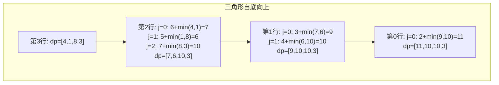
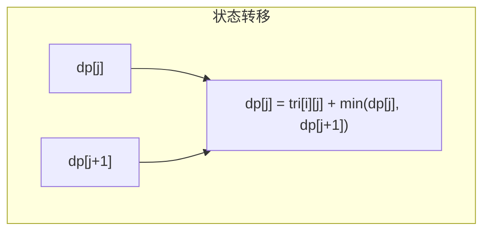
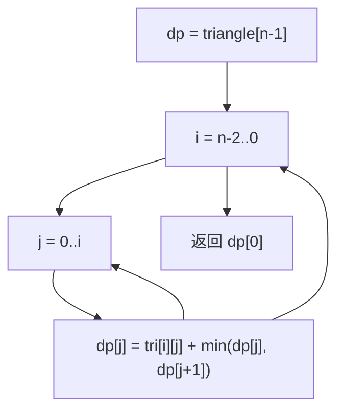

# LeetCode 120. Triangle（三角形最小路径和） — **中等**

## 考点
Array, Dynamic Programming

## 题目描述
给定一个三角形 `triangle` ，找出自顶向下的最小路径和。

每一步只能移动到下一行中相邻的结点上。相邻的结点在这里指的是 **下标** 与上一层结点下标相同或者等于上一层结点下标 `+ 1` 的两个结点。也就是说，如果正位于当前行的下标 `i` ，那么下一步可以移动到下一行的下标 `i` 或 `i + 1` 。

**示例 1：**

```
输入：triangle = [[2],[3,4],[6,5,7],[4,1,8,3]]
输出：11
解释：如下面简图所示：
   2
  3 4
 6 5 7
4 1 8 3
自顶向下的最小路径和为 11（即，2 + 3 + 5 + 1 = 11）。
```

**示例 2：**

```
输入：triangle = [[-10]]
输出：-10
```

**提示：**
- `1 <= triangle.length <= 200`
- `triangle[0].length == 1`
- `triangle[i].length == triangle[i - 1].length + 1`
- `-10^4 <= triangle[i][j] <= 10^4`

**进阶：** 你可以只使用 O(n) 的额外空间（n 为三角形的总行数）来解决这个问题吗？

## 图解







## 解题思路

### 核心思路
三角形最小路径和问题。自顶向下存在大量重叠子问题，典型的动态规划。核心洞察：**自底向上 DP** 比自顶向下更简洁，因为每个位置只需要看下方相邻的两个值，避免了处理边界条件的复杂性。

### 方法一：自底向上 DP（一维优化）

从三角形底部开始，逐层向上计算到达当前层每个位置的最小路径和。

#### 状态定义
`dp[j]` = 从当前位置 `(i, j)` 出发到达底部的最小路径和

#### 状态转移
`dp[j] = triangle[i][j] + min(dp[j], dp[j+1])`

即当前位置的最小路径和 = 当前值 + 下方两个相邻位置中较小的路径和。

#### 算法步骤
1. 初始化 `dp` 为三角形的最后一行
2. 从倒数第二行（`i = n-2`）向上遍历到第 0 行
3. 对于每行的每个位置 `j`：`dp[j] = triangle[i][j] + min(dp[j], dp[j+1])`
4. 最终 `dp[0]` 即为答案

#### 图解示例

```
triangle = [
     [2],
    [3,4],
   [6,5,7],
  [4,1,8,3]
]

自底向上计算过程：

初始化 dp = [4, 1, 8, 3]  ← 最后一行

i=2（第2行 [6,5,7]）：
  j=0: dp[0] = 6 + min(4, 1) = 6 + 1 = 7
  j=1: dp[1] = 5 + min(1, 8) = 5 + 1 = 6
  j=2: dp[2] = 7 + min(8, 3) = 7 + 3 = 10
  dp = [7, 6, 10, 3]

图示（从底向上，每个节点值=当前值+min(左下,右下)）：
         2            → 最终: 2+min(9,10)=11 ← 答案
       /   \
      3     4         → 3+min(7,6)=9, 4+min(6,10)=10
     / \   / \
    6   5 7   7       → dp[0]=7, dp[1]=6, dp[2]=10(保留row3的3)
   / \ / \/ \/ \
  4   1 8  3          → 初始dp=[4,1,8,3]

i=1（第1行 [3,4]）：
  j=0: dp[0] = 3 + min(7, 6) = 3 + 6 = 9
  j=1: dp[1] = 4 + min(6, 10) = 4 + 6 = 10
  dp = [9, 10, 10, 3]

i=0（第0行 [2]）：
  j=0: dp[0] = 2 + min(9, 10) = 2 + 9 = 11
  dp = [11, 10, 10, 3]

返回 dp[0] = 11
```

**路径追踪**：2 → 3 → 5 → 1 = 11

#### 逐步追踪

| 步骤 | 当前行 i | 遍历的值 | min 选择 | dp 更新 |
|------|---------|---------|---------|--------|
| 初始 | 3 | - | - | [4, 1, 8, 3] |
| i=2 | [6,5,7] | j=0:6+min(4,1)=7 | 选右下1 | [7, 1, 8, 3] |
| | | j=1:5+min(1,8)=6 | 选左下1 | [7, 6, 8, 3] |
| | | j=2:7+min(8,3)=10 | 选右下3 | [7, 6, 10, 3] |
| i=1 | [3,4] | j=0:3+min(7,6)=9 | 选右下6 | [9, 6, 10, 3] |
| | | j=1:4+min(6,10)=10 | 选左下6 | [9, 10, 10, 3] |
| i=0 | [2] | j=0:2+min(9,10)=11 | 选左下9 | [11, 10, 10, 3] |

### 方法二：自顶向下 DP

定义 `dp[i][j]` = 从顶部到达 `(i, j)` 的最小路径和。

```
dp[i][j] = triangle[i][j] + min(dp[i-1][j-1], dp[i-1][j])
```

需要处理左右边界（`j = 0` 时只能从 `dp[i-1][0]` 来，`j = i` 时只能从 `dp[i-1][i-1]` 来），最后遍历最后一行取最小值。空间 O(n²)，可优化。

### 方法三：原地修改

直接在 `triangle` 数组上修改，从倒数第二行向上更新每个位置的值为最小路径和。空间复杂度 O(1)。

### 边界情况
- 单行三角形：直接返回唯一的元素
- 负数元素：算法同样适用，`min()` 能正确处理负数
- 极端值：元素范围 `[-10^4, 10^4]`，最多 200 行，最坏路径和约为 `200 × 10^4 = 2×10^6`，在 int 范围内

### 复杂度分析

| 方法 | 时间复杂度 | 空间复杂度 |
|------|-----------|-----------|
| 自底向上 DP（一维） | O(n²) | O(n) |
| 自顶向下 DP | O(n²) | O(n²) / O(n) |
| 原地修改 | O(n²) | O(1) |

n 为三角形行数，总元素数约为 n²/2。
