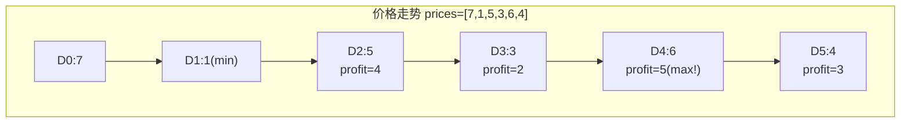
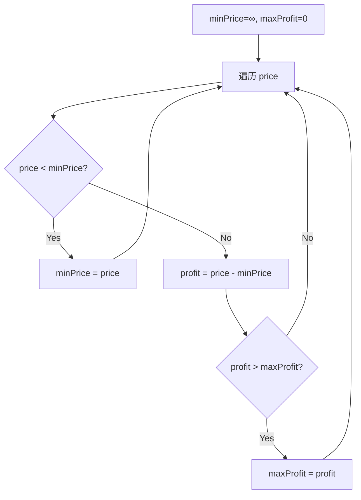

# LeetCode 121. Best Time to Buy and Sell Stock（买卖股票的最佳时机） — **简单**

## 考点
Array, Dynamic Programming

## 题目描述
给定一个数组 `prices` ，它的第 `i` 个元素 `prices[i]` 表示一支给定股票第 `i` 天的价格。

你只能选择 **某一天** 买入这只股票，并选择在 **未来的某一个不同的日子** 卖出该股票。设计一个算法来计算你所能获取的最大利润。

返回你可以从这笔交易中获取的最大利润。如果你不能获取任何利润，返回 `0` 。

**示例 1：**

```
输入：[7,1,5,3,6,4]
输出：5
解释：在第 2 天（股票价格 = 1）的时候买入，在第 5 天（股票价格 = 6）的时候卖出，最大利润 = 6-1 = 5 。
     注意利润不能是 7-1 = 6, 因为卖出价格需要大于买入价格；同时，你不能在买入前卖出股票。
```

**示例 2：**

```
输入：prices = [7,6,4,3,1]
输出：0
解释：在这种情况下, 没有交易完成, 所以最大利润为 0。
```

**提示：**
- `1 <= prices.length <= 10^5`
- `0 <= prices[i] <= 10^4`

## 图解





## 解题思路

### 核心思路
只能买卖一次，要求在最低点买入、最高点卖出（且卖出必须在买入之后）。本质是求数组中 `prices[j] - prices[i]` 的最大值，其中 `j > i`。

关键优化：一次遍历即可。维护 **历史最低价格**，每天计算「当天卖出」能获得的最大利润。

### 方法一：一次遍历（贪心）

#### 算法步骤
1. 初始化 `minPrice = Infinity`（历史最低买入价），`maxProfit = 0`
2. 遍历每一天的价格 `price`：
   - 如果 `price < minPrice`，更新 `minPrice = price`（发现更低买入点）
   - 否则计算 `profit = price - minPrice`，如果 `profit > maxProfit`，更新 `maxProfit`
3. 返回 `maxProfit`

#### 图解示例

```
prices = [7, 1, 5, 3, 6, 4]

遍历过程：
Day 0: price=7
       minPrice = min(∞, 7) = 7     ← 目前最低买入价
       profit = 7-7 = 0
       maxProfit = max(0, 0) = 0

Day 1: price=1
       minPrice = min(7, 1) = 1     ← 发现更低买入价！
       profit 不计算（当天只能买不能同时卖）

Day 2: price=5
       minPrice = min(1, 5) = 1
       profit = 5 - 1 = 4           ← 如果这天卖，赚4
       maxProfit = max(0, 4) = 4

Day 3: price=3
       minPrice = min(1, 3) = 1
       profit = 3 - 1 = 2           ← 赚2，不如之前
       maxProfit = max(4, 2) = 4

Day 4: price=6
       minPrice = min(1, 6) = 1
       profit = 6 - 1 = 5           ← 赚5，最优！
       maxProfit = max(4, 5) = 5

Day 5: price=4
       minPrice = min(1, 4) = 1
       profit = 4 - 1 = 3
       maxProfit = max(5, 3) = 5

结果：maxProfit = 5（买入价1，卖出价6）

ASCII 图示：
价格
7 | *                           
6 |             *               
5 |       *           ← 卖出点  
4 |           *           *     
3 |                           
2 |                           
1 |    *  ← 买入点              
0 +---+---+---+---+---+---→ 天
    0   1   2   3   4   5
```

#### 逐步追踪

| 天 | 价格 | minPrice | 当天利润 | maxProfit | 说明 |
|----|------|---------|---------|----------|------|
| 0 | 7 | 7 | 0 | 0 | 初始化买入价 |
| 1 | 1 | 1 | - | 0 | 发现更低买点 |
| 2 | 5 | 1 | 4 | 4 | 有利润 |
| 3 | 3 | 1 | 2 | 4 | 利润下降 |
| 4 | 6 | 1 | 5 | 5 | 最优利润 |
| 5 | 4 | 1 | 3 | 5 | 不如之前 |

### 方法二：动态规划（状态机）

定义两个状态：
- `dp[i][0]`：第 i 天结束时，不持有股票的最大收益
- `dp[i][1]`：第 i 天结束时，持有股票的最大收益（即已买入）

状态转移（只允许交易一次）：
```
dp[i][0] = max(dp[i-1][0], dp[i-1][1] + prices[i])   // 继续不持有 或 卖出
dp[i][1] = max(dp[i-1][1], -prices[i])                // 继续持有 或 首次买入
```

由于只交易一次，买入时现金损失就是 `-prices[i]`（而不是 `dp[i-1][0] - prices[i]`）。

可以压缩为两个变量，最终和方法一等价。

### 方法三：转换为最大子数组和（Kadane）

计算每日的差价数组 `diff[i] = prices[i] - prices[i-1]`，然后求差价数组的最大子数组和。

```
prices = [7, 1, 5, 3, 6, 4]
diff   = [  -6, 4,-2, 3,-2]

最大子数组和 = 4 + (-2) + 3 = 5 ← 对应买入价1，卖出价6
```

这本质和方法一相同，但提供了不同视角。

### 边界情况
- 价格单调递减：`maxProfit = 0`（不交易）
- 单天：`maxProfit = 0`
- 全部相同价格：`maxProfit = 0`

### 复杂度分析

| 方法 | 时间复杂度 | 空间复杂度 |
|------|-----------|-----------|
| 一次遍历（贪心） | O(n) | O(1) |
| DP 状态机 | O(n) | O(1) |
| Kadane 差价法 | O(n) | O(1) |

所有方法都达到最优 O(n) 时间、O(1) 空间。
