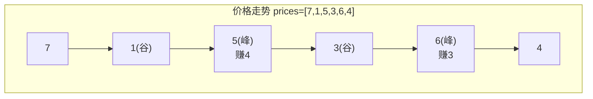
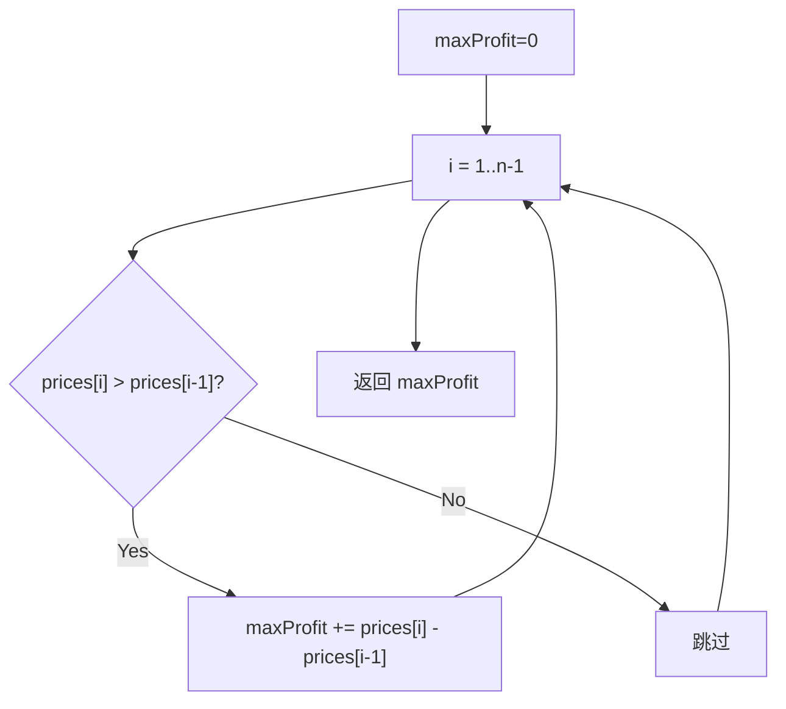

# LeetCode 122. Best Time to Buy and Sell Stock II（买卖股票的最佳时机II） — **中等**

## 考点
Greedy, Array, Dynamic Programming

## 题目描述
给你一个整数数组 `prices` ，其中 `prices[i]` 表示某支股票第 `i` 天的价格。

在每一天，你可以决定是否购买和/或出售股票。你在任何时候 **最多** 只能持有 **一股** 股票。你也可以先购买，然后在 **同一天** 出售。

返回 *你能获得的 **最大** 利润* 。

**示例 1：**

```
输入：prices = [7,1,5,3,6,4]
输出：7
解释：在第 2 天（股票价格 = 1）的时候买入，在第 3 天（股票价格 = 5）的时候卖出, 利润 = 4 。
     随后在第 4 天（股票价格 = 3）的时候买入，在第 5 天（股票价格 = 6）的时候卖出, 利润 = 3 。
     总利润 = 4 + 3 = 7 。
```

**示例 2：**

```
输入：prices = [1,2,3,4,5]
输出：4
解释：在第 1 天（股票价格 = 1）时买入，在第 5 天（股票价格 = 5）时卖出, 利润 = 4 。
总利润 = 4 。
```

**示例 3：**

```
输入：prices = [7,6,4,3,1]
输出：0
解释：在这种情况下, 交易无法获得正利润，所以不参与交易可以获得最大利润，最大利润为 0 。
```

**提示：**
- `1 <= prices.length <= 3 * 10^4`
- `0 <= prices[i] <= 10^4`

## 图解





## 解题思路

### 核心思路
与 LeetCode 121（只能交易一次）不同，本题可以无限次交易（但每天最多持有一股）。核心洞察：**所有上涨区间的利润都可以吃到**。等价于：只要今天比昨天贵，就可以在昨天买、今天卖，把所有正差价累加起来就是最大利润。

为什么不需要考虑「持股等待」？因为在连续上涨的区间，分段交易和持有一段的总利润相等。

### 方法一：贪心算法

#### 算法步骤
1. 初始化 `maxProfit = 0`
2. 遍历 `i` 从 1 到 `n-1`
3. 如果 `prices[i] > prices[i-1]`，`maxProfit += prices[i] - prices[i-1]`
4. 返回 `maxProfit`

#### 图解示例

```
prices = [7, 1, 5, 3, 6, 4]

价格走势：
7 | *                        
6 |             *            
5 |       *                  
4 |           *           *  
3 |                          
2 |                          
1 |    *                     
0 +---+---+---+---+---+---→
    0   1   2   3   4   5

上涨区间分析：
  区间[1→2]: 1 → 5, 差价为 +4  → 累加 4
  区间[3→4]: 3 → 6, 差价为 +3  → 累加 3
  总利润 = 4 + 3 = 7

等价于：
  第1天买(1)，第2天卖(5)，赚4
  第3天买(3)，第4天卖(6)，赚3
  总赚 7
```

**为什么连续上涨分段交易 = 持有一段？**

```
prices = [1, 2, 3, 4, 5]

方案A（持有一段）：第0天买(1)，第4天卖(5)，赚 4
方案B（分段交易）：
  第0天买(1)，第1天卖(2)，赚 1
  第1天买(2)，第2天卖(3)，赚 1
  第2天买(3)，第3天卖(4)，赚 1
  第3天买(4)，第4天卖(5)，赚 1
  总赚 4

结果相同！
```

#### 逐步追踪

| 天 i | prices[i] | prices[i-1] | 差价 | 累加？ | 累计利润 |
|------|-----------|-------------|------|--------|---------|
| 1 | 1 | 7 | -6 | 否 | 0 |
| 2 | 5 | 1 | +4 | 是 | 4 |
| 3 | 3 | 5 | -2 | 否 | 4 |
| 4 | 6 | 3 | +3 | 是 | 7 |
| 5 | 4 | 6 | -2 | 否 | 7 |

### 方法二：动态规划（状态机）

定义两个状态：
- `dp[i][0]`：第 i 天结束时，不持有股票的最大利润
- `dp[i][1]`：第 i 天结束时，持有股票的最大利润

状态转移（允许多次交易）：
```
dp[i][0] = max(dp[i-1][0], dp[i-1][1] + prices[i])  // 继续空仓 或 卖出
dp[i][1] = max(dp[i-1][1], dp[i-1][0] - prices[i])  // 继续持有 或 买入
```

与 LeetCode 121 的关键区别：买入时用 `dp[i-1][0] - prices[i]`（之前利润减去买入成本），因为可以多次交易，之前交易可能有累积利润。

状态压缩为两个变量：
```
cash = max(cash, hold + price)    // 不持股
hold = max(hold, cash - price)    // 持股
```

#### DP 逐步追踪

| 天 | price | hold（之前） | cash（之前） | hold（新） | cash（新） |
|----|-------|-------------|-------------|-----------|-----------|
| 初始 | - | -∞ | 0 | -∞ | 0 |
| 0 | 7 | -∞ | 0 | max(-∞, 0-7) = -7 | max(0, -∞+7) = 0 |
| 1 | 1 | -7 | 0 | max(-7, 0-1) = -1 | max(0, -7+1) = 0 |
| 2 | 5 | -1 | 0 | max(-1, 0-5) = -1 | max(0, -1+5) = 4 |
| 3 | 3 | -1 | 4 | max(-1, 4-3) = 1 | max(4, -1+3) = 4 |
| 4 | 6 | 1 | 4 | max(1, 4-6) = 1 | max(4, 1+6) = 7 |
| 5 | 4 | 1 | 7 | max(1, 7-4) = 3 | max(7, 1+4) = 7 |

结果：`cash = 7` ✓

### 方法三：峰谷法

找到所有「谷→峰」的区间，累加差值。本质与贪心法相同。

```
prices = [7, 1, 5, 3, 6, 4]
         谷     谷
           \   / \   /
           峰=5  峰=6

峰谷对：(1→5) 利润 4, (3→6) 利润 3, 总利润 7
```

### 边界情况
- 单调递减：不交易，利润 0
- 单天：利润 0
- 单日买入卖出：同一天买卖允许，利润 0（差价 0）

### 复杂度分析

| 方法 | 时间复杂度 | 空间复杂度 |
|------|-----------|-----------|
| 贪心 | O(n) | O(1) |
| DP 状态机 | O(n) | O(1) |
| 峰谷法 | O(n) | O(1) |

贪心法最简洁，DP 法最通用（可推广到限制交易次数的问题）。
