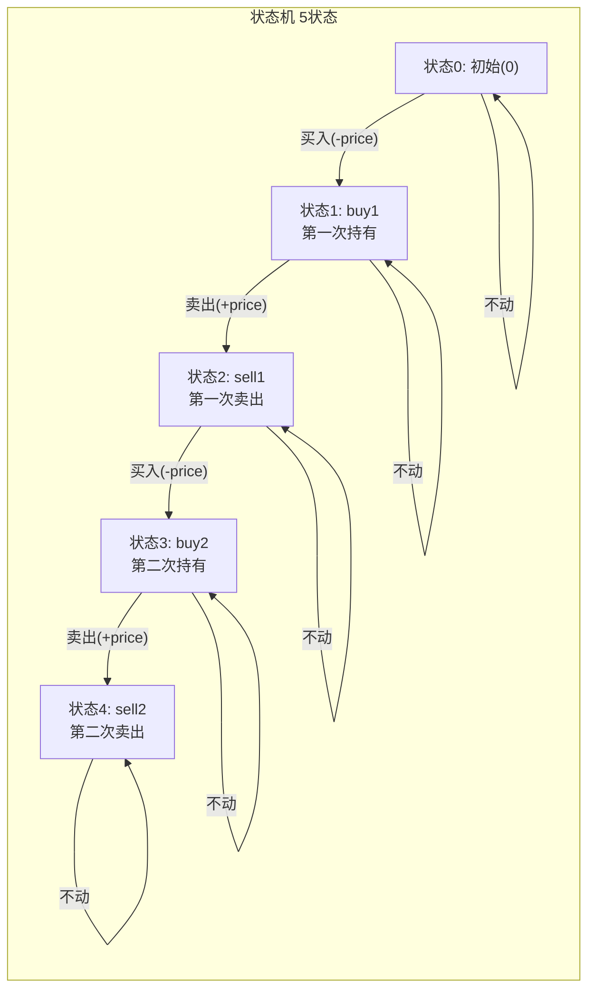
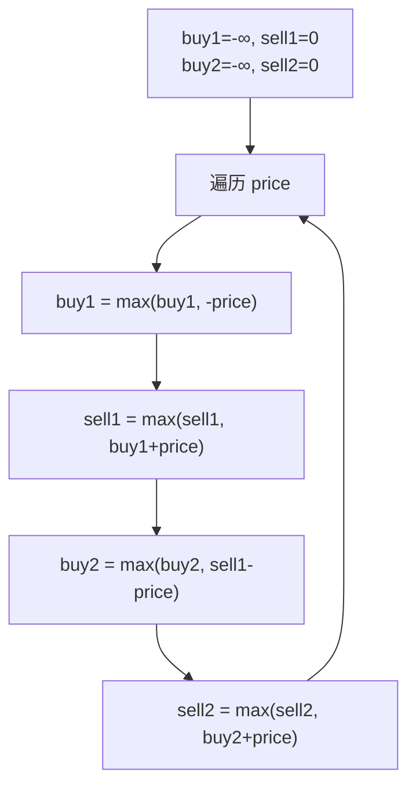

# LeetCode 123. Best Time to Buy and Sell Stock III（买卖股票的最佳时机III） — **困难**

## 考点
Array, Dynamic Programming

## 题目描述
给定一个数组，它的第 `i` 个元素是一支给定的股票在第 `i` 天的价格。

设计一个算法来计算你所能获取的最大利润。你最多可以完成 **两笔** 交易。

**注意：** 你不能同时参与多笔交易（你必须在再次购买前出售掉之前的股票）。

**示例 1：**

```
输入：prices = [3,3,5,0,0,3,1,4]
输出：6
解释：在第 4 天（股票价格 = 0）的时候买入，在第 6 天（股票价格 = 3）的时候卖出，利润 = 3-0 = 3 。
     随后在第 7 天（股票价格 = 1）的时候买入，在第 8 天（股票价格 = 4）的时候卖出，利润 = 4-1 = 3 。
     总利润 = 3 + 3 = 6 。
```

**示例 2：**

```
输入：prices = [1,2,3,4,5]
输出：4
解释：在第 1 天（股票价格 = 1）时买入，在第 5 天（股票价格 = 5）时卖出, 利润 = 4 。
     总利润 = 4 。
```

**示例 3：**

```
输入：prices = [7,6,4,3,1]
输出：0
解释：没有交易, 最大利润为 0。
```

**提示：**
- `1 <= prices.length <= 10^5`
- `0 <= prices[i] <= 10^5`

## 图解





## 解题思路

### 核心思路
最多两笔交易，求最大利润。相比无限次交易（LC122），限制交易次数使得问题更复杂——需要决定在何时进行两笔最优交易。

核心洞察：**两笔交易不能重叠**（必须在再次购买前卖掉）。可以将问题分解为：在某个分割点 `k`，左边做一笔最优交易，右边做一笔最优交易。或者使用状态机 DP，定义 5 个状态。

### 方法一：状态机 DP（最优解法）

定义 5 个状态（按操作顺序）：
- 状态 0：未进行任何操作（初始）
- 状态 1：第一次买入后（`buy1`）
- 状态 2：第一次卖出后（`sell1`）
- 状态 3：第二次买入后（`buy2`）
- 状态 4：第二次卖出后（`sell2`）

#### 状态转移
```
buy1  = max(buy1,  -prices[i])           // 第一次买入：不动 或 从0买入
sell1 = max(sell1, buy1 + prices[i])     // 第一次卖出：不动 或 卖出
buy2  = max(buy2,  sell1 - prices[i])    // 第二次买入：不动 或 从第一次卖出后买入
sell2 = max(sell2, buy2 + prices[i])     // 第二次卖出：不动 或 卖出
```

注意：`buy1` 用的是 `-price` 而非 `0 - price`，因为第一笔交易前没有累积利润。

#### 图解示例

```
prices = [3, 3, 5, 0, 0, 3, 1, 4]

逐日状态追踪：

Day 0 (price=3):
  buy1  = max(-∞, -3)  = -3
  sell1 = max(0, -3+3)  = 0
  buy2  = max(-∞, 0-3)  = -3
  sell2 = max(0, -3+3)  = 0

Day 1 (price=3):
  buy1  = max(-3, -3)     = -3
  sell1 = max(0, -3+3)    = 0
  buy2  = max(-3, 0-3)    = -3
  sell2 = max(0, -3+3)    = 0

Day 2 (price=5):
  buy1  = max(-3, -5)     = -3
  sell1 = max(0, -3+5)    = 2          ← 第一次卖出赚2
  buy2  = max(-3, 0-5)    = -3
  sell2 = max(0, -3+5)    = 2

Day 3 (price=0):
  buy1  = max(-3, 0)      = 0          ← 第一次以0买入更优!
  sell1 = max(2, 0+0)     = 2
  buy2  = max(-3, 2-0)    = 2          ← 第二次买入，资金2
  sell2 = max(2, -3+0)    = 2

Day 4 (price=0):
  buy1  = max(0, 0)       = 0
  sell1 = max(2, 0+0)     = 2
  buy2  = max(2, 2-0)     = 2
  sell2 = max(2, 2+0)     = 2

Day 5 (price=3):
  buy1  = max(0, -3)      = 0
  sell1 = max(2, 0+3)     = 3
  buy2  = max(2, 2-3)     = 2
  sell2 = max(2, 2+3)     = 5

Day 6 (price=1):
  buy1  = max(0, -1)      = 0
  sell1 = max(3, 0+1)     = 3
  buy2  = max(2, 3-1)     = 2
  sell2 = max(5, 2+1)     = 5

Day 7 (price=4):
  buy1  = max(0, -4)      = 0
  sell1 = max(3, 0+4)     = 4
  buy2  = max(2, 3-4)     = 2
  sell2 = max(5, 2+4)     = 6          ← 最终答案

最终 sell2 = 6
交易方案：第3天买(0)→第5天卖(3), 第6天买(1)→第7天卖(4)
利润：(3-0) + (4-1) = 6 ✓
```

#### ASCII 状态图
```
      买1          卖1          买2          卖2
[初始] → [持有1] → [空仓1] → [持有2] → [空仓2]
  0       buy1      sell1      buy2      sell2

操作： -price   +price    -price    +price
```

#### 逐步追踪汇总

| Day | price | buy1 | sell1 | buy2 | sell2 |
|-----|-------|------|-------|------|-------|
| 初始 | - | -∞ | 0 | -∞ | 0 |
| 0 | 3 | -3 | 0 | -3 | 0 |
| 1 | 3 | -3 | 0 | -3 | 0 |
| 2 | 5 | -3 | 2 | -3 | 2 |
| 3 | 0 | 0 | 2 | 2 | 2 |
| 4 | 0 | 0 | 2 | 2 | 2 |
| 5 | 3 | 0 | 3 | 2 | 5 |
| 6 | 1 | 0 | 3 | 2 | 5 |
| 7 | 4 | 0 | 4 | 2 | **6** |

### 方法二：双向扫描（分割点法）

1. 从左到右扫描，`left[i]` = 第 0 到 i 天最多一笔交易的最大利润
2. 从右到左扫描，`right[i]` = 第 i 到 n-1 天最多一笔交易的最大利润
3. 遍历所有分割点 `k`，`maxProfit = max(left[k] + right[k+1])`

```
prices = [3,3,5,0,0,3,1,4]

left  (前i天最优):  [0, 0, 2, 2, 2, 3, 3, 4]
right (后i天最优):  [4, 4, 4, 4, 4, 3, 3, 0]

最优分割点 k=3: left[3] + right[4] = 2 + 4 = 6
```

时间 O(n)，空间 O(n)。方法一更优（O(1) 空间）。

### 边界情况
- 价格单调递减：返回 0（不交易）
- 不足两天：返回 0
- 只做一笔交易也合法：状态机会自动处理（buy2/sell2 可能等于 buy1/sell1）

### 复杂度分析

| 方法 | 时间复杂度 | 空间复杂度 |
|------|-----------|-----------|
| 状态机 DP | O(n) | O(1) |
| 双向扫描 | O(n) | O(n) |

推荐状态机 DP，可轻松推广到 k 笔交易（LeetCode 188）。
