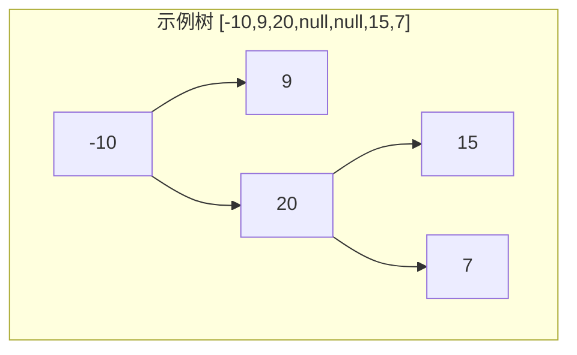
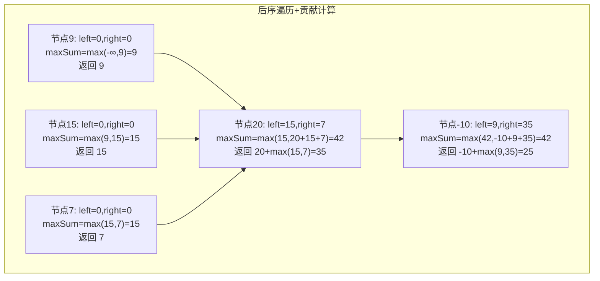
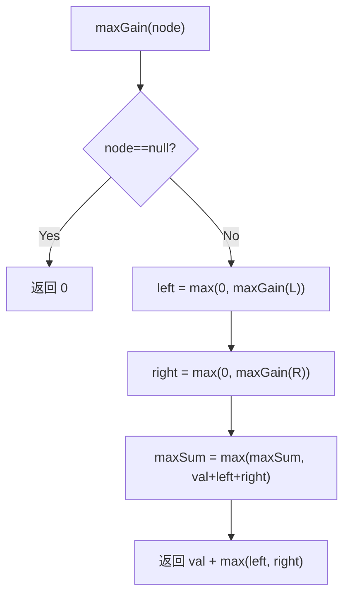

# LeetCode 124. Binary Tree Maximum Path Sum（二叉树中的最大路径和） — **困难**

## 考点
Tree, DFS, DP, Binary Tree

## 题目描述
二叉树中的 **路径** 被定义为一条节点序列，序列中每对相邻节点之间都存在一条边。同一个节点在一条路径序列中 **至多出现一次** 。该路径 **至少包含一个** 节点，且不一定经过根节点。

**路径和** 是路径中各节点值的总和。

给你一个二叉树的根节点 `root` ，返回其 **最大路径和** 。

**示例 1：**

```
输入：root = [1,2,3]
输出：6
解释：最优路径是 2 -> 1 -> 3 ，路径和为 2 + 1 + 3 = 6
```

**示例 2：**

```
输入：root = [-10,9,20,null,null,15,7]
输出：42
解释：最优路径是 15 -> 20 -> 7 ，路径和为 15 + 20 + 7 = 42
```

**提示：**
- 树中节点数目范围是 `[1, 3 * 10^4]`
- `-1000 <= Node.val <= 1000`

## 图解







## 解题思路

### 核心思路
求二叉树中的**最大路径和**，路径不一定经过根节点。关键挑战：路径在每个节点处只能选择一条分支（左或右），不能分叉；但可以在某个"拐点"节点处同时包含左右子树来形成一个完整路径。

核心技巧：**递归函数返回"最大单边贡献"**（只能选左或右），同时在每个节点处计算"经过该节点的最大路径和"（可以选左+右+当前节点）来更新全局最大值。

### 方法一：DFS 后序遍历

#### 算法步骤
1. 维护全局变量 `maxSum` 初始化为 `-Infinity`（因为节点值可能为负）
2. 递归函数 `maxGain(node)`：
   - 若 `node` 为空，返回 0
   - 递归计算 `leftGain = max(0, maxGain(node.left))`（负数贡献直接舍弃）
   - 递归计算 `rightGain = max(0, maxGain(node.right))`
   - **更新全局**：`maxSum = max(maxSum, node.val + leftGain + rightGain)`（以当前节点为"拐点"的完整路径）
   - **返回单边**：`node.val + max(leftGain, rightGain)`（只能选一边向上传递）

#### 图解示例

```
示例1: root = [1,2,3]
    1
   / \
  2   3

递归过程：
节点 2: leftGain=0, rightGain=0
  maxSum = max(-∞, 2+0+0) = 2
  返回: 2 + max(0,0) = 2

节点 3: leftGain=0, rightGain=0
  maxSum = max(2, 3+0+0) = 3
  返回: 3 + max(0,0) = 3

节点 1: leftGain=2, rightGain=3
  maxSum = max(3, 1+2+3) = 6      ← 找到最优路径 2→1→3
  返回: 1 + max(2,3) = 4

最终 maxSum = 6


示例2: root = [-10,9,20,null,null,15,7]

       -10
       /  \
      9   20
         /  \
        15   7

递归过程：
节点 9: leftGain=0, rightGain=0
  maxSum = max(-∞, 9) = 9
  返回 9

节点 15: leftGain=0, rightGain=0
  maxSum = max(9, 15) = 15
  返回 15

节点 7: leftGain=0, rightGain=0
  maxSum = max(15, 7) = 15
  返回 7

节点 20: leftGain=15, rightGain=7
  maxSum = max(15, 20+15+7) = 42  ← 找到最优路径 15→20→7
  返回: 20 + max(15,7) = 35

节点 -10: leftGain=9, rightGain=35
  maxSum = max(42, -10+9+35) = 42 ← 路径15→20→7 总和不经过根节点更优
  返回: -10 + max(9,35) = 25

最终 maxSum = 42
```

**路径分析**：
```
最优路径: 15 → 20 → 7 = 42
不经过根节点 -10！
这就体现了在每个节点都做"拐点判断"的价值。
```

#### ASCII 结构图

```
以 -10 为拐点：             以 20 为拐点：
9 → -10 → 20 → 15 = 34      15 → 20 → 7 = 42 ← 最大！
9 → -10 → 20 → 7 = 26

在每个节点处考虑三种路径：
  (1) 只走左边:  leftGain + node.val
  (2) 只走右边:  rightGain + node.val
  (3) 左右都走:  leftGain + node.val + rightGain  ← 拐点，不能向上传
  (4) 只走自己:  node.val （当左右都是负数时）

返回给父节点时只能是 (1) 或 (2) 或 (4) 中的最大值（单边路径）
```

#### 逐步追踪

| 节点 | 左贡献 | 右贡献 | 拐点路径和 | 更新后 maxSum | 向上返回 |
|------|--------|--------|-----------|--------------|---------|
| 9 | 0 | 0 | 9 | 9 | 9 |
| 15 | 0 | 0 | 15 | 15 | 15 |
| 7 | 0 | 0 | 7 | 15 | 7 |
| 20 | 15 | 7 | 42 | 42 | 35 |
| -10 | 9 | 35 | 34 | 42 | 25 |

### 方法二：迭代 + 栈 + HashMap

用后序遍历的迭代版本，HashMap 存储每个节点的左右贡献值，避免递归栈溢出（当树退化为链表时）。

### 边界情况
- 单节点（可能为负）：返回该节点值
- 全部负数：选最大的那个负数作为路径
- 树退化为链表：路径就是最大子数组和
- 节点值为负：`max(0, gain)` 自动舍弃负贡献，但节点自身可能被选为拐点

### 复杂度分析

| 方法 | 时间复杂度 | 空间复杂度 |
|------|-----------|-----------|
| 递归 DFS | O(n) | O(h) |
| 迭代 DFS | O(n) | O(n) |

n 为节点数，h 为树高。最坏情况下 h = n（退化为链表）。
