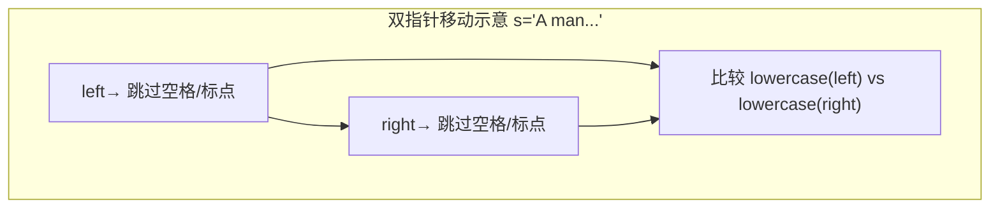
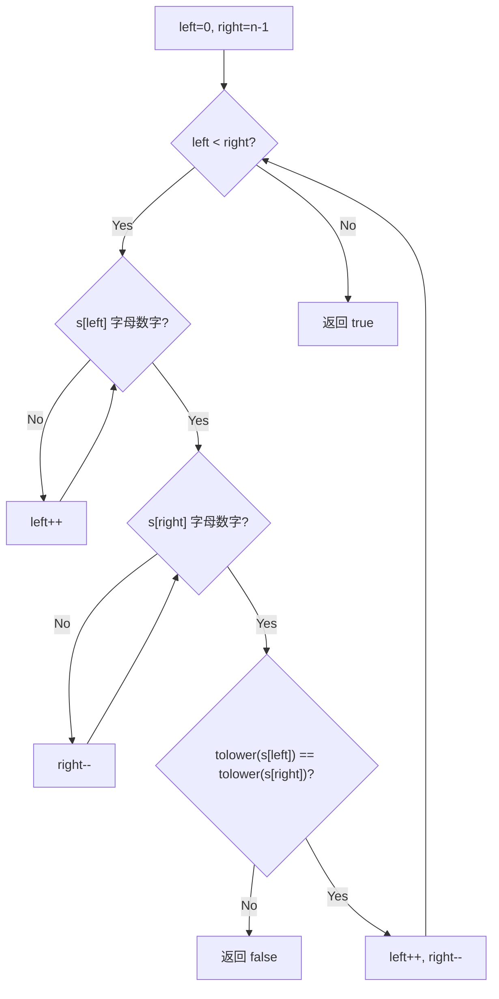

# LeetCode 125. Valid Palindrome（验证回文串） — **简单**

## 考点
Two Pointers, String

## 题目描述
如果在将所有大写字符转换为小写字符、并移除所有非字母数字字符之后，短语正着读和反着读都一样。则可以认为该短语是一个 **回文串** 。

字母和数字都属于字母数字字符。

给你一个字符串 `s`，如果它是 **回文串** ，返回 `true` ；否则，返回 `false` 。

**示例 1：**

```
输入: s = "A man, a plan, a canal: Panama"
输出：true
解释："amanaplanacanalpanama" 是回文串。
```

**示例 2：**

```
输入：s = "race a car"
输出：false
解释："raceacar" 不是回文串。
```

**示例 3：**

```
输入：s = " "
输出：true
解释：在移除非字母数字字符之后，s 是一个空字符串 "" 。
由于空字符串正着反着读都一样，所以是回文串。
```

**提示：**
- `1 <= s.length <= 2 * 10^5`
- `s` 仅由可打印的 ASCII 字符组成

## 图解





## 解题思路

### 核心思路
验证回文串（只考虑字母数字字符，忽略大小写）。经典双指针问题。核心技巧：**在线性扫描中跳过无效字符**，不需要预处理整个字符串（避免 O(n) 额外空间）。

### 方法一：双指针（原地扫描）

#### 算法步骤
1. 初始化 `left = 0`，`right = s.length - 1`
2. 循环 `while (left < right)`：
   - `left` 向右移动直到指向字母数字字符
   - `right` 向左移动直到指向字母数字字符
   - 如果 `left >= right`，跳出（全部匹配）
   - 比较 `s[left]` 和 `s[right]` 的小写形式，不相等则返回 `false`
   - `left++, right--`
3. 返回 `true`

#### 图解示例

```
s = "A man, a plan, a canal: Panama"

初始:  left=0('A')  right=30('a')
        ↓                           ↓
       "A   m a n ,   a     p l a n ,   a     c a n a l :   P a n a m a"

Step 1: left='A'(字母), right='a'(字母)
        比较: 'a' vs 'a' → 相等 ✓
        left=1, right=29

Step 2: left=' '(空格，跳过), left=2('m')
        right='m'(字母)
        比较: 'm' vs 'm' → 相等 ✓
        left=3, right=28

Step 3: left='a', right='a'
        比较: 'a' vs 'a' → 相等 ✓
        ...

双指针移动示意图：
" A   m a n ,   a     p l a n ,   a     c a n a l :   P a n a m a "
  ↑              ↑              ↑                    ↑
 left          (跳过)        (跳过)               right
  ↓              ↓              ↓                    ↓
  a    →    m    →    a    →   ...   ←    m    ←    a

所有有效字符顺序：
a m a n a p l a n a c a n a l p a n a m a

反转后：
a m a n a p l a n a c a n a l p a n a m a

完全相同 → true
```

#### 逐步追踪

| Step | left 字符 | right 字符 | 跳过？ | 比较 | 结果 |
|------|----------|-----------|--------|------|------|
| 0 | 'A'(0) | 'a'(30) | 否 | 'a'=='a' | ✓ |
| 1 | ' '(1)→'m'(2) | 'm'(29) | left 跳过空格 | 'm'=='m' | ✓ |
| 2 | 'a'(3) | 'a'(28) | 否 | 'a'=='a' | ✓ |
| 3 | 'n'(4) | 'n'(27) | 否 | 'n'=='n' | ✓ |
| 4 | ','(5)→'a'(6) | 'a'(26) | left 跳过逗号空格 | 'a'=='a' | ✓ |
| ... | ... | ... | ... | ... | ✓ |
| 最终 | left > right | - | - | - | true |

完整有效字符序列（通过双指针验证）：
```
位置:  0 2 3 4 6 7 8 9 11 ...
字符:  a m a n a p l a n a ...

反转对比始终一致
```

### 方法二：预处理 + 双指针

1. 遍历字符串，过滤出所有字母数字字符并转为小写，存入新字符串
2. 对新字符串使用双指针判断回文

缺点：需要 O(n) 额外空间。方法一更优。

### 方法三：直接反转比较

1. 过滤 + 小写得到 `filtered`
2. 比较 `filtered == reverse(filtered)`

同样需要 O(n) 额外空间，且反转本身也 O(n)。

### 字符判断技巧

```java
// 判断是否为字母数字
Character.isLetterOrDigit(ch)

// 手动判断
boolean isValid(char c) {
    return (c >= 'a' && c <= 'z') || 
           (c >= 'A' && c <= 'Z') || 
           (c >= '0' && c <= '9');
}

// 转小写（只对字母有效）
char toLower(char c) {
    if (c >= 'A' && c <= 'Z') return (char)(c + 32);
    return c;
}
```

### 边界情况
- 空字符串或全空格：返回 `true`
- 只有非字母数字字符（如 `".,"`）：返回 `true`（过滤后为空串）
- 单字符：返回 `true`
- 大小写混合：统一转小写比较
- 含数字：数字也是有效字符

### 复杂度分析

| 方法 | 时间复杂度 | 空间复杂度 |
|------|-----------|-----------|
| 双指针（原地） | O(n) | O(1) |
| 预处理 + 双指针 | O(n) | O(n) |
| 反转比较 | O(n) | O(n) |

推荐方法一，O(1) 空间，一次遍历。
