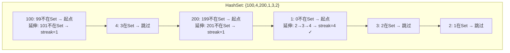
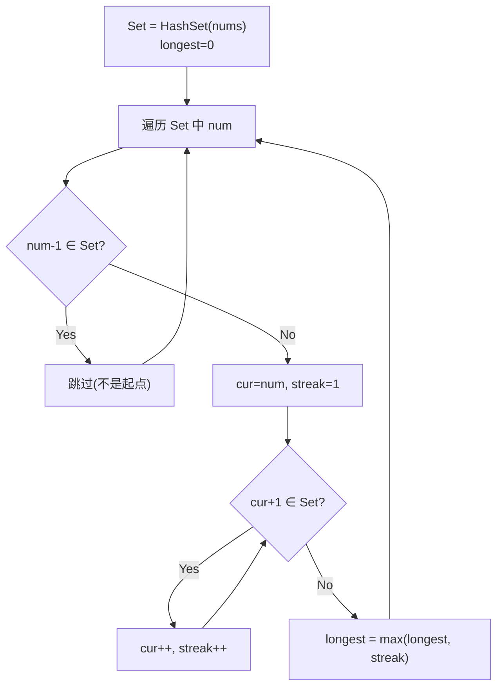

# LeetCode 128. Longest Consecutive Sequence（最长连续序列） — **中等**

## 考点
Union Find, Array, Hash Table

## 题目描述
给定一个未排序的整数数组 `nums` ，找出数字连续的最长序列（不要求序列元素在原数组中连续）的长度。

请你设计并实现时间复杂度为 `O(n)` 的算法解决此问题。

**示例 1：**

```
输入：nums = [100,4,200,1,3,2]
输出：4
解释：最长数字连续序列是 [1, 2, 3, 4]。它的长度为 4。
```

**示例 2：**

```
输入：nums = [0,3,7,2,5,8,4,6,0,1]
输出：9
```

**提示：**
- `0 <= nums.length <= 10^5`
- `-10^9 <= nums[i] <= 10^9`

## 图解





## 解题思路

### 核心思路
找出未排序数组中的最长连续序列，要求 O(n) 时间。排序方法（O(n log n)）不能满足要求。关键：用哈希集合存储所有数字，然后**只从序列起点开始向后扩展**，确保每个数字最多被访问两次（一次检查是否是起点，一次作为序列延伸被访问）。

### 方法一：哈希集合（最优）

#### 核心洞察
如果一个数字 `x` 的 `x-1` 存在于集合中，那么 `x` 不可能是序列的起点——它只是某个更长序列的中间元素。所以**只有找到那些 `x-1` 不在集合中的数字时，才往后找连续序列**。

#### 算法步骤
1. 将所有数字放入 `HashSet`
2. 初始化 `longest = 0`
3. 遍历 `Set` 中的每个数字 `num`：
   - 如果 `num - 1` **不在** `Set` 中（说明 `num` 是某个连续序列的起点）：
     - `cur = num`，`curStreak = 1`
     - 循环 `while (Set.contains(cur + 1))`：`cur++`，`curStreak++`
     - `longest = max(longest, curStreak)`
4. 返回 `longest`

#### 图解示例

```
nums = [100, 4, 200, 1, 3, 2]

HashSet: {100, 4, 200, 1, 3, 2}

遍历数字：

num = 100: 99 不在 Set 中？→ 是，100 是起点
  cur=100, streak=1
  101 不在 Set 中 → 停止
  longest = max(0, 1) = 1

num = 4: 3 在 Set 中？→ 是，4 不是起点，跳过！

num = 200: 199 不在 Set 中？→ 是，200 是起点
  cur=200, streak=1
  201 不在 Set 中 → 停止
  longest = max(1, 1) = 1

num = 1: 0 不在 Set 中？→ 是，1 是起点 ← 关键！
  cur=1, streak=1
  2 在 Set 中 → cur=2, streak=2
  3 在 Set 中 → cur=3, streak=3
  4 在 Set 中 → cur=4, streak=4
  5 不在 Set 中 → 停止
  longest = max(1, 4) = 4

num = 3: 2 在 Set 中？→ 是，3 不是起点，跳过！
num = 2: 1 在 Set 中？→ 是，2 不是起点，跳过！

最终: longest = 4  （序列 [1, 2, 3, 4]）


ASCII 序列图示：
数字轴:  1    2    3    4         100         200
         ●────●────●────●          ●            ●
         └── 4个连续 ──┘

不会重复计算的证明：
  遍历时只有 1 触发了延伸（因为它是最小值）
  2, 3, 4 都因为 num-1 存在而跳过
  每个元素最多被"检查是否是起点"一次 + "作为延伸元素被访问"一次
  总操作次数 ≤ 2n = O(n)
```

#### 逐步追踪

| 当前 num | num-1 在 Set？ | 是起点？ | 延伸过程 | streak | longest |
|----------|----------------|----------|---------|--------|---------|
| 100 | 99 不在 | 是 | 无延伸 | 1 | 1 |
| 4 | 3 在 | 否 | - | - | 1 |
| 200 | 199 不在 | 是 | 无延伸 | 1 | 1 |
| 1 | 0 不在 | 是 | 1→2→3→4 | 4 | 4 |
| 3 | 2 在 | 否 | - | - | 4 |
| 2 | 1 在 | 否 | - | - | 4 |

### 方法二：并查集（Union Find）

1. 将每个数字看作一个节点，如果 `num+1` 存在则合并 `num` 和 `num+1`
2. 维护每个连通分量的大小
3. 找出最大连通分量大小

时间也是 O(n * α(n)) ≈ O(n)，但实现更复杂，通常不如此方法简洁。

### 方法三：排序 + 线性扫描

1. 排序数组：O(n log n)
2. 遍历：如果 `nums[i] == nums[i-1] + 1`，延长当前 streak；如果相等则跳过；否则重置 streak

不满足 O(n) 要求，但如果是面试中可以提及的思路。

### 边界情况
- 空数组：返回 0
- 含重复元素：`Set` 自动去重，正确处理
- 单元素：返回 1
- 负数：`Set.contains()` 同样支持负数
- 数值范围极大（±10^9）：哈希集合不受数值范围影响

### 复杂度分析

| 方法 | 时间复杂度 | 空间复杂度 | 满足 O(n)？ |
|------|-----------|-----------|------------|
| 哈希集合 | O(n) | O(n) | ✓ |
| 并查集 | O(n·α(n)) | O(n) | ✓ |
| 排序 + 扫描 | O(n log n) | O(1) 或 O(n) | ✗ |

推荐哈希集合方法，简洁且严格 O(n)。
