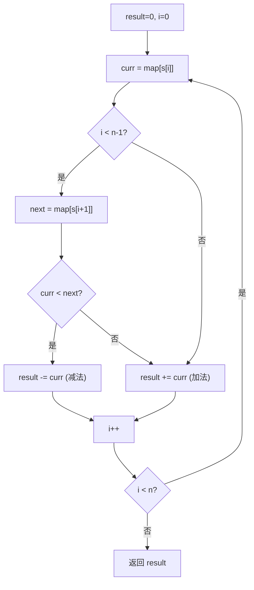

# LeetCode 13. Roman to Integer（罗马数字转整数） — **简单**

## 考点
Hash Table, Math, String

## 题目描述
罗马数字包含以下七种字符: `I`，`V`，`X`，`L`，`C`，`D` 和 `M`。

| 字符 | 数值 |
|------|------|
| I    | 1    |
| V    | 5    |
| X    | 10   |
| L    | 50   |
| C    | 100  |
| D    | 500  |
| M    | 1000 |

例如，罗马数字 2 写做 `II`，即为两个并列的 1。12 写做 `XII`，即为 `X + II`。27 写做 `XXVII`，即为 `XX + V + II`。

通常情况下，罗马数字中小的数字在大的数字的右边。但也存在特例，例如 4 不写做 `IIII`，而是 `IV`。数字 1 在数字 5 的左边，所表示的数等于大数 5 减小数 1 得到的数值 4。同样地，数字 9 表示为 `IX`。

给定一个罗马数字，将其转换成整数。

**示例 1：**
```
输入: s = "III"
输出: 3
```

**示例 2：**
```
输入: s = "IV"
输出: 4
```

**示例 3：**
```
输入: s = "IX"
输出: 9
```

**示例 4：**
```
输入: s = "LVIII"
输出: 58
解释: L = 50, V= 5, III = 3.
```

**示例 5：**
```
输入: s = "MCMXCIV"
输出: 1994
解释: M = 1000, CM = 900, XC = 90, IV = 4.
```

**提示：**
- `1 <= s.length <= 15`
- `s` 仅含字符 `('I', 'V', 'X', 'L', 'C', 'D', 'M')`
- 题目数据保证 `s` 是一个有效的罗马数字，且表示整数在范围 `[1, 3999]` 内

## 图解



## 解题思路

### 核心思路
罗马数字的规则是：如果一个较小的数字出现在较大数字的左边，表示减法；否则表示加法。因此从左到右遍历，比较当前字符与下一个字符的值即可判断是加还是减。

### 算法步骤

1. 创建字符到数值的映射表：
   - `I→1, V→5, X→10, L→50, C→100, D→500, M→1000`
2. 初始化结果 `result = 0`，字符串长度 `n = s.length`
3. 遍历字符串，对于每个位置 `i`（0 到 n-1）：
   - 获取当前字符的值 `curr = map[s[i]]`
   - 如果不是最后一个字符，获取下一个字符的值 `next = map[s[i+1]]`
   - **判断**：
     - 如果 `curr < next`：说明是减法情况（如 I 在 V 左边 → IV = 5-1 = 4），`result -= curr`
     - 否则：正常加法，`result += curr`
4. 返回 `result`

### 图解示例

以输入 `s = "MCMXCIV"` 为例：

```
字符位置:  M    C    M    X    C    I    V
  索引:    0    1    2    3    4    5    6
  数值:  1000  100 1000  10  100   1    5

Step 1: i=0, 'M'
  curr=1000, i不是最后一个
  next=s[1]='C'→100
  curr(1000) > next(100) → 加法
  result += 1000 → result = 1000

  "M  C  M  X  C  I  V"    →  M + ?
   ↑  ↑
   cur next

Step 2: i=1, 'C'
  curr=100, next=s[2]='M'→1000
  curr(100) < next(1000) → 减法！
  result -= 100 → result = 900  (即 1000 - 100 = 900, CM)

  "M  C  M  X  C  I  V"    →  (M - C) = CM = 900
      ↑  ↑
      cur next

Step 3: i=2, 'M'
  curr=1000, next=s[3]='X'→10
  curr(1000) > next(10) → 加法
  result += 1000 → result = 1900

Step 4: i=3, 'X'
  curr=10, next=s[4]='C'→100
  curr(10) < next(100) → 减法！
  result -= 10 → result = 1890  (即 1900 - 10, XC = 90)

Step 5: i=4, 'C'
  curr=100, next=s[5]='I'→1
  curr(100) > next(1) → 加法
  result += 100 → result = 1990

Step 6: i=5, 'I'
  curr=1, next=s[6]='V'→5
  curr(1) < next(5) → 减法！
  result -= 1 → result = 1989  (即 1990 - 1, IV = 4... 但这里是 1990-1=1989 还要加最后一个)

Step 7: i=6, 'V'（最后一个字符）
  curr=5, 没有 next
  result += 5 → result = 1994

最终结果：1994 ✓
```

### 逐步追踪

以输入 `s = "LVIII"` 为例：

| 步骤 | i | 字符 | curr | next(如果有) | 比较 | 操作 | result |
|------|---|------|------|-------------|------|------|--------|
| 1    | 0 | L    | 50   | V→5         | 50>5 | +50  | 50     |
| 2    | 1 | V    | 5    | I→1         | 5>1  | +5   | 55     |
| 3    | 2 | I    | 1    | I→1         | 1=1  | +1   | 56     |
| 4    | 3 | I    | 1    | I→1         | 1=1  | +1   | 57     |
| 5    | 4 | I    | 1    | 无          | —    | +1   | 58     |

最终结果：LVIII = 58 ✓

以输入 `s = "IV"` 为例：

| 步骤 | i | 字符 | curr | next | 比较 | 操作 | result |
|------|---|------|------|------|------|------|--------|
| 1    | 0 | I    | 1    | V→5  | 1<5  | -1   | -1     |
| 2    | 1 | V    | 5    | 无   | —    | +5   | 4      |

最终结果：IV = 4 ✓

### 边界情况

1. **单字符**（如 "I"）：直接返回 map 中对应的值
2. **全加法情况**（如 "III", "LVIII"）：每个 curr >= next，全做加法
3. **全减法情况**：不可能，因为罗马数字规律决定了不会连续出现两个减法
4. **混合情况**（如 "MCMXCIV"）：加减交替，算法自然处理
5. **重复符号**（如 "III"）：加法规则，严格从左到右

### 复杂度分析

时间复杂度：O(n) — 遍历字符串一次，n 为字符串长度
空间复杂度：O(1) — 映射表大小固定，只用常数变量

### 为什么不用栈或其他复杂结构？

罗马数字的规则非常简洁：
- 只有 6 种减法组合：IV, IX, XL, XC, CD, CM
- 其余全是加法

因此"比较相邻两个字符的值"就足以判断所有情况，不需要栈、不需要从右向左遍历。

### 方法对比

| 方法 | 时间复杂度 | 空间复杂度 | 说明 |
|------|-----------|-----------|------|
| 从左到右 + 比较相邻 | O(n) | O(1) | 最简洁直观 ✓ |
| 从右到左遍历 | O(n) | O(1) | 也正确，但逻辑稍复杂 |
| 字符串替换预处理 | O(n) | O(1) | 先把 IV→IIII 等替换，再累加；可行但不优雅 |
