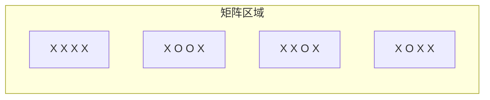
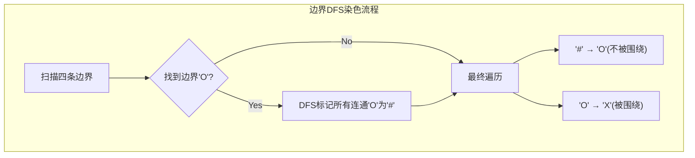
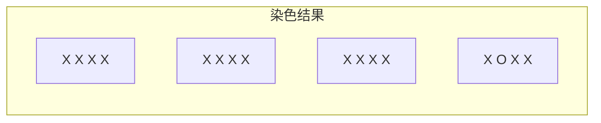

# LeetCode 130. Surrounded Regions（被围绕的区域） — **中等**

## 考点
DFS, BFS, Union Find, Array, Matrix

## 题目描述
给你一个 `m x n` 的矩阵 `board` ，由若干字符 `'X'` 和 `'O'` 组成，**捕获** 所有 **被围绕的区域**：

- **连接：** 一个单元格与水平或垂直方向上相邻的单元格连接。
- **区域：** 连接所有 `'O'` 的单元格来形成一个区域。
- **围绕：** 如果你可以用 `'X'` 单元格 **围绕**这个区域，区域中的单元格就被捕获了。

被围绕的区间不会存在于边界上，换句话说，任何边界上的 `'O'` 都不会被填充为 `'X'`。任何不在边界上，或不与边界上的 `'O'` 相连的 `'O'` 最终都会被填充为 `'X'`。

**示例 1：**

```
输入：board = [["X","X","X","X"],["X","O","O","X"],["X","X","O","X"],["X","O","X","X"]]
输出：[["X","X","X","X"],["X","X","X","X"],["X","X","X","X"],["X","O","X","X"]]
```

**示例 2：**

```
输入：board = [["X"]]
输出：[["X"]]
```

**提示：**
- `m == board.length`
- `n == board[i].length`
- `1 <= m, n <= 200`
- `board[i][j]` 为 `'X'` 或 `'O'`

## 图解







## 解题思路

### 核心思路
将被围绕的区域填充为 `'X'`。边界上的 `'O'` 及其相连的 `'O'` 不被围绕。核心：**反向思维**——与其找被围绕的 `'O'`，不如先标记所有不被围绕的 `'O'`（与边界相连的），剩下的 `'O'` 都是被围绕的。

这被称为"洪水填充"（Flood Fill）或"边界染色"策略。

### 方法一：DFS 边界染色

#### 算法步骤
1. 遍历矩阵的**四条边界**（第一行、最后一行、第一列、最后一列）
2. 遇到 `'O'` 就进行 DFS，将所有连通的 `'O'` 标记为临时字符 `'#'`
3. 再次遍历整个矩阵：
   - 遇到 `'#'` → 恢复为 `'O'`（原本就在边界上或与边界相连）
   - 遇到 `'O'` → 改为 `'X'`（被围绕的）
4. 完成

#### 图解示例

```
board = [
  ["X","X","X","X"],
  ["X","O","O","X"],
  ["X","X","O","X"],
  ["X","O","X","X"]
]

Step 1: 检查边界
边界上的 'O'：
  - 最后一行第2列: board[3][1] = 'O' ← 发现边界 O！
  - 没有其他边界 'O'

Step 2: 从 board[3][1] 开始 DFS 染色
  board[3][1]('O') → '#'
  检查邻居：
    board[2][1] = 'X' → 不处理
    board[3][0] = 'X' → 不处理
    board[3][2] = 'X' → 不处理
  (board[3][1]没有相邻的'O'，染色结束)

染色后矩阵:
  ["X","X","X","X"]
  ["X","O","O","X"]    ← 这些'O'没有变色，说明被围绕
  ["X","X","O","X"]
  ["X","#","X","X"]    ← 边界'O'染为'#'

Step 3: 最终遍历
  'O' → 'X'（被围绕）
  '#' → 'O'（恢复边界）

结果:
  ["X","X","X","X"]
  ["X","X","X","X"]
  ["X","X","X","X"]
  ["X","O","X","X"]


ASCII 区域图：
       列  0   1   2   3
行 0    [ X , X , X , X ]
行 1    [ X , O , O , X ]   ← 内部 O，被围绕
行 2    [ X , X , O , X ]   ← 内部 O，被围绕
行 3    [ X , O*, X , X ]   ← 边界 O，不被围绕(*)

染色后：
       列  0   1   2   3
行 0    [ X , X , X , X ]
行 1    [ X , O , O , X ]   → 这些 O 最终变 X
行 2    [ X , X , O , X ]   → 这个 O 最终变 X
行 3    [ X , # , X , X ]   → # 变回 O
```

#### 逐步追踪

| 步骤 | 操作 | 位置 | 动作 |
|------|------|------|------|
| 边界扫描 | 行0 | (0,0-3) | 全 X，跳过 |
| 边界扫描 | 行3 | (3,0):X, (3,1):O | (3,1)触发DFS |
| DFS (3,1) | 染色 | (3,1) | O → # |
| DFS (3,1) | 上 | (2,1)='X' | 停止 |
| DFS (3,1) | 下 | 越界 | 停止 |
| DFS (3,1) | 左 | (3,0)='X' | 停止 |
| DFS (3,1) | 右 | (3,2)='X' | 停止 |
| 最终扫描 | 所有 | O→X, #→O | 完成 |

### 方法二：BFS 边界染色

用队列代替递归，避免递归栈溢出。逻辑与 DFS 相同，只是搜索顺序不同。

```
BFS 伪代码：
queue = 所有边界 'O' 的位置
while queue 非空:
  弹出 (r, c)，标记为 '#'
  将四个方向中值为 'O' 的邻居入队
```

### 方法三：并查集（Union Find）

1. 创建虚拟节点 `dummy` 代表"边界区域"
2. 遍历所有 `'O'`，如果在边界上则与 `dummy` 合并
3. 如果相邻也是 `'O'`，则合并两个位置
4. 最终遍历：如果 `'O'` 不与 `dummy` 连通，改为 `'X'`

时间 O(mn · α(mn))，实现更复杂但思路值得了解。

### 边界情况
- 1×1 矩阵：边界就是全部，不会被围绕
- 全部是 `'X'`：不做任何操作
- 全部是 `'O'`：因为都在边界上或与边界相连，全部保留为 `'O'`
- 大矩阵递归 DFS 可能栈溢出：改用 BFS 或迭代 DFS

### 复杂度分析

| 方法 | 时间复杂度 | 空间复杂度 |
|------|-----------|-----------|
| DFS 边界染色 | O(m × n) | O(m × n) 递归栈 |
| BFS 边界染色 | O(m × n) | O(min(m, n)) 队列 |
| 并查集 | O(m × n · α(n)) | O(m × n) |

推荐 BFS 方法，避免递归栈溢出风险。
