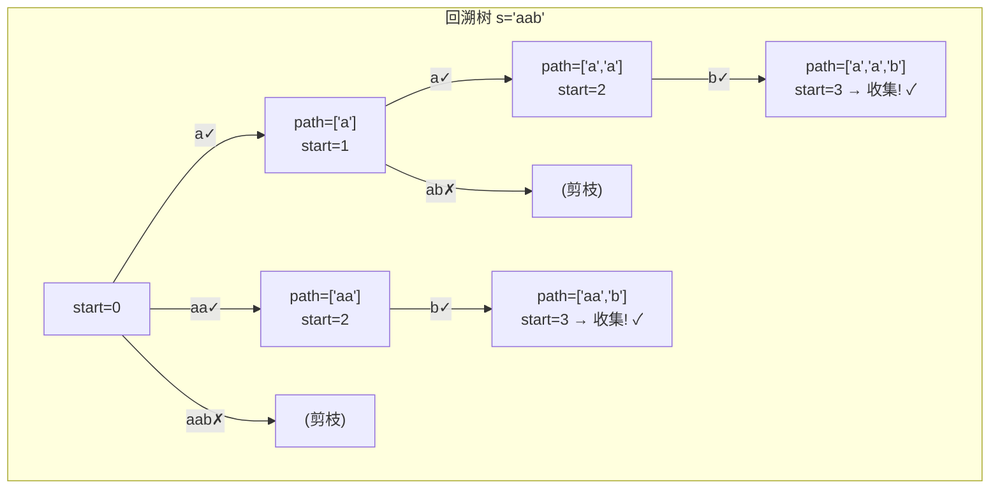
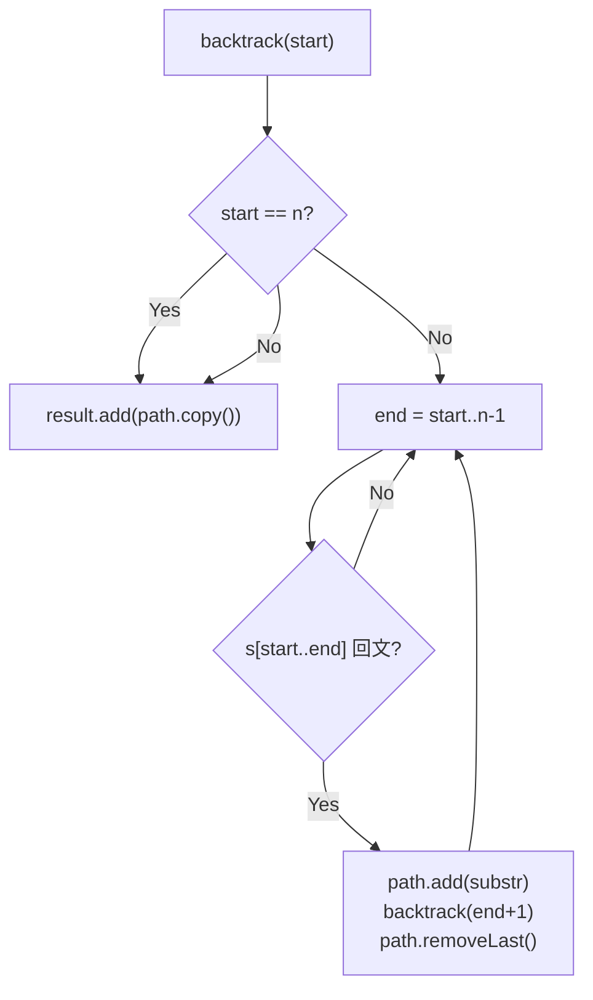

# LeetCode 131. Palindrome Partitioning（分割回文串） — **中等**

## 考点
String, Dynamic Programming, Backtracking

## 题目描述
给你一个字符串 `s`，请你将 `s` 分割成一些子串，使每个子串都是 **回文串** 。返回 s 所有可能的分割方案。

**示例 1：**

```
输入：s = "aab"
输出：[["a","a","b"],["aa","b"]]
```

**示例 2：**

```
输入：s = "a"
输出：[["a"]]
```

**提示：**
- `1 <= s.length <= 16`
- `s` 仅由小写英文字母组成

## 图解





## 解题思路

### 核心思路
分割字符串，使每个子串都是回文串，返回所有可能的分割方案。这是一个**回溯（Backtracking）**问题的经典应用。在回溯过程中枚举切割位置，如果当前子串是回文，就加入路径并递归处理剩余部分。

### 方法一：回溯 + 双指针判断回文

#### 算法步骤
1. 定义结果列表 `result`，路径列表 `path`
2. `backtrack(start)`：从 `start` 位置开始尝试切割
   - 如果 `start >= s.length`，将 `path` 的副本加入 `result`
   - 遍历 `end` 从 `start` 到 `s.length - 1`：
     - 如果 `s[start..end]` 是回文：
       - 将子串加入 `path`
       - `backtrack(end + 1)` 递归
       - 回溯：从 `path` 中移除最后一个子串

#### 图解示例

```
s = "aab"

回溯树：
                        start=0
                       /   |    \
          "a"是回文?✓  "aa"是回文?✓  "aab"是回文?✗
            /              \
         start=1          start=2
        /   |   \          /   |   \
 "a"✓   "ab"✗          "b"✓
   /        (剪枝)        |
start=2                  start=3 → 找到方案! ["aa","b"]
   |
start=3 → 找到方案! ["a","a","b"]

所有方案：
1. ["a", "a", "b"]   ← 每个字符单独分割
2. ["aa", "b"]       ← "aa"整体作为一个回文子串
```

#### 逐步追踪

| 递归层 | start | 尝试 end | 子串 | 回文？ | 操作 |
|--------|-------|---------|------|--------|------|
| 1 | 0 | 0 | "a" | ✓ | path=["a"], 递归 start=1 |
| 2 | 1 | 1 | "a" | ✓ | path=["a","a"], 递归 start=2 |
| 3 | 2 | 2 | "b" | ✓ | path=["a","a","b"], 递归 start=3 |
| 4 | 3 | - | - | - | start==len, 记录 ["a","a","b"] |
| 回溯 | 2 | - | - | - | path=["a","a"], end++ → end=3 越界 |
| 回溯 | 1 | 2 | "ab" | ✗ | 跳过 |
| 回溯 | 0 | 1 | "aa" | ✓ | path=["aa"], 递归 start=2 |
| 2 | 2 | 2 | "b" | ✓ | path=["aa","b"], 递归 start=3 |
| 3 | 3 | - | - | - | start==len, 记录 ["aa","b"] |
| 回溯 | 0 | 2 | "aab" | ✗ | 跳过, 完成 |

### 方法二：回溯 + DP 预处理回文表

先用 DP 预计算所有子串是否是回文，回溯时 O(1) 查询。

#### DP 预处理
```
isPal[i][j] = s[i]==s[j] && (j-i<=2 || isPal[i+1][j-1])
```

```
s = "aab"
DP 表:
    a  a  b
a [ T, T, F ]
a [ -, T, F ]
b [ -, -, T ]

isPal[0][0]="a"=T, isPal[0][1]="aa"=T, isPal[0][2]="aab"=F
isPal[1][1]="a"=T, isPal[1][2]="ab"=F
isPal[2][2]="b"=T
```

回溯时直接查表 `isPal[start][end]`，避免重复计算回文。

### ASCII 递归树

```
            ("", 0)
           /   |    \
       "a"    "aa"   "aab"✗
       / \      \
    "a"  "ab"✗  "b"
    /
  "b"
  /
  ✓ ["a","a","b"]     ✓ ["aa","b"]
```

### 方法三：回溯 + 记忆化

对每个 `start` 位置记忆所有回文前缀，减少重复的字符串截取操作。

### 边界情况
- `s` 长度为 1：只有一种方案 `[s]`
- `s` 全部相同字符（如 `"aaa"`）：方案数为 2^(n-1)，指数级
- 长度上限 16：2^15 = 32768 种方案，可接受

### 复杂度分析

| 方法 | 时间复杂度 | 空间复杂度 |
|------|-----------|-----------|
| 回溯 + 双指针 | O(n · 2^n) | O(n) 递归栈 |
| 回溯 + DP 预处理 | O(n^2 + 2^n) | O(n^2) DP表 + O(n) 栈 |

最坏情况：s 全为相同字符如 `"aaaa..."`，每个子串都是回文，有 2^(n-1) 种分割方案。n ≤ 16 保证了可行性。
