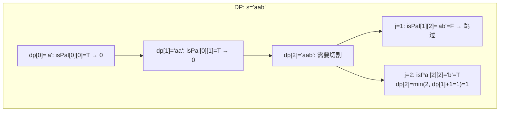
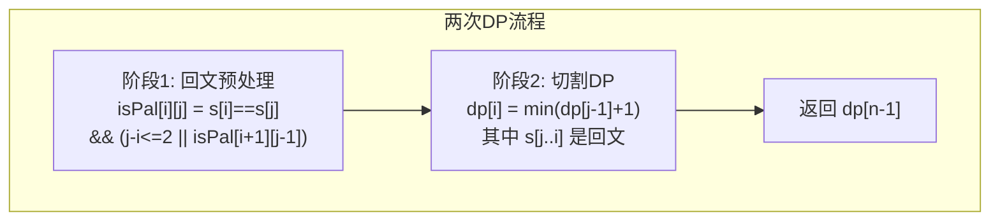

# LeetCode 132. Palindrome Partitioning II（分割回文串II） — **困难**

## 考点
String, Dynamic Programming

## 题目描述
给你一个字符串 `s`，请你将 `s` 分割成一些子串，使每个子串都是回文串。

返回符合要求的 **最少分割次数** 。

**示例 1：**

```
输入：s = "aab"
输出：1
解释：只需一次分割就可将 s 分割成 ["aa","b"] 这样两个回文子串。
```

**示例 2：**

```
输入：s = "a"
输出：0
```

**示例 3：**

```
输入：s = "ab"
输出：1
```

**提示：**
- `1 <= s.length <= 2000`
- `s` 仅由小写英文字母组成

## 图解





## 解题思路

### 核心思路
求将字符串分割为回文子串的**最少切割次数**。与 LeetCode 131（求所有方案）不同，本题只需求最小切割数，是典型的**最优子结构 DP**。

核心分两步：
1. **预处理**：用 DP 计算出所有子串是否是回文（`isPal[i][j]`）
2. **DP 求解**：`dp[i]` = `s[0..i]` 的最少切割次数

### 方法一：两次 DP（预处理 + 切割 DP）

#### 第一步：回文预处理

用**区间 DP** 或**中心扩展**法预处理回文表。

**区间 DP 方式**：
```
isPal[i][j] = s[i]==s[j] && (j-i<=2 || isPal[i+1][j-1])
```

从长度 1 开始逐步扩展到全长，或从右向左遍历 `i`，从左向右遍历 `j`。

#### 第二步：最少切割 DP

定义 `dp[i]` = `s[0..i]` 的最少切割次数。

状态转移：
```
dp[i] = 0                           // 如果 s[0..i] 本身是回文
dp[i] = min(dp[j-1] + 1)            // j in [0, i]，且 s[j..i] 是回文
```

即：在 `j` 处切一刀，`s[j..i]` 作为最后一个回文段。

#### 算法步骤
1. 预处理 `isPal[n][n]` 回文表
2. 初始化 `dp[i] = i`（最坏情况：每个字符单独切割，切 i 次）
3. 遍历 `i` 从 0 到 n-1：
   - 如果 `isPal[0][i]`，`dp[i] = 0`（整段回文，无需切割）
   - 否则遍历 `j` 从 1 到 i：
     - 如果 `isPal[j][i]`，`dp[i] = min(dp[i], dp[j-1] + 1)`
4. 返回 `dp[n-1]`

#### 图解示例

```
s = "aab"

回文表 isPal[i][j]:
    a  a  b
a [ T, T, F ]   ← "aab" 不是回文
a [ -, T, F ]   ← "ab" 不是回文
b [ -, -, T ]

切割 DP:
dp[0] (子串 "a"):
  isPal[0][0] = T → dp[0] = 0     ← 本身就是回文

dp[1] (子串 "aa"):
  isPal[0][1] = T → dp[1] = 0     ← "aa" 是回文，无需切割

dp[2] (子串 "aab"):
  isPal[0][2] = F → 需要切割
  j=1: isPal[1][2] = "ab" = F → 跳过
  j=2: isPal[2][2] = "b" = T → dp[2] = min(2, dp[1]+1=1) = 1
  → dp[2] = 1  (切割方案: "aa" | "b")


ASCII 切割方案：
  方案1: a | a | b → 2 次切割
  方案2: aa | b    → 1 次切割 ← 最优
```

#### 逐步追踪

```
s = "aab", n=3

回文预处理（区间DP，从短到长）：
  长度1: isPal[0][0]=T, isPal[1][1]=T, isPal[2][2]=T
  长度2: isPal[0][1]=(a==a && 1-0<=2)=T
         isPal[1][2]=(a==b)=F
  长度3: isPal[0][2]=(a==b)=F

DP 过程:
  i=0: dp[0] = (isPal[0][0]) ? 0 = 0
  i=1: dp[1] = (isPal[0][1]) ? 0 = 0
  i=2: dp[2] = 2 (初始最坏)
       j=1: isPal[1][2]=F, 跳过
       j=2: isPal[2][2]=T, dp[2]=min(2, dp[1]+1=1) = 1
  → 返回 dp[2] = 1
```

### 方法二：中心扩展 + DP（优化回文预处理）

用中心扩展法同时处理回文判断和 DP 更新：

1. 对于每个中心（单字符或双字符），向两边扩展
2. 当扩展到 `[left, right]` 是回文时，更新 `dp[right] = min(dp[right], (left==0 ? 0 : dp[left-1] + 1))`

省去 O(n²) 的 `isPal` 表空间，但时间复杂度仍为 O(n²)。

### 方法三：BFS（图论视角）

将每个位置视为图中的节点，如果 `s[i..j]` 是回文，则在 `i` 和 `j+1` 之间连边。问题转化为求从 0 到 n 的最短路径长度减 1。用 BFS 求解，但时间可能更差。

### 边界情况
- 单字符：返回 0（无需切割）
- 本身就是回文（如 `"aba"`）：返回 0
- 全部不同字符（如 `"abc"`）：返回 `n-1`（每个字符单独成段）
- `dp` 数组初始化：`dp[i] = i`（最坏情况就是每个字符切一刀）

### 复杂度分析

| 方法 | 时间复杂度 | 空间复杂度 |
|------|-----------|-----------|
| 两次 DP | O(n²) | O(n²) |
| 中心扩展 DP | O(n²) | O(n) |
| BFS | O(n²) | O(n²) |

推荐方法一的两次 DP 思路最清晰；方法二空间更优。n ≤ 2000，O(n²) 时间完全可行。
