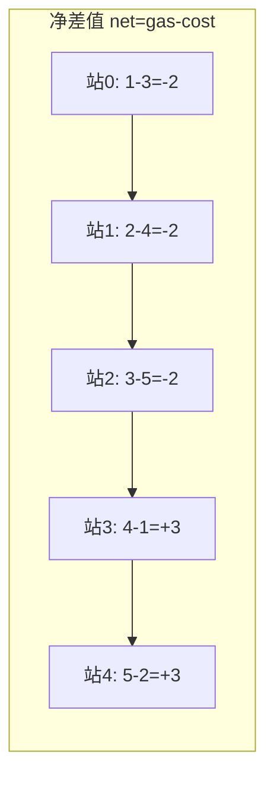
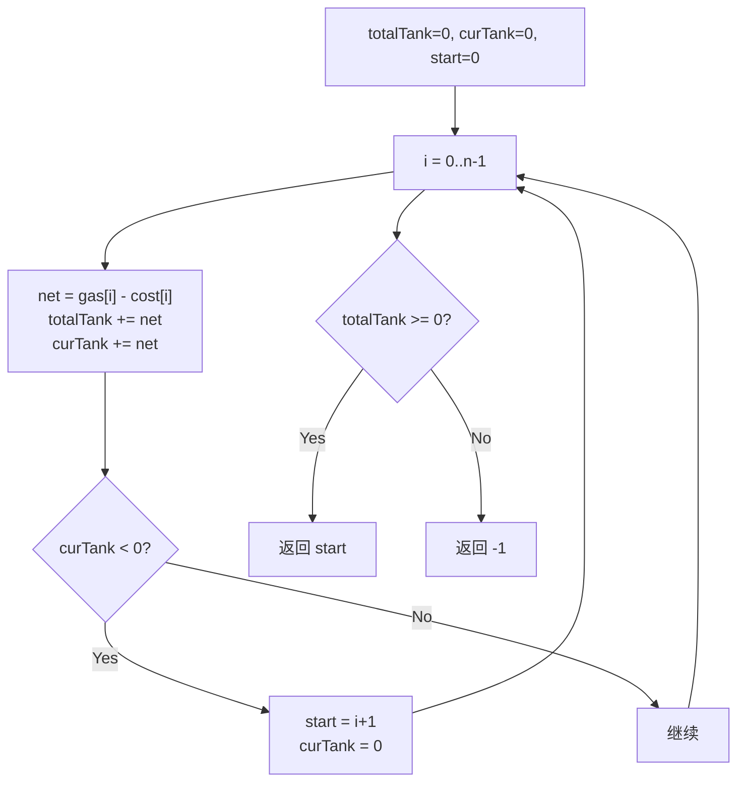

# LeetCode 134. Gas Station（加油站） — **中等**

## 考点
Greedy, Array

## 题目描述
在一条环路上有 `n` 个加油站，其中第 `i` 个加油站有汽油 `gas[i]` 升。

你有一辆油箱容量无限的汽车，从第 `i` 个加油站开往第 `i+1` 个加油站需要消耗汽油 `cost[i]` 升。你从其中的一个加油站出发，开始时油箱为空。

给定两个整数数组 `gas` 和 `cost` ，如果你可以按顺序绕环路行驶一周，则返回出发时加油站的编号，否则返回 `-1` 。如果存在解，则 **保证** 它是 **唯一** 的。

**示例 1：**

```
输入: gas = [1,2,3,4,5], cost = [3,4,5,1,2]
输出: 3
解释:
从 3 号加油站(索引为 3 处)出发，可获得 4 升汽油。此时油箱有 = 0 + 4 = 4 升汽油
开往 4 号加油站，此时油箱有 4 - 1 + 5 = 8 升汽油
开往 0 号加油站，此时油箱有 8 - 2 + 1 = 7 升汽油
开往 1 号加油站，此时油箱有 7 - 3 + 2 = 6 升汽油
开往 2 号加油站，此时油箱有 6 - 4 + 3 = 5 升汽油
开往 3 号加油站，此时油箱有 5 - 5 + 4 = 4 升汽油
```

**示例 2：**

```
输入: gas = [2,3,4], cost = [3,4,3]
输出: -1
解释:
你不能从 0 号或 1 号加油站出发，因为没有足够的汽油可以让你行驶到下一个加油站。
从 2 号加油站出发，可以获得 4 升汽油。出发后油不够到 0 号加油站。
```

**提示：**
- `gas.length == n`
- `cost.length == n`
- `1 <= n <= 10^5`
- `0 <= gas[i], cost[i] <= 10^4`

## 图解





## 解题思路

### 核心思路
在环形路线上找到能绕行一周的起点加油站。两个关键洞察：
1. **总油量 ≥ 总消耗**是存在解的**充要条件**
2. 如果从 `A` 出发无法到达 `B`，那么 `A` 到 `B` 之间的任何点都无法到达 `B`（因为从 `A` 出发时至少有 0 油，中间站出发油更少）

基于洞察 2，可以用贪心一次遍历找到答案。

### 方法一：贪心一次遍历

#### 算法步骤
1. 初始化 `totalTank = 0`（总剩余油量），`curTank = 0`（当前段剩余油量），`start = 0`
2. 遍历 `i` 从 0 到 n-1：
   - `totalTank += gas[i] - cost[i]`
   - `curTank += gas[i] - cost[i]`
   - 如果 `curTank < 0`（从 start 出发到不了 i+1）：
     - `start = i + 1`（重置起点）
     - `curTank = 0`（清空当前油量）
3. 返回 `totalTank >= 0 ? start : -1`

#### 图解示例

```
gas  = [1, 2, 3, 4, 5]
cost = [3, 4, 5, 1, 2]

差值 net = gas - cost:
站 0: 1-3 = -2
站 1: 2-4 = -2
站 2: 3-5 = -2
站 3: 4-1 = +3
站 4: 5-2 = +3

totalNet = -2-2-2+3+3 = 0 ≥ 0 → 存在解

遍历过程：
i=0: curTank += -2 = -2 < 0 → start=1, curTank=0
i=1: curTank += -2 = -2 < 0 → start=2, curTank=0
i=2: curTank += -2 = -2 < 0 → start=3, curTank=0
i=3: curTank += +3 = +3 ≥ 0 → 继续
i=4: curTank += +3 = +6 ≥ 0 → 完成

返回 start = 3

验证从站3出发：
站3: 油箱 0+4=4, 消耗1→剩3 → 到站4
站4: 油箱 3+5=8, 消耗2→剩6 → 到站0
站0: 油箱 6+1=7, 消耗3→剩4 → 到站1
站1: 油箱 4+2=6, 消耗4→剩2 → 到站2
站2: 油箱 2+3=5, 消耗5→剩0 → 回到站3 ✓


ASCII 环形图：
        站0(-2)
       /      \
  站4(+3)    站1(-2)       从站0出发 → 到站1就没油了 ✗
      |        |           从站1出发 → 到站2就没油了 ✗
  站3(+3)    站2(-2)       从站2出发 → 到站3就没油了 ✗
       \      /            从站3出发 → 能绕一圈! ✓
         环

差值分布：
  -2  -2  -2  +3  +3
  [0] [1] [2] [3] [4]
                ↑
              最优起点
```

#### 逐步追踪

| 站 i | gas[i] | cost[i] | net | totalTank | curTank | curTank<0? | start |
|------|--------|---------|-----|-----------|---------|------------|-------|
| 0 | 1 | 3 | -2 | -2 | -2 | 是 | 1 |
| 1 | 2 | 4 | -2 | -4 | -2 | 是 | 2 |
| 2 | 3 | 5 | -2 | -6 | -2 | 是 | 3 |
| 3 | 4 | 1 | +3 | -3 | +3 | 否 | 3 |
| 4 | 5 | 2 | +3 | 0 | +6 | 否 | 3 |

totalTank = 0 ≥ 0 → start = 3

### 方法二：暴力法

尝试每个起点，模拟绕行一周。时间 O(n²)，不满足大数据要求。

### 数学证明

**命题 1**：如果 `totalGas >= totalCost`，一定存在解。

**命题 2**：如果从 `A` 出发无法到达 `B`（中间所有站都可达，但 `B` 不可达），那么 `A` 到 `B`（含）之间的任何站出发都无法到达 `B`。

证明：设从 `A` 出发到达 `k`（A < k < B）时剩油为 `T(k)`。由于从 A 到 k 可达，`T(k) ≥ 0`。如果从 k 出发，初始油量为 0，显然 `0 ≤ T(k)`，即从 k 出发时油箱油量更少，更不可能到达 B。

### 边界情况
- `totalGas < totalCost`：返回 -1
- 单加油站：如果 `gas[0] >= cost[0]` 返回 0，否则 -1
- 差值全部为非负：从 0 出发即可

### 复杂度分析

| 方法 | 时间复杂度 | 空间复杂度 |
|------|-----------|-----------|
| 贪心一次遍历 | O(n) | O(1) |
| 暴力法 | O(n²) | O(1) |

贪心法是最优解。
