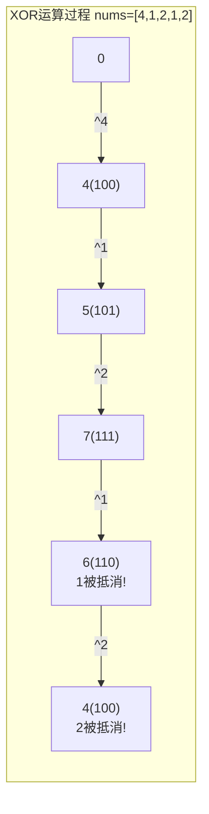
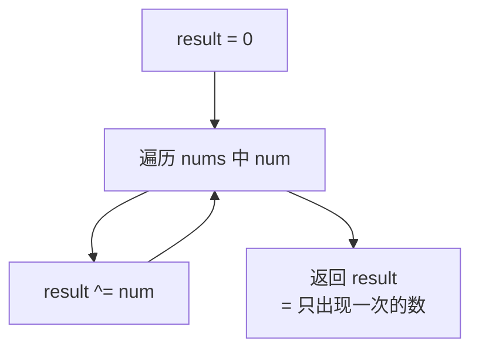

# LeetCode 136. Single Number（只出现一次的数字） — **简单**

## 考点
Bit Manipulation, Array

## 题目描述
给你一个 **非空** 整数数组 `nums` ，除了某个元素只出现一次以外，其余每个元素均出现两次。找出那个只出现了一次的元素。

你必须设计并实现线性时间复杂度的算法来解决此问题，且该算法只使用常量额外空间。

**示例 1：**

```
输入：nums = [2,2,1]
输出：1
```

**示例 2：**

```
输入：nums = [4,1,2,1,2]
输出：4
```

**示例 3：**

```
输入：nums = [1]
输出：1
```

**提示：**
- `1 <= nums.length <= 3 * 10^4`
- `-3 * 10^4 <= nums[i] <= 3 * 10^4`
- 除了某个元素只出现一次以外，其余每个元素均出现两次。

## 图解





## 解题思路

### 核心思路
找出数组中唯一出现一次的数字，其余元素均恰好出现两次。要求 O(n) 时间、O(1) 空间。**异或运算（XOR）** 是完美解决方案。

### 异或运算的关键性质

| 性质 | 表达式 | 说明 |
|------|--------|------|
| 自反性 | `a ⊕ a = 0` | 相同数字异或得 0 |
| 恒等性 | `a ⊕ 0 = a` | 与 0 异或不变 |
| 交换律 | `a ⊕ b = b ⊕ a` | 顺序无关 |
| 结合律 | `(a ⊕ b) ⊕ c = a ⊕ (b ⊕ c)` | 分组无关 |

基于这些性质，将所有数字异或：成对的数字会互相抵消为 0，最终只剩下那个单独的数字！

### 方法一：异或运算（最优）

#### 算法步骤
1. 初始化 `result = 0`
2. 遍历数组中的每个数字 `num`：`result ^= num`
3. 返回 `result`

#### 图解示例

```
nums = [4, 1, 2, 1, 2]

异或过程（利用交换律和结合律重排）：
result = 0

0 ⊕ 4 = 4
4 ⊕ 1 = 5
5 ⊕ 2 = 7
7 ⊕ 1 = 6    ← 与之前的 1 配对抵消了吗？不，这里的 1 与第 2 步的 1 配对了！
6 ⊕ 2 = 4    ← 与第 3 步的 2 配对抵消！

验证：
0 ⊕ 4 ⊕ 1 ⊕ 2 ⊕ 1 ⊕ 2
= 4 ⊕ (1 ⊕ 1) ⊕ (2 ⊕ 2)    ← 交换律重排
= 4 ⊕ 0 ⊕ 0                ← 自反性：成对抵消
= 4                         ← 恒等性：只剩单独的数字


ASCII 追踪：
数字:     4   1   2   1   2
异或演算:
  0 ⊕ 4 = 4     (二进制:  000 ^ 100 = 100)
  4 ⊕ 1 = 5     (二进制:  100 ^ 001 = 101)
  5 ⊕ 2 = 7     (二进制:  101 ^ 010 = 111)
  7 ⊕ 1 = 6     (二进制:  111 ^ 001 = 110)
  6 ⊕ 2 = 4     (二进制:  110 ^ 010 = 100)

最终: 4 ✓
```

#### 二进制详细追踪

```
nums = [4, 1, 2, 1, 2]

二进制表示：
4 = 100
1 = 001
2 = 010
1 = 001
2 = 010

逐位异或：
  000  (初始值)
^ 100  (4)   → 100
^ 001  (1)   → 101
^ 010  (2)   → 111
^ 001  (1)   → 110
^ 010  (2)   → 100 = 4

观察每位的变化：
  第0位(1): 0→0→1→1→0→0 (出现偶数次1，抵消)
  第1位(2): 0→0→0→1→1→1→0 (出现偶数次1，抵消)
  第2位(4): 0→1→1→1→1→1 (只有一次1，保留)
  结果: 100₂ = 4
```

#### 逐步追踪

| 步骤 | 当前 num | result 十进制 | result 二进制 | 说明 |
|------|---------|-------------|-------------|------|
| 初始化 | - | 0 | 000 | |
| 1 | 4 | 4 | 100 | 0 ^ 4 |
| 2 | 1 | 5 | 101 | 4 ^ 1 |
| 3 | 2 | 7 | 111 | 5 ^ 2 |
| 4 | 1 | 6 | 110 | 7 ^ 1, 1被抵消 |
| 5 | 2 | 4 | 100 | 6 ^ 2, 2被抵消 |

### 方法二：哈希表

统计频率，找频率为 1 的数。时间 O(n)，空间 O(n)。不满足进阶要求。

### 方法三：数学公式

`2 × sum(unique_nums) - sum(all_nums)`

需要额外空间存储唯一元素集合 O(n)，不满足空间要求。

### 边界情况
- 单元素数组：直接返回该元素
- 负数：异或运算对负数同样有效（基于补码运算）
- 大数组（3×10⁴）：一次遍历无压力

### 复杂度分析

| 方法 | 时间复杂度 | 空间复杂度 |
|------|-----------|-----------|
| 异或运算 | O(n) | O(1) |
| 哈希表 | O(n) | O(n) |
| 数学公式 | O(n) | O(n) |

异或运算是最优解，完美满足 O(n) 时间和 O(1) 空间的要求。
