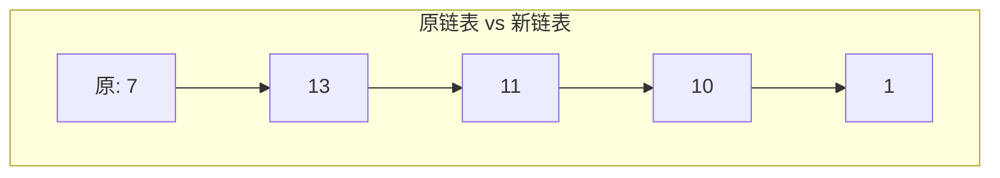
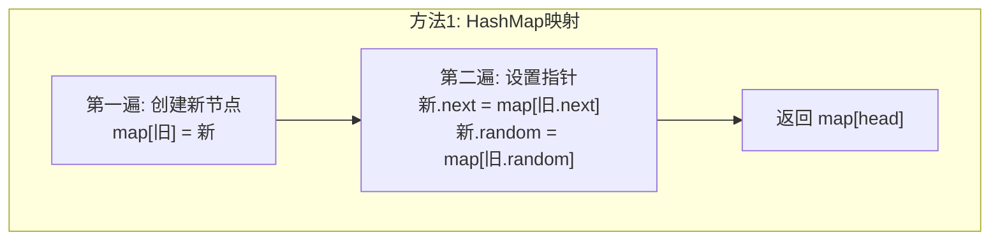
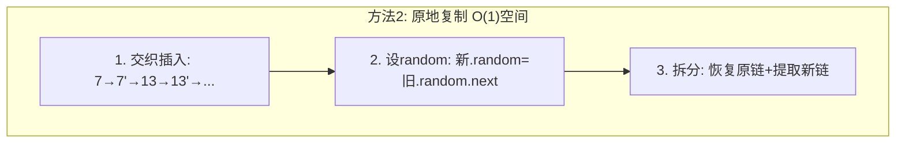

# LeetCode 138. Copy List with Random Pointer（随机链表的复制） — **中等**

## 考点
Hash Table, Linked List

## 题目描述
给你一个长度为 `n` 的链表，每个节点包含一个额外增加的随机指针 `random` ，该指针可以指向链表中的任何节点或空节点。

构造这个链表的 **深拷贝**。深拷贝应该正好由 `n` 个 **全新** 节点组成，其中每个新节点的值都设为其对应的原节点的值。新节点的 `next` 指针和 `random` 指针也都应指向复制链表中的新节点，并使原链表和复制链表中的这些指针能够表示相同的链表状态。复制链表中的指针都不应指向原链表中的节点 。

**示例 1：**

```
输入：head = [[7,null],[13,0],[11,4],[10,2],[1,0]]
输出：[[7,null],[13,0],[11,4],[10,2],[1,0]]
```

**示例 2：**

```
输入：head = [[1,1],[2,1]]
输出：[[1,1],[2,1]]
```

**提示：**
- `0 <= n <= 1000`
- `-10^4 <= Node.val <= 10^4`
- `Node.random` 为 `null` 或指向链表中的节点。

## 图解







## 解题思路

### 核心思路
复制带随机指针的链表，要求**深拷贝**。核心难点：`random` 指针可能指向任意节点，如果直接复制，设置 `random` 时目标节点可能还未创建。需要建立**原节点 → 新节点**的映射。

### 方法一：哈希表映射

#### 算法步骤
1. 创建 `Map<旧节点, 新节点>` 的哈希表
2. **第一遍遍历**：复制所有节点的值，建立旧→新映射（不设 next 和 random）
3. **第二遍遍历**：根据映射设置新节点的 `next` 和 `random` 指针
4. 返回映射中 `head` 对应的新节点

#### 图解示例

```
原链表: 7 → 13 → 11 → 10 → 1
        ↓   ↓    ↓    ↓   ↓
random: null 7   1    11  7

Step 1: 创建新节点 + HashMap
  旧节点映射:
    7  → new7
    13 → new13
    11 → new11
    10 → new10
    1  → new1

Step 2: 设置指针
  new7.next  = map.get(7.next)  = new13
  new7.random = map.get(7.random) = map.get(null) = null

  new13.next  = map.get(13.next) = new11
  new13.random = map.get(13.random) = map.get(7) = new7

  new11.next  = map.get(11.next) = new10
  new11.random = map.get(11.random) = map.get(1) = new1

  ...

结果：
  new7 → new13 → new11 → new10 → new1
  ↓      ↓       ↓       ↓       ↓
  null   new7    new1    new11   new7

← 所有 random 都指向新链表中的节点，完全独立 ✓


ASCII 节点映射图：
原链表:
   [7|•] → [13|•] → [11|•] → [10|•] → [1|•]
    ↓r      ↓r       ↓r       ↓r      ↓r
   null     [7]      [1]      [11]     [7]

HashMap:
   ┌───────┬───────┬───────┬───────┬───────┐
   │   7   │  13   │  11   │  10   │   1   │  (原节点)
   │   ↓   │   ↓   │   ↓   │   ↓   │   ↓   │
   │  n7   │  n13  │  n11  │  n10  │  n1   │  (新节点)
   └───────┴───────┴───────┴───────┴───────┘

新链表（独立复制）:
   [7|•] → [13|•] → [11|•] → [10|•] → [1|•]
    ↓r      ↓r       ↓r       ↓r      ↓r
   null    [n7]      [n1]     [n11]    [n7]
```

#### 逐步追踪

| 遍历 | 旧节点 | 操作 |
|------|--------|------|
| 第一遍 | 7 | map[7] = new Node(7) |
| | 13 | map[13] = new Node(13) |
| | 11 | map[11] = new Node(11) |
| | 10 | map[10] = new Node(10) |
| | 1 | map[1] = new Node(1) |
| 第二遍 | 7 | n7.next=map[13], n7.random=null |
| | 13 | n13.next=map[11], n13.random=map[7] |
| | 11 | n11.next=map[10], n11.random=map[1] |
| | 10 | n10.next=map[1], n10.random=map[11] |
| | 1 | n1.next=null, n1.random=map[7] |

### 方法二：原地复制 + 拆分（O(1) 空间）

无需 HashMap，达到 O(1) 额外空间。

#### 算法步骤
1. **插入复制节点**：在每个原节点后插入其复制节点
   ```
   A → B → C  变为  A → A' → B → B' → C → C'
   ```
2. **设置 random 指针**：`copy.random = original.random.next`
   （因为 copy 就在 original 后面）
3. **拆分链表**：将交织的链表拆分为原链表和复制链表

```
Step 1: 交织
  原:  7 → 13 → 11 → 10 → 1
  交织: 7 → 7'→ 13→ 13'→ 11→ 11'→ 10→ 10'→ 1 → 1'

Step 2: 设 random
  original.random.next 就是对应复制节点的 random 目标

Step 3: 拆分
  copy.next = copy.next.next (跳过原节点)
  恢复原链表 + 提取复制链表
```

#### 逐步追踪（原地复制）

| 步骤 | 链表状态 |
|------|---------|
| 初始 | 7→13→11→10→1 |
| 插入后 | 7→7'→13→13'→11→11'→10→10'→1→1' |
| 设random | 7'.random = null, 13'.random=7', 11'.random=1', ... |
| 拆分 | 原:7→13→11→10→1, 新:7'→13'→11'→10'→1' |

### 边界情况
- 空链表：返回 `null`
- 单节点（random 为 null 或指向自身）
- `random` 指向后续还没遍历到的节点：方法一用 HashMap 无此问题；方法二第一次遍历后才设置

### 复杂度分析

| 方法 | 时间复杂度 | 空间复杂度 |
|------|-----------|-----------|
| 哈希表 | O(n) | O(n) |
| 原地复制 | O(n) | O(1) |

推荐面试中两个方法都掌握：方法一最直观，方法二展示空间优化能力。
