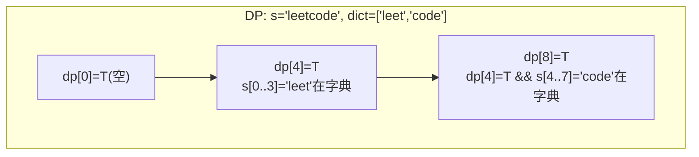
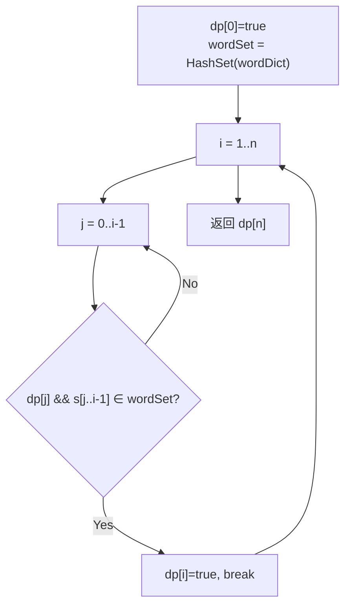

# LeetCode 139. Word Break（单词拆分） — **中等**

## 考点
Trie, Memoization, Hash Table, String, DP

## 题目描述
给你一个字符串 `s` 和一个字符串列表 `wordDict` 作为字典。如果可以利用字典中出现的一个或多个单词拼接出 `s` 则返回 `true`。

**注意：** 不要求字典中出现的单词全部都使用，并且字典中的单词可以重复使用。

**示例 1：**

```
输入: s = "leetcode", wordDict = ["leet", "code"]
输出: true
解释: 返回 true 因为 "leetcode" 可以由 "leet" 和 "code" 拼接成。
```

**示例 2：**

```
输入: s = "applepenapple", wordDict = ["apple", "pen"]
输出: true
解释: 返回 true 因为 "applepenapple" 可以由 "apple" "pen" "apple" 拼接成。
注意，你可以重复使用字典中的单词。
```

**示例 3：**

```
输入: s = "catsandog", wordDict = ["cats", "dog", "sand", "and", "cat"]
输出: false
```

**提示：**
- `1 <= s.length <= 300`
- `1 <= wordDict.length <= 1000`
- `1 <= wordDict[i].length <= 20`
- `s` 和 `wordDict[i]` 仅由小写英文字母组成
- `wordDict` 中的所有字符串 **互不相同**

## 图解





## 解题思路

### 核心思路
判断字符串 `s` 是否能由字典中的单词拼接而成，单词可无限次重复使用。经典的**动态规划**问题，核心是检查字符串的每个前缀是否能被拆分。

### 方法一：动态规划

#### 状态定义
`dp[i]` = 布尔值，表示 `s[0..i-1]`（前 i 个字符）是否能由字典单词拼接。

#### 状态转移
```
dp[i] = true  如果存在 j∈[0, i-1] 使得:
  dp[j] == true  &&  s[j..i-1] 在字典中
```

即：前 j 个字符可拆分，且第 j 到 i-1 个字符组成字典中的单词。

#### 算法步骤
1. 将 `wordDict` 转为 `HashSet` 以 O(1) 查找
2. 初始化 `dp[0] = true`（空前缀始终可拆分）
3. 遍历 `i` 从 1 到 `n`：
   - 遍历 `j` 从 0 到 `i-1`（或从 `i-1` 到 0）：
     - 如果 `dp[j] && set.contains(s[j..i-1])`，则 `dp[i] = true`，break
4. 返回 `dp[n]`

#### 图解示例

```
s = "leetcode", wordDict = ["leet", "code"]

初始化: dp[0] = true (空前缀)

dp[1] (s[0]="l"):
  j=0: dp[0]=true, "l" 在字典? ✗ → dp[1]=false

dp[2] (s[0..1]="le"):
  所有 j: "le" 不在字典 → dp[2]=false

dp[3] (s[0..2]="lee"):
  所有 j: "lee" 不在字典 → dp[3]=false

dp[4] (s[0..3]="leet"):
  j=0: dp[0]=true, "leet" 在字典? ✓ → dp[4]=true!

dp[5] (s[0..4]="leetc"):
  j=4: dp[4]=true, "c" 不在字典 ✗
  ...都失败 → dp[5]=false

dp[6] (s[0..5]="leetco"):
  ...都失败 → dp[6]=false

dp[7] (s[0..6]="leetcod"):
  ...都失败 → dp[7]=false

dp[8] (s[0..7]="leetcode"):
  j=4: dp[4]=true, "code" 在字典? ✓ → dp[8]=true!

返回 dp[8] = true


ASCII DP 过程：
s = "l  e  e  t  c  o  d  e"
     0  1  2  3  4  5  6  7
dp: [T, F, F, F, T, F, F, F, T]
     0   1  2  3  4  5  6  7  8
     ↑                  ↑      ↑
   起点              "leet"   "code"
                    可拆分    可拆分

拆分方案: "leet" + "code" = "leetcode" ✓
```

#### 逐步追踪

| i | s[0..i-1] | 尝试 j | 检查子串 | 结果 |
|---|-----------|--------|---------|------|
| 0 | "" | - | - | dp[0]=T |
| 1 | "l" | 0 | "l"→不在字典 | dp[1]=F |
| 2 | "le" | 0 | "le"→不在字典 | dp[2]=F |
| 3 | "lee" | 0 | "lee"→不在字典 | dp[3]=F |
| 4 | "leet" | 0 | "leet"→在字典 ✓ | dp[4]=T |
| 5 | "leetc" | 4 | "c"→不在 | dp[5]=F |
| 6 | "leetco" | 4 | "co"→不在 | dp[6]=F |
| 7 | "leetcod" | 4 | "cod"→不在 | dp[7]=F |
| 8 | "leetcode" | 4 | "code"→在字典 ✓ | dp[8]=T |

### 方法二：记忆化搜索（DFS + Memo）

从位置 0 开始 DFS，尝试每个字典单词作为前缀匹配，递归处理剩余部分。用 memo 数组避免重复计算。

```
dfs(start):
  如果 start == n: 返回 true
  如果 memo[start] 已计算: 返回 memo[start]
  遍历 wordDict 中的每个 word:
    如果 s[start:start+len] == word && dfs(start+len)==true:
      memo[start] = true, 返回 true
  memo[start] = false, 返回 false
```

### 方法三：BFS

将字符串的每个位置视为图中的节点，如果存在字典单词可以匹配 `s[i..j]`，则在 `i` 和 `j+1` 之间连边。BFS 从 0 出发，如果到达 n 则返回 true。

### 优化：剪枝

- 只遍历 `j` 从 `max(0, i-maxWordLen)` 到 `i-1`（如果子串长度超过字典最大单词长度，不可能匹配）
- 提前计算 `wordDict` 中单词的最大长度

### 边界情况
- 空字符串：返回 `true`（题目约束 `s.length >= 1`）
- 字典包含 `s` 本身：返回 `true`
- 字典中单词不能组成 `s`：返回 `false`（如 `s="catsandog", dict=["cats","dog","sand","and","cat"]`）

### 复杂度分析

| 方法 | 时间复杂度 | 空间复杂度 |
|------|-----------|-----------|
| DP | O(n² · L) | O(n) |
| 记忆化 DFS | O(n² · L) | O(n) |
| BFS | O(n² · L) | O(n) |

n = s.length，L = 字典单词平均长度。使用 HashSet 后子串比较为 O(L) 或 O(1)（取决于语言的 substring 实现）。Java 中 substring 在 Java 7+ 是 O(n) 的复制，但 s.length ≤ 300，完全可接受。
