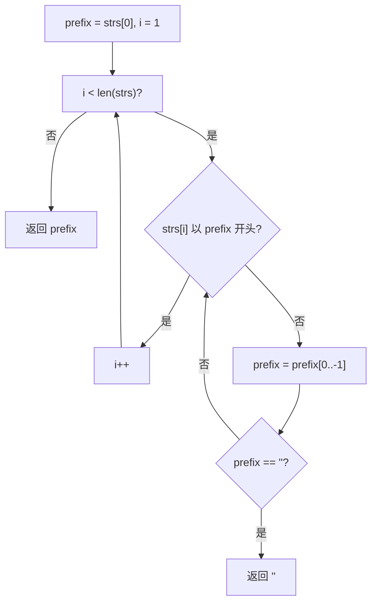

# LeetCode 14. Longest Common Prefix（最长公共前缀） — **简单**

## 考点
String, Trie

## 题目描述
编写一个函数来查找字符串数组中的最长公共前缀。

如果不存在公共前缀，返回空字符串 `""`。

**示例 1：**
```
输入：strs = ["flower","flow","flight"]
输出："fl"
```

**示例 2：**
```
输入：strs = ["dog","racecar","car"]
输出：""
解释：输入不存在公共前缀。
```

**提示：**
- `1 <= strs.length <= 200`
- `0 <= strs[i].length <= 200`
- `strs[i]` 仅由小写英文字母组成

## 图解



## 解题思路

### 核心思路
公共前缀必须被所有字符串共享。以第一个字符串为基准，逐个与后面的字符串比较，不断缩短前缀直到它成为所有字符串的公共前缀。

### 算法步骤

**方法一：横向扫描（逐个字符串比较）**

1. 如果数组为空或长度为 0，返回 `""`
2. 取第一个字符串作为初始前缀 `prefix = strs[0]`
3. 遍历数组中剩余的每个字符串 `strs[i]`（i 从 1 开始）：
   - 当 `strs[i].indexOf(prefix) != 0`（即 prefix 不是 strs[i] 的前缀）时：
     - `prefix = prefix.substring(0, prefix.length - 1)`（去掉最后一个字符）
     - 如果 `prefix` 变为空，直接返回 `""`
4. 返回最终的 `prefix`

**方法二：纵向扫描（逐列比较字符）**

1. 取第一个字符串为基准
2. 遍历第一个字符串的每个字符位置 j：
   - 获取当前字符 `c = strs[0][j]`
   - 检查所有其他字符串在位置 j 是否也有字符 c
   - 如果某个字符串在该位置字符不同，或长度不足，返回 `strs[0].substring(0, j)`
3. 如果全部匹配到第一个字符串末尾，返回 `strs[0]`

### 图解示例

以输入 `strs = ["flower", "flow", "flight"]` 为例：

**方法一（横向扫描）过程：**

```
初始: prefix = "flower"

比较 "flow":
  "flow".indexOf("flower") → -1 (不是前缀)
  prefix = "flowe"
  "flow".indexOf("flowe") → -1
  prefix = "flow"
  "flow".indexOf("flow") → 0 (是前缀!) ✓

比较 "flight":
  "flight".indexOf("flow") → -1 (不是前缀)
  prefix = "flo"
  "flight".indexOf("flo") → -1
  prefix = "fl"
  "flight".indexOf("fl") → 0 (是前缀!) ✓

循环结束，prefix = "fl"
```

**方法二（纵向扫描）过程：**

```
字符串对齐：
  flower
  flow
  flight

位置 0: 'f' 'f' 'f' → 全相同，继续
  f lower
  f low
  f light
  ↑

位置 1: 'l' 'l' 'l' → 全相同，继续
  fl ower
  fl ow
  fl ight
   ↑

位置 2: 'o' 'o' 'i' → 不同！'o'≠'i'
  flo wer
  flo w
  fli ght
    ↑
  → 返回 strs[0].substring(0, 2) = "fl"
```

### 逐步追踪

以输入 `strs = ["dog", "racecar", "car"]` 为例（方法一）：

| 步骤 | 当前字符串 | prefix(前) | indexOf 结果 | 是前缀? | prefix(后) |
|------|-----------|-----------|-------------|---------|-----------|
| 1    | "racecar" | "dog"     | -1          | 否      | "do"      |
| 2    | "racecar" | "do"      | -1          | 否      | "d"       |
| 3    | "racecar" | "d"       | -1          | 否      | ""        |
| —    | —         | ""        | —           | —       | 返回 ""   |

### 边界情况

1. **空数组**：返回 `""`
2. **只有一个字符串**：返回该字符串本身
3. **第一个字符串是其他字符串的前缀**（如 ["a", "ab", "abc"]）：横向扫描中 prefix 无需缩短，直接返回 "a"
4. **所有字符串相同**（如 ["abc", "abc", "abc"]）：prefix 不缩短，直接返回 "abc"
5. **某个字符串是空字符串**（如 ["abc", ""]）：在纵向扫描中位置 0 就会触发返回 ""
6. **第一个字符串很长**（如 ["abcdefg", "a", "ab"]）：纵向扫描会因后面字符串长度不足而提前返回

### 复杂度分析

**方法一（横向扫描）：**
- 时间复杂度：O(S)，S 是所有字符串的字符总数。最坏情况下所有字符串都相同，每个字符都要比较
- 空间复杂度：O(1)

**方法二（纵向扫描）：**
- 时间复杂度：O(S)，同样需要比较所有字符
- 空间复杂度：O(1)

两种方法复杂度相同，实际选择看个人偏好。

### 方法对比

| 方法 | 时间复杂度 | 空间复杂度 | 优点 | 缺点 |
|------|-----------|-----------|------|------|
| 横向扫描 | O(S) | O(1) | 代码简洁 | 每个字符串都要做 indexOf |
| 纵向扫描 | O(S) | O(1) | 提前终止能力强 | 需要索引到每个字符串 |
| 分治法 | O(S) | O(log n * len) | 可以并行 | 代码复杂，不必要 |
| 二分查找 | O(S * log minLen) | O(1) | — | 实现复杂 |
