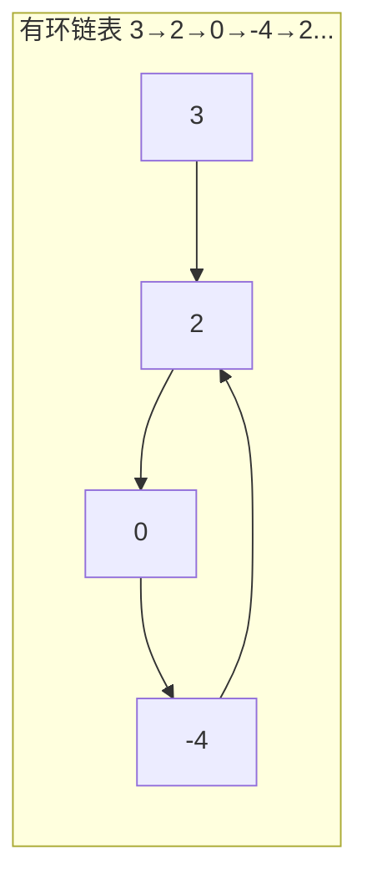
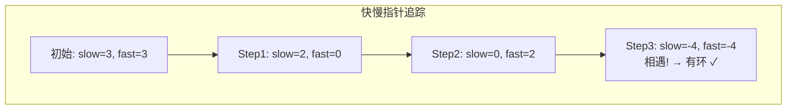
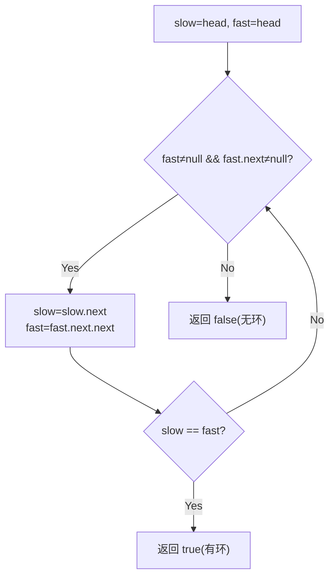

# LeetCode 141. Linked List Cycle（环形链表） — **简单**

## 考点
Hash Table, Linked List, Two Pointers

## 题目描述
给你一个链表的头节点 `head` ，判断链表中是否有环。

如果链表中有某个节点，可以通过连续跟踪 `next` 指针再次到达，则链表中存在环。为了表示给定链表中的环，评测系统内部使用整数 `pos` 来表示链表尾连接到链表中的位置（索引从 0 开始）。**注意：`pos` 不作为参数进行传递** 。仅仅是为了标识链表的实际情况。

如果链表中存在环 ，则返回 `true` 。否则，返回 `false` 。

**示例 1：**

```
输入：head = [3,2,0,-4], pos = 1
输出：true
解释：链表中有一个环，其尾部连接到第二个节点。
```

**示例 2：**

```
输入：head = [1,2], pos = 0
输出：true
解释：链表中有一个环，其尾部连接到第一个节点。
```

**示例 3：**

```
输入：head = [1], pos = -1
输出：false
解释：链表中没有环。
```

**提示：**
- 链表中节点的数目范围是 `[0, 10^4]`
- `-10^5 <= Node.val <= 10^5`
- `pos` 为 `-1` 或者链表中的一个 **有效索引** 。

## 图解







## 解题思路

### 核心思路
判断链表中是否有环。经典算法：**Floyd 判圈算法（快慢指针/龟兔赛跑）**。快指针每次走两步，慢指针每次走一步。如果存在环，快慢指针必然在环内相遇；如果不存在环，快指针会先到达链表尾部。

### 数学原理
环形跑道追及问题：快指针速度为 2，慢指针速度为 1，相对速度为 1。如果有环，快指针每步比慢指针多走一步，**一定**会在某个时刻追上慢指针（套圈）。如果无环，快指针永远在其前面直到终点。

### 方法一：快慢指针（最优）

#### 算法步骤
1. 初始化 `slow = head`，`fast = head`
2. 循环 `while (fast != null && fast.next != null)`：
   - `slow = slow.next`（走一步）
   - `fast = fast.next.next`（走两步）
   - 如果 `slow == fast`，返回 `true`（相遇，有环）
3. 快指针到达链表尾（`fast == null || fast.next == null`），返回 `false`

#### 图解示例

```
示例1: 有环链表
head = 3 → 2 → 0 → -4
              ↑_______↓

初始:   slow=3, fast=3

Step 1: slow=2, fast=0
  3 → [2] → 0 → -4
       ↑          ↓
       └──────────┘
  slow 在 2, fast 在 0 (走两步: 3→2→0)

Step 2: slow=0, fast=2
  3 → 2 → [0] → -4
       ↑          ↓
       └──────────┘
  slow 在 0, fast 在 2 (走两步: 0→-4→2)

Step 3: slow=-4, fast=-4
  3 → 2 → 0 → [-4]
       ↑           ↓
       └───────────┘
  slow 和 fast 都在 -4 → 相遇！返回 true


示例2: 无环链表
head = 1 → 2 → 3 → null

Step 1: slow=2, fast=3
Step 2: slow=3, fast=null → fast==null, 返回 false


ASCII 追及过程：
有环链表运行轨迹（展开视角，假设环足够大）：
  位置: 0  1  2  3  4  5  6  7  8 ...
  slow: 3  2  0 -4  2  0 -4  2  0 ...
  fast: 3  0  2 -4  0  2 -4  0  2 ...
               ↑              ↑
            差距1步        相遇！

快慢指针的距离（在环内）每步缩小1，所以必然相遇。
```

#### 逐步追踪

| 步骤 | slow 位置 | fast 位置 | 操作 | 说明 |
|------|----------|----------|------|------|
| 初始 | 3 | 3 | - | 都从头开始 |
| 1 | 2 | 0 | slow=2, fast=3→2→0 | |
| 2 | 0 | 2 | slow=0, fast=0→-4→2 | |
| 3 | -4 | -4 | slow=-4, fast=2→0→-4 | 相遇，有环！|

### 方法二：哈希表

遍历链表，将访问过的节点存入 `HashSet`。如果遇到已访问的节点，说明有环。时间 O(n)，空间 O(n)。

### 为什么快指针走两步？

- 如果快指针走 1 步，和慢指针同步，永远追不上
- 如果快指针走 2 步，相对速度 = 1，必然追及
- 如果快指针走 3 步，相对速度 = 2，可能跳过（但概率很低，仍能检测）
- 两步是最优选择：既能保证必相遇，又不会跳过

### 边界情况
- 空链表：返回 `false`
- 单节点无环：`fast.next == null`，返回 `false`
- 单节点自己成环：`fast.next == slow`（如果 head.next == head），一步判别
- 两节点成环：快慢指针正常运作

### 复杂度分析

| 方法 | 时间复杂度 | 空间复杂度 |
|------|-----------|-----------|
| 快慢指针 | O(n) | O(1) |
| 哈希表 | O(n) | O(n) |

快慢指针是 Floyd 判圈算法的经典应用，空间 O(1)。
