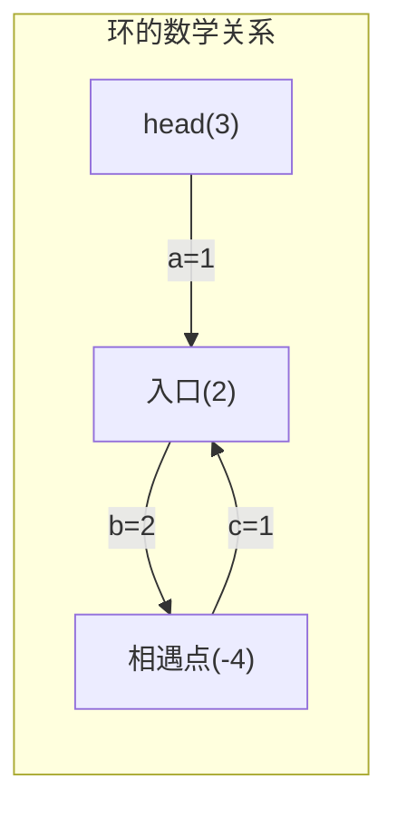
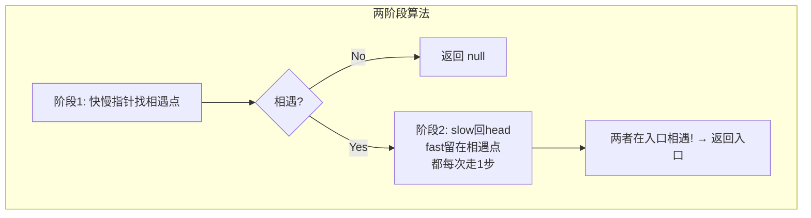
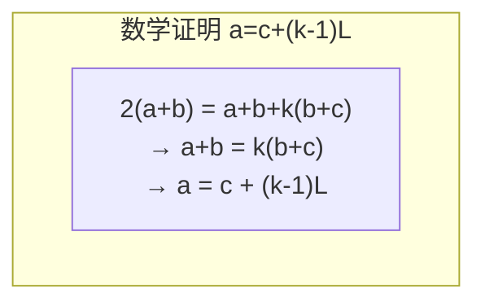

# LeetCode 142. Linked List Cycle II（环形链表II） — **中等**

## 考点
Hash Table, Linked List, Two Pointers

## 题目描述
给定一个链表的头节点 `head` ，返回链表开始入环的第一个节点。 *如果链表无环，则返回 `null`。*

如果链表中有某个节点，可以通过连续跟踪 `next` 指针再次到达，则链表中存在环。为了表示给定链表中的环，评测系统内部使用整数 `pos` 来表示链表尾连接到链表中的位置（**索引从 0 开始**）。如果 `pos` 是 `-1`，则在该链表中没有环。**注意：`pos` 不作为参数进行传递**，仅仅是为了标识链表的实际情况。

**不允许修改** 链表。

**示例 1：**

```
输入：head = [3,2,0,-4], pos = 1
输出：返回索引为 1 的链表节点
解释：链表中有一个环，其尾部连接到第二个节点。
```

**示例 2：**

```
输入：head = [1,2], pos = 0
输出：返回索引为 0 的链表节点
解释：链表中有一个环，其尾部连接到第一个节点。
```

**示例 3：**

```
输入：head = [1], pos = -1
输出：返回 null
解释：链表中没有环。
```

**提示：**
- 链表中节点的数目范围在范围 `[0, 10^4]` 内
- `-10^5 <= Node.val <= 10^5`
- `pos` 的值为 `-1` 或者链表中的一个有效索引

## 图解







## 解题思路

### 核心思路
找到链表中环的入口节点（即被 `tail.next` 指向的节点）。在 LeetCode 141 判断是否有环的基础上，进一步确定环的起点。

**核心数学证明**：设
- `a` = 从头节点到环入口的距离
- `b` = 从环入口到快慢指针相遇点的距离
- `c` = 从相遇点到环入口的距离（沿环的方向）

**相遇时**：慢指针走了 `a + b` 步，快指针走了 `a + b + k(b + c)` 步（在环内多绕了 k 圈）。

因为快指针速度是慢指针的 2 倍：`2(a + b) = a + b + k(b + c)`，化简得 `a = c + (k-1)(b + c)`。

**结论**：从头到入口的距离 `a` = 从相遇点到入口的距离 `c` 加上整数圈环长。所以**从 head 和相遇点同时出发（每次一步），会在环入口相遇**！

### 方法一：快慢指针（两阶段）

#### 算法步骤
**阶段 1：检测环**
1. 快慢指针初始化指向 `head`
2. 快指针走两步，慢指针走一步
3. 如果无环（fast 到 null），返回 null
4. 如果相遇，记录相遇点，进入阶段 2

**阶段 2：找环入口**
1. 慢指针重新指向 `head`
2. 快指针（留在相遇点）改为每次走一步
3. 两指针同步向前，相遇点即为环入口

#### 图解示例

```
链表: 3 → 2 → 0 → -4
           ↑_________↓

标识:
  head = 3
  环入口 = 2 (a = 1, 从3到2)
  环内: 2 → 0 → -4 → 2 (b + c = 3)

阶段1: 快慢指针
  slow: 3 → 2 → 0 → -4 → 2 → ...
  fast: 3 → 0 → 2 → -4 → 0 → ...
                ↑
            相遇在 -4 ??

实际追踪:
  Step 1: slow=2, fast=0
  Step 2: slow=0, fast=2
  Step 3: slow=-4, fast=-4 → 相遇在节点 -4!

  相遇点: -4
  环入口: 2
  头到入口: a = 1 (3→2)
  入口到相遇: b = 2 (2→0→-4)
  相遇到入口: c = 1 (-4→2)

阶段2: 找入口
  慢指针回到 head(3)
  快指针留在相遇点(-4)，都改为每次1步

  Step 1: slow从3→2, fast从-4→2 → 相遇在2 ← 就是环入口!


ASCII 示意图:
        a=1         b=2
  [head] → [入口] → → → [相遇点]
    3        2     0   -4
    ↑        ↑           │
    │        │←── c=1 ───┘
    │        │
    └─慢指针回head
    快指针从相遇点出发

  两者步调一致前进:
  head(3)→2, 相遇点(-4)→2 → 同时到达入口!
```

#### 逐步追踪

**阶段 1：检测环**

| 步骤 | slow | fast | slow==fast? |
|------|------|------|-------------|
| 初始 | 3 | 3 | - |
| 1 | 2 | 0 | ✗ |
| 2 | 0 | 2 | ✗ |
| 3 | -4 | -4 | ✓ 相遇 |

**阶段 2：找入口**

| 步骤 | slow (从head) | fast (从相遇点) | 说明 |
|------|--------------|----------------|------|
| 初始 | 3 | -4 | slow 回 head，fast 步速改为 1 |
| 1 | 2 | 2 | ✓ 相遇在 2，即环入口 |

### 方法二：哈希表

遍历链表，第一个被重复访问的节点就是环入口。时间 O(n)，空间 O(n)。

### 数学证明深入

```
0 ──a──→ 入口 ──b──→ 相遇点
          ↑           │
          └─── c ─────┘

设环长 L = b + c

慢指针路程: a + b
快指针路程: a + b + k·L  (k ≥ 1，多绕了 k 圈)

2(a + b) = a + b + k·L
a + b = k·L
a = k·L - b = (k-1)·L + (L - b) = (k-1)·L + c

所以 a = c + (k-1)·L
即: 从头走 a 步 = 从相遇点走 c 步 + 额外绕 (k-1) 圈

因为环的存在，从相遇点走 c 步 和 走 c + (k-1)L 步到达同一位置: 环入口
```

### 边界情况
- 无环：阶段 1 返回 null
- 单节点自己成环：阶段 1 直接相遇，阶段 2 得 head.next==head 的特殊处理
- 环入口就是 head（a=0）：相遇点就是 head 或稍远，阶段 2 正确

### 复杂度分析

| 方法 | 时间复杂度 | 空间复杂度 |
|------|-----------|-----------|
| 快慢指针 | O(n) | O(1) |
| 哈希表 | O(n) | O(n) |

快慢指针法时间 O(n)（两个阶段各 O(n)），空间 O(1)。
