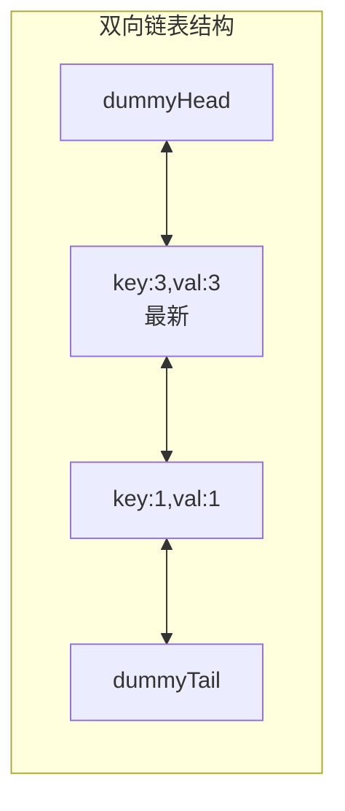
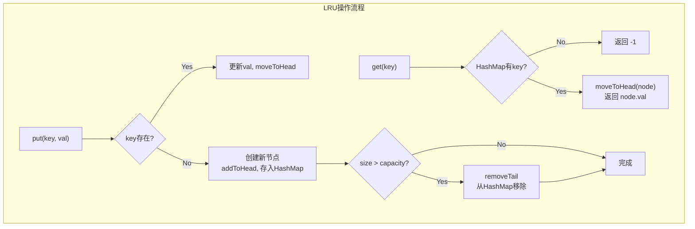
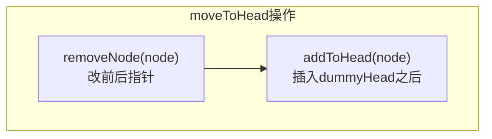

# LeetCode 146. LRU Cache（LRU缓存） — **中等**

## 考点
Design, Hash Table, Linked List, Doubly-Linked List

## 题目描述
请你设计并实现一个满足 **LRU（最近最少使用）缓存** 约束的数据结构。

实现 `LRUCache` 类：
- `LRUCache(int capacity)` 以 **正整数** 作为容量 `capacity` 初始化 LRU 缓存
- `int get(int key)` 如果关键字 `key` 存在于缓存中，则返回关键字的值，否则返回 `-1` 。
- `void put(int key, int value)` 如果关键字 `key` 已经存在，则变更其数据值 `value` ；如果不存在，则向缓存中插入该组 `key-value` 。如果插入操作导致关键字数量超过 `capacity` ，则应该 **逐出** 最久未使用的关键字。

函数 `get` 和 `put` 必须以 `O(1)` 的平均时间复杂度运行。

**示例：**

```
输入
["LRUCache", "put", "put", "get", "put", "get", "put", "get", "get", "get"]
[[2], [1, 1], [2, 2], [1], [3, 3], [2], [4, 4], [1], [3], [4]]
输出
[null, null, null, 1, null, -1, null, -1, 3, 4]

解释
LRUCache lRUCache = new LRUCache(2);
lRUCache.put(1, 1); // 缓存是 {1=1}
lRUCache.put(2, 2); // 缓存是 {1=1, 2=2}
lRUCache.get(1);    // 返回 1
lRUCache.put(3, 3); // 该操作会使得关键字 2 作废，缓存是 {1=1, 3=3}
lRUCache.get(2);    // 返回 -1 (未找到)
lRUCache.put(4, 4); // 该操作会使得关键字 1 作废，缓存是 {4=4, 3=3}
lRUCache.get(1);    // 返回 -1 (未找到)
lRUCache.get(3);    // 返回 3
lRUCache.get(4);    // 返回 4
```

**提示：**
- `1 <= capacity <= 3000`
- `0 <= key <= 10000`
- `0 <= value <= 10^5`
- 最多调用 `2 * 10^5` 次 `get` 和 `put`

## 图解







## 解题思路

### 核心思路
设计 LRU (Least Recently Used) 缓存，要求 `get` 和 `put` 操作都是 O(1)。核心数据结构：**哈希表 + 双向链表**。
- **哈希表**：提供 O(1) 的 key 查找
- **双向链表**：维护访问顺序，O(1) 的插入和删除

### 数据结构设计

```
双向链表节点:
┌────────┬────────┬────────┐
│  prev  │ k,val  │  next  │
└────────┴────────┴────────┘

链表头部 = 最近使用 (most recent)
链表尾部 = 最久未使用 (least recent)

哈希表: Map<key, ListNode>
```

### 方法一：哈希表 + 双向链表

#### 关键操作
- **访问（get/put 已存在的 key）**：将该节点移到链表头部
- **插入新 key**：在链表头部插入新节点
- **容量超限时淘汰**：删除链表尾部节点（最久未使用）

#### 算法步骤

**初始化**：
- 双向链表使用虚拟头尾节点 `dummyHead ↔ dummyTail`，简化边界操作

**`get(key)`**：
1. 在 HashMap 中查找 key
2. 如果不存在，返回 -1
3. 如果存在：`moveToHead(node)`，返回 `node.val`

**`put(key, value)`**：
1. 如果 key 已存在：更新 `node.val`，`moveToHead(node)`
2. 如果 key 不存在：
   - 创建新节点，插入链表头部，存入 HashMap
   - 如果 `size > capacity`：删除链表尾部节点，从 HashMap 中移除对应 key

**辅助方法**：
- `addToHead(node)`：在 dummyHead 之后插入节点
- `removeNode(node)`：从链表中移除节点（改前后指针）
- `moveToHead(node)`：`removeNode(node)` + `addToHead(node)`
- `removeTail()`：删除 dummyTail 的前驱节点并返回

#### 图解示例

```
操作序列（capacity=2）：

LRUCache(2):

put(1, 1):
  HashMap: {1→n1}
  链表: [dHead] ↔ [1,1] ↔ [dTail]    size=1

put(2, 2):
  HashMap: {1→n1, 2→n2}
  链表: [dHead] ↔ [2,2] ↔ [1,1] ↔ [dTail]    size=2

get(1): 返回 1，将 n1 移到头部
  链表: [dHead] ↔ [1,1] ↔ [2,2] ↔ [dTail]

put(3, 3): size=2==capacity，淘汰尾部节点(2,2)
  删除链表尾部: 移除 [2,2]
  HashMap 移除 key=2
  插入新节点:
  HashMap: {1→n1, 3→n3}
  链表: [dHead] ↔ [3,3] ↔ [1,1] ↔ [dTail]    size=2

get(2): 返回 -1（已被淘汰）

put(4, 4): 淘汰尾部节点(1,1)
  链表: [dHead] ↔ [4,4] ↔ [3,3] ↔ [dTail]
  HashMap: {3→n3, 4→n4}

get(1): -1, get(3): 3, get(4): 4


ASCII 链表操作示意图：

初始: [dHead] ↔ [dTail]

put(1,1):     [dHead] ↔ [1,1] ↔ [dTail]

put(2,2):     [dHead] ↔ [2,2] ↔ [1,1] ↔ [dTail]
                      head(最新)         tail(最旧)

get(1):       移除[1,1] → 插入头部
              [dHead] ↔ [1,1] ↔ [2,2] ↔ [dTail]

put(3,3):     容量满，删尾部[2,2]
              [dHead] ↔ [3,3] ↔ [1,1] ↔ [dTail]
```

#### 逐步追踪

| 操作 | HashMap | 链表（head→tail） | 说明 |
|------|---------|-------------------|------|
| 初始 | {} | dHead↔dTail | capacity=2 |
| put(1,1) | {1:n1} | dHead↔[1,1]↔dTail | |
| put(2,2) | {1:n1, 2:n2} | dHead↔[2,2]↔[1,1]↔dTail | |
| get(1) | {1:n1, 2:n2} | dHead↔[1,1]↔[2,2]↔dTail | moveToHead |
| put(3,3) | {1:n1, 3:n3} | dHead↔[3,3]↔[1,1]↔dTail | 淘汰 2 |
| get(2) | {1:n1, 3:n3} | dHead↔[3,3]↔[1,1]↔dTail | 返回 -1 |
| put(4,4) | {3:n3, 4:n4} | dHead↔[4,4]↔[3,3]↔dTail | 淘汰 1 |
| get(1) | - | - | 返回 -1 |
| get(3) | - | dHead↔[3,3]↔[4,4]↔dTail | moveToHead |
| get(4) | - | dHead↔[4,4]↔[3,3]↔dTail | moveToHead |

### 方法二：Java LinkedHashMap

利用 `LinkedHashMap` 的 `accessOrder=true` 模式自动维护访问顺序，重写 `removeEldestEntry` 方法即可。代码极简但不推荐面试（考察的是手动实现）。

### 方法三：单链表 + HashMap + 前驱指针

HashMap 存储 `key → 前驱节点`，操作时通过前驱节点来删除。实现稍复杂，不如双向链表直观。

### 虚拟头尾节点的价值

```
没有虚拟节点: 删除头部需要特殊判断 head==null
             删除尾部需要特殊判断 tail==null && prev==null

有虚拟节点:  永远操作 dummyHead.next, dummyTail.prev
             不需要判空
```

### 边界情况
- `capacity = 1`：每次 put 新 key 都淘汰
- `put` 已存在的 key：更新 value 并移到头部
- `get` 不存在的 key：返回 -1

### 复杂度分析

| 操作 | 时间复杂度 | 操作 |
|------|-----------|------|
| get | O(1) | HashMap 查找 + 链表移动 |
| put | O(1) | HashMap 查找/插入 + 链表插入/删除 |

空间复杂度：O(capacity)，存储最多 capacity 个节点。
