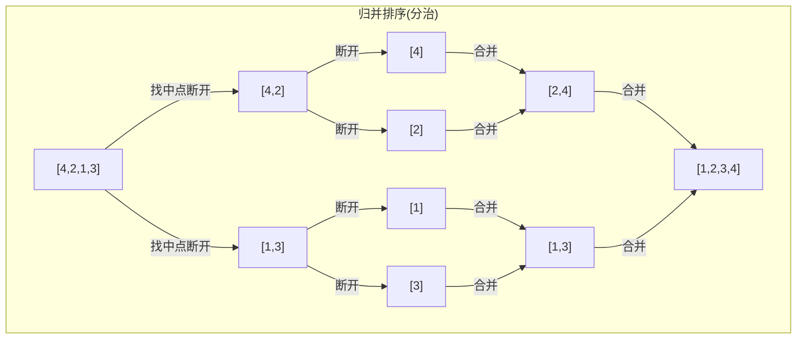
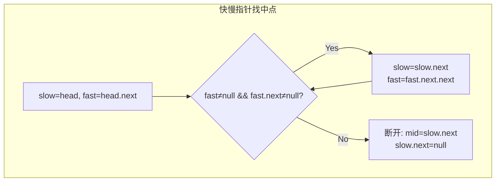

# LeetCode 148. Sort List（排序链表） — **中等**

## 考点
Linked List, Two Pointers, Divide and Conquer, Sorting, Merge Sort

## 题目描述
给你链表的头结点 `head` ，请将其按 **升序** 排列并返回 **排序后的链表** 。

**示例 1：**

```
输入：head = [4,2,1,3]
输出：[1,2,3,4]
```

**示例 2：**

```
输入：head = [-1,5,3,4,0]
输出：[-1,0,3,4,5]
```

**示例 3：**

```
输入：head = []
输出：[]
```

**提示：**
- 链表中节点的数目在范围 `[0, 5 * 10^4]` 内
- `-10^5 <= Node.val <= 10^5`

**进阶：** 你可以在 `O(n log n)` 时间复杂度和常数级空间复杂度下，对链表进行排序吗？

## 图解





## 解题思路

### 核心思路
对链表进行排序，要求 O(n log n) 时间。常见的 O(n log n) 排序算法有：归并排序、快速排序、堆排序。对于链表：
- **归并排序**是最佳选择（天然适合链表的合并操作，O(1) 额外空间合并）
- 快速排序在链表上分区操作复杂，且不稳定
- 堆排序需要随机访问，不适合链表

### 方法一：自顶向下归并排序（递归）

#### 算法步骤
1. **边界条件**：如果链表为空或只有一个节点，直接返回
2. **找中点**：使用快慢指针找到链表中点，断开链表为左右两半
3. **递归排序**：对左右两部分递归调用 `sortList`
4. **合并**：合并两个已排序的链表（类似 LeetCode 21）

#### 图解示例

```
head = [4, 2, 1, 3]

递归分解过程：
                    [4→2→1→3]
                   /          \
             [4→2]            [1→3]
            /     \          /     \
          [4]     [2]      [1]     [3]
           ↓       ↓        ↓       ↓
  (单节点直接返回)  

合并过程：
          [4] + [2]          [1] + [3]
             ↓                   ↓
          [2→4]     +       [1→3]
                 \         /
                  [1→2→3→4]


ASCII 分解合并树：
Level 0:        [4→2→1→3]              ← 原始链表
               ↙          ↘
Level 1:    [4→2]          [1→3]        ← 快慢指针分割
           ↙    ↘        ↙    ↘
Level 2:  [4]   [2]     [1]   [3]      ← 单节点，停止分割
           ↘    ↙        ↘    ↙
Level 1':   [2→4]         [1→3]        ← 合并两个有序链表
               ↘          ↙
Level 0':       [1→2→3→4]              ← 最终结果

快慢指针找中点：
[4] → [2] → [1] → [3]
 ↑     ↑           ↑
slow  (停顿)     fast

Step 1: slow=2, fast=1
Step 2: slow=1, fast=null → 中点在 1 之前

分割: left=[4→2], right=[1→3]
```

#### 逐步追踪

**分解阶段**：

| 递归层 | 当前链表 | 快慢找中点 | 左半 | 右半 |
|--------|---------|-----------|------|------|
| 0 | [4,2,1,3] | slow 到 1, 前驱是 2 | [4,2] | [1,3] |
| 1-L | [4,2] | slow 到 2, 断开 | [4] | [2] |
| 1-R | [1,3] | slow 到 1, 断开 | [1] | [3] |

**合并阶段**：

| 步骤 | 左链表 | 右链表 | 合并结果 |
|------|--------|--------|---------|
| 1 | [4] | [2] | [2,4] |
| 2 | [1] | [3] | [1,3] |
| 3 | [2,4] | [1,3] | [1,2,3,4] |

合并 [2,4] 和 [1,3]：
```
dummy → ?
比较 2 vs 1: 1 较小 → dummy→1, right 前进
比较 2 vs 3: 2 较小 → 1→2, left 前进
比较 4 vs 3: 3 较小 → 1→2→3, right 前进
right 为空 → 接上 left 剩余: 1→2→3→4
```

### 方法二：自底向上归并排序（迭代，O(1) 空间）

不依赖递归栈，严格 O(1) 额外空间（忽略递归栈的 O(log n)）。

#### 算法步骤
1. 从 `step = 1` 开始，每次将步长翻倍
2. 对于当前步长 `step`，将链表分割为长度为 `step` 的子链表对
3. 合并每对子链表
4. `step *= 2`，重复直到 `step >= n`

```
step=1: 合并 [4][2]→[2,4], [1][3]→[1,3]
        链表: [2→4→1→3]

step=2: 合并 [2,4][1,3]→[1,2,3,4]
        链表: [1→2→3→4]

step=4 ≥ n=4, 停止
```

#### 逐步追踪（迭代）

| 轮次 | step | 分组 | 合并操作 | 结果 |
|------|------|------|---------|------|
| 1 | 1 | [4],[2] | merge→[2,4] | |
| | | [1],[3] | merge→[1,3] | [2,4,1,3] |
| 2 | 2 | [2,4],[1,3] | merge→[1,2,3,4] | [1,2,3,4] |
| 3 | 4 | 4≥4 停止 | - | 完成 |

### 方法三：快速排序（不推荐）

链表分区需要额外处理，且最坏 O(n²)，不适合。

### 边界情况
- 空链表：返回 null
- 单节点：直接返回
- 两节点：快慢指针找到中点（slow 和 fast 各一步后 fast.next==null），分割后合并

### 复杂度分析

| 方法 | 时间复杂度 | 空间复杂度 |
|------|-----------|-----------|
| 自顶向下归并 | O(n log n) | O(log n) 递归栈 |
| 自底向上归并 | O(n log n) | O(1) |
| 快速排序 | O(n log n) 平均 / O(n²) 最坏 | O(log n) |

推荐自底向上迭代归并（满足进阶要求的 O(1) 空间），面试中自顶向下递归归并也完全可接受。
