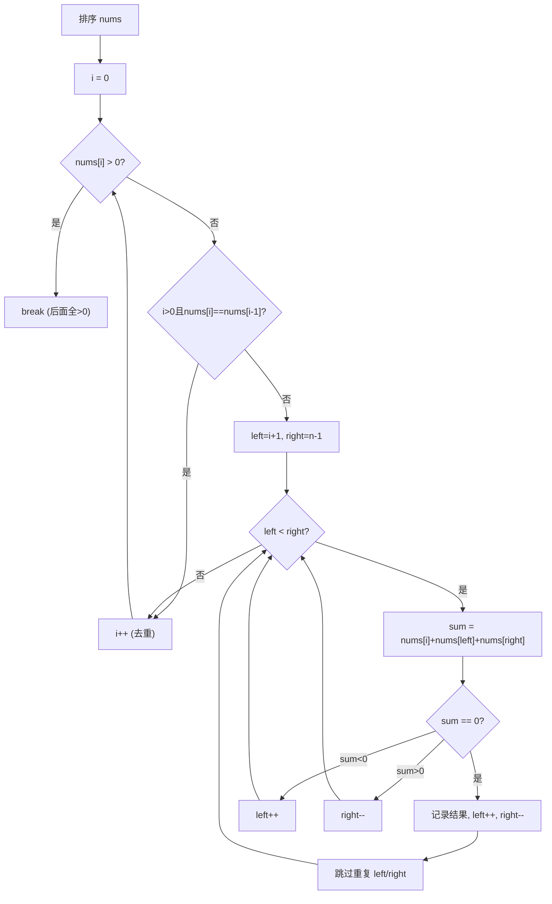

# LeetCode 15. 3Sum（三数之和） — **中等**

## 考点
Array, Two Pointers, Sorting

## 题目描述
给你一个整数数组 `nums`，判断是否存在三元组 `[nums[i], nums[j], nums[k]]` 满足 `i != j`、`i != k` 且 `j != k`，同时还满足 `nums[i] + nums[j] + nums[k] == 0`。请你返回所有和为 `0` 且不重复的三元组。

注意：答案中不可以包含重复的三元组。

**示例 1：**
```
输入：nums = [-1,0,1,2,-1,-4]
输出：[[-1,-1,2],[-1,0,1]]
解释：
nums[0] + nums[1] + nums[2] = (-1) + 0 + 1 = 0 。
nums[1] + nums[2] + nums[4] = 0 + 1 + (-1) = 0 。
nums[0] + nums[3] + nums[4] = (-1) + 2 + (-1) = 0 。
不同的三元组是 [-1,0,1] 和 [-1,-1,2] 。
注意，输出的顺序和三元组的顺序并不重要。
```

**示例 2：**
```
输入：nums = [0,1,1]
输出：[]
解释：唯一可能的三元组和不为 0 。
```

**示例 3：**
```
输入：nums = [0,0,0]
输出：[[0,0,0]]
解释：唯一可能的三元组和为 0 。
```

**提示：**
- `3 <= nums.length <= 3000`
- `-10^5 <= nums[i] <= 10^5`

## 图解



## 解题思路

### 核心思路
将三数之和转化为两数之和：排序后固定第一个数，在剩下的有序数组中使用双指针寻找两个数，使三数之和为 0。排序不仅让双指针可行，还使得去重变得简单（跳过相同元素即可）。

### 算法步骤

**方法一：暴力枚举（不可行）**

1. 三重循环枚举所有三元组，复杂度 O(n³)，n=3000 时约为 270 亿次，必定超时

**方法二：排序 + 双指针（最优解）**

1. 对数组进行升序排序，时间复杂度 O(n log n)
2. 遍历排序后的数组，固定第一个数 `nums[i]`（i 从 0 到 n-3）：
   - **剪枝优化**：如果 `nums[i] > 0`，由于数组已排序，后面的数都大于 0，三数之和不可能为 0，直接 break
   - **去重**：如果 `i > 0` 且 `nums[i] == nums[i-1]`，跳过（避免重复三元组）
   - 在 `[i+1, n-1]` 区间使用双指针：
     - `left = i + 1`，`right = n - 1`
     - 当 `left < right` 时循环：
       - 计算 `sum = nums[i] + nums[left] + nums[right]`
       - 如果 `sum == 0`：记录结果，然后同时跳过 `left` 和 `right` 的重复值
       - 如果 `sum < 0`：`left++`（需要更大的值）
       - 如果 `sum > 0`：`right--`（需要更小的值）
3. 返回结果列表

### 图解示例

以输入 `nums = [-1, 0, 1, 2, -1, -4]` 为例：

```
Step 0: 排序
  nums = [-4, -1, -1, 0, 1, 2]

═══════════════════════════════════════
i = 0, nums[i] = -4

  目标：找到两个数使它们的和 = 0 - (-4) = 4

  [-4, -1, -1,  0,  1,  2]
    ↑   ↑                ↑
    i  left            right

  sum = -4 + (-1) + 2 = -3  (< 0)
  left++

  [-4, -1, -1,  0,  1,  2]
    ↑       ↑            ↑
    i      left        right

  sum = -4 + (-1) + 2 = -3  (< 0)
  left++

  [-4, -1, -1,  0,  1,  2]
    ↑          ↑         ↑
    i         left     right

  sum = -4 + 0 + 2 = -2  (< 0)
  left++

  [-4, -1, -1,  0,  1,  2]
    ↑             ↑      ↑
    i            left  right

  sum = -4 + 1 + 2 = -1  (< 0)
  left++

  此时 left(5) >= right(5)，循环结束，未找到解

═══════════════════════════════════════
i = 1, nums[i] = -1

  目标：找到两个数使它们的和 = 0 - (-1) = 1

  [-4, -1, -1,  0,  1,  2]
        ↑   ↑            ↑
        i  left       right

  sum = -1 + (-1) + 2 = 0  ✓ 找到解！
  结果: [-1, -1, 2]
  去重: left++ → left=3(跳过重复的-1), right-- → right=4

  [-4, -1, -1,  0,  1,  2]
        ↑       ↑    ↑
        i      left right

  sum = -1 + 0 + 1 = 0  ✓ 找到解！
  结果: [-1, 0, 1]
  去重: left++ → left=4, right-- → right=3
  left(4) > right(3)，循环结束

═══════════════════════════════════════
i = 2, nums[i] = -1
  i > 0 且 nums[2] == nums[1] → 跳过（去重）

═══════════════════════════════════════
i = 3, nums[i] = 0
  0 > 0? 否，继续

  目标：找到两个数使它们的和 = 0 - 0 = 0

  [-4, -1, -1,  0,  1,  2]
                 ↑  ↑   ↑
                 i left right

  sum = 0 + 1 + 2 = 3 (> 0), right--

  [-4, -1, -1,  0,  1,  2]
                 ↑  ↑  ↑
                 i left right

  sum = 0 + 1 + 1 = 2 (> 0), right--
  left(4) >= right(3)，循环结束

═══════════════════════════════════════
最终结果：[[-1, -1, 2], [-1, 0, 1]]
```

### 逐步追踪

| 步骤 | i | nums[i] | left(idx/val) | right(idx/val) | sum | 与0比较 | 操作 |
|------|---|---------|---------------|----------------|-----|---------|------|
| 1    | 0 | -4      | 1/-1          | 5/2            | -3  | < 0     | left++ |
| 2    | 0 | -4      | 2/-1          | 5/2            | -3  | < 0     | left++ |
| 3    | 0 | -4      | 3/0           | 5/2            | -2  | < 0     | left++ |
| 4    | 0 | -4      | 4/1           | 5/2            | -1  | < 0     | left++ |
| 5    | 1 | -1      | 2/-1          | 5/2            | 0   | = 0     | 记录[-1,-1,2], left++, right-- |
| 6    | 1 | -1      | 3/0           | 4/1            | 0   | = 0     | 记录[-1,0,1], left++, right-- |
| 7    | 2 | -1      | —             | —              | —   | —       | 跳过(与i=1相同) |
| 8    | 3 | 0       | 4/1           | 5/2            | 3   | > 0     | right-- |
| 9    | 3 | 0       | 4/1           | 4/1            | 2   | > 0     | right--, 循环结束 |

### 边界情况

1. **数组长度恰好为 3**：只有一组可能的三元组，直接双指针判断
2. **全部为正数或全部为负数**：剪枝优化（nums[i] > 0 时 break）大幅减少计算
3. **大量重复元素**（如 [0, 0, 0, 0, 0]）：去重逻辑确保只返回一组 [0, 0, 0]
4. **没有任何和为 0 的三元组**（如 [1, 2, 3, 4, 5]）：nums[0]=1 > 0，直接 break，O(1) 判断
5. **包含极端值**（如 [-10^5, 0, 10^5]）：注意 sum 可能超出 int 范围，需要使用 long（Java）

### 复杂度分析

时间复杂度：O(n²) — 排序 O(n log n)，外层循环 O(n)，内层双指针 O(n)，总体 O(n²)
空间复杂度：O(1) — 不计返回结果的存储空间，排序也可以在原数组上进行

### 去重策略详解

去重是这题最容易出错的地方：

```
去重有三个位置：

1. 固定数去重（外层）：
   if (i > 0 && nums[i] == nums[i-1]) continue;
   注意：是和 nums[i-1] 比较，不是 nums[i+1]！
   原因：[-1, -1, 2] 这种解，第一个 -1 已经在 i=1 时找到了，
        第二个 -1 不需要再找，否则会重复。

2. 左指针去重（内层找到解后）：
   while (left < right && nums[left] == nums[left+1]) left++;
   left++之后再安全推进一次。

3. 右指针去重（内层找到解后）：
   while (left < right && nums[right] == nums[right-1]) right--;
   right--之后再安全后退一次。
```

### 方法对比

| 方法 | 时间复杂度 | 空间复杂度 | 说明 |
|------|-----------|-----------|------|
| 暴力三重循环 | O(n³) | O(1) | 必定超时 |
| 哈希表（固定一个 + Two Sum） | O(n²) | O(n) | 可行，但去重复杂 |
| 排序 + 双指针 | O(n²) | O(1) | 最优解，去重简单 ✓ |
