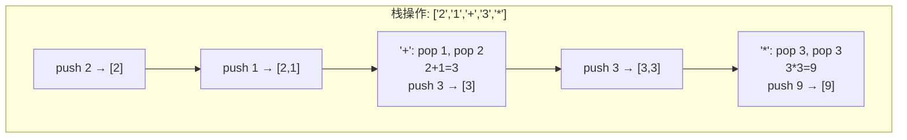
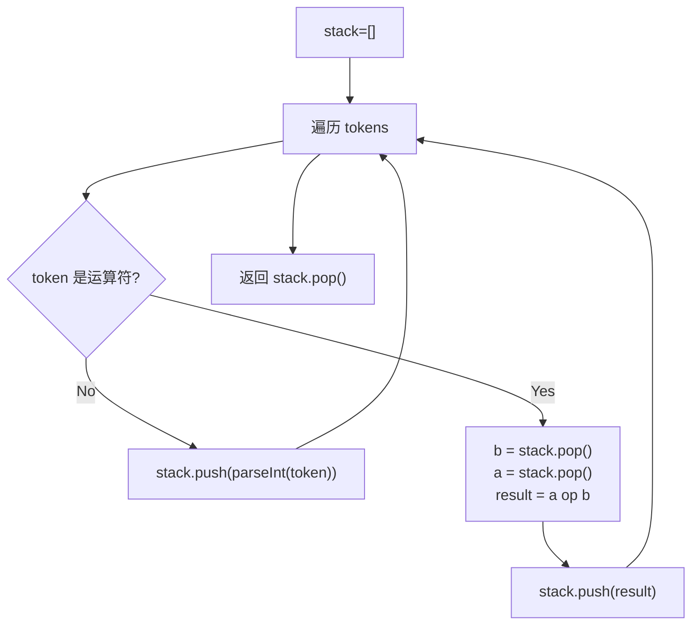

# LeetCode 150. Evaluate Reverse Polish Notation（逆波兰表达式求值） — **中等**

## 考点
Stack, Array, Math

## 题目描述
给你一个字符串数组 `tokens` ，表示一个根据 **逆波兰表示法** 表示的算术表达式。

请你计算该表达式。返回一个表示表达式值的整数。

**注意：**
- 有效的算符为 `'+'`、`'-'`、`'*'` 和 `'/'` 。
- 每个操作数（运算对象）都可以是一个整数或者另一个表达式。
- 两个整数之间的除法总是 **向零截断** 。
- 表达式中不含除零运算。
- 输入是一个根据逆波兰表示法表示的算术表达式。
- 答案及所有中间计算结果可以用 **32 位** 整数表示。

**示例 1：**

```
输入：tokens = ["2","1","+","3","*"]
输出：9
解释：该算式转化为常见的中缀算术表达式为：((2 + 1) * 3) = 9
```

**示例 2：**

```
输入：tokens = ["4","13","5","/","+"]
输出：6
解释：该算式转化为常见的中缀算术表达式为：(4 + (13 / 5)) = 6
```

**示例 3：**

```
输入：tokens = ["10","6","9","3","+","-11","*","/","*","17","+","5","+"]
输出：22
解释：该算式转化为常见的中缀算术表达式为：
  ((10 * (6 / ((9 + 3) * -11))) + 17) + 5
= ((10 * (6 / (12 * -11))) + 17) + 5
= ((10 * (6 / -132)) + 17) + 5
= ((10 * 0) + 17) + 5
= (0 + 17) + 5
= 17 + 5
= 22
```

**提示：**
- `1 <= tokens.length <= 10^4`
- `tokens[i]` 是一个算符（`"+"`、`"-"`、`"*"` 或 `"/"`），或是在范围 `[-200, 200]` 内的一个整数

## 图解





## 解题思路

### 核心思路
计算逆波兰表达式（后缀表达式）的值。逆波兰表达式的特点：**运算符出现在操作数之后**，天然适合用栈来计算。遇到数字压栈，遇到运算符则弹出两个操作数，计算结果再压回栈。

### 方法一：栈模拟

#### 算法步骤
1. 初始化一个整数栈
2. 遍历 `tokens` 中的每个 `token`：
   - 如果 `token` 是数字：转换为整数后压入栈
   - 如果 `token` 是运算符：
     - 弹出栈顶元素作为 `b`（右操作数）
     - 弹出栈顶元素作为 `a`（左操作数）
     - 根据运算符计算 `a op b`
     - 将结果压入栈
3. 返回栈顶元素（最终结果）

#### 图解示例

```
tokens = ["2", "1", "+", "3", "*"]

遍历过程：
  token="2": 压栈 → 栈: [2]
  token="1": 压栈 → 栈: [2, 1]
  token="+": 弹出 b=1, 弹出 a=2, 计算 2+1=3, 压栈 → 栈: [3]
  token="3": 压栈 → 栈: [3, 3]
  token="*": 弹出 b=3, 弹出 a=3, 计算 3*3=9, 压栈 → 栈: [9]

返回 9


中缀 vs 后缀的对应关系：
中缀: (2 + 1) * 3
后缀: 2 1 + 3 *

ASCII 栈操作示意图：
   "2"      "1"      "+"       "3"      "*"
  ┌───┐   ┌───┐    ┌───┐    ┌───┐    ┌───┐
  │   │   │   │    │   │    │   │    │   │
  │   │   │ 1 │    │   │    │ 3 │    │   │
  │ 2 │   │ 2 │    │ 3 │    │ 3 │    │ 9 │
  └───┘   └───┘    └───┘    └───┘    └───┘
   压2      压1    弹1弹2    压3    弹3弹3
                  算2+1=3          算3*3=9
                   压3              压9
```

#### 逐步追踪

```
tokens = ["4","13","5","/","+"]

| Step | token | 栈操作 | 栈内容 |
|------|-------|--------|--------|
| 1 | "4" | 压入 4 | [4] |
| 2 | "13" | 压入 13 | [4, 13] |
| 3 | "5" | 压入 5 | [4, 13, 5] |
| 4 | "/" | pop b=5, pop a=13, 13/5=2, push 2 | [4, 2] |
| 5 | "+" | pop b=2, pop a=4, 4+2=6, push 6 | [6] |

返回 6


tokens = ["10","6","9","3","+","-11","*","/","*","17","+","5","+"]

| Step | token | 栈操作 | 栈 |
|------|-------|--------|-----|
| 1 | "10" | push 10 | [10] |
| 2 | "6" | push 6 | [10,6] |
| 3 | "9" | push 9 | [10,6,9] |
| 4 | "3" | push 3 | [10,6,9,3] |
| 5 | "+" | 9+3=12 | [10,6,12] |
| 6 | "-11" | push -11 | [10,6,12,-11] |
| 7 | "*" | 12*(-11)=-132 | [10,6,-132] |
| 8 | "/" | 6/(-132)=0 | [10,0] |
| 9 | "*" | 10*0=0 | [0] |
| 10 | "17" | push 17 | [0,17] |
| 11 | "+" | 0+17=17 | [17] |
| 12 | "5" | push 5 | [17,5] |
| 13 | "+" | 17+5=22 | [22] |

返回 22
```

#### 中缀表达式 ↔ 后缀表达式

```
中缀: (10 * (6 / ((9 + 3) * -11))) + 17 + 5
后缀: 10 6 9 3 + -11 * / * 17 + 5 +

为什么后缀不需要括号？
  因为运算符顺序隐含了计算顺序：
  9 3 + → 先算 9+3
  12 -11 * → 再乘以 -11
  6 -132 / → 再用 6 除
  10 0 * → 再乘以 10
  0 17 + → 加 17
  17 5 + → 加 5
```

### 方法二：递归（基于语法的递归下降解析）

不推荐用于本题，但展示了后缀表达式可以被递归解析（从右向左处理）。

### 除法注意事项

```
Java: 整数除法自动向零截断（和题目要求一致）
      6 / (-132) = 0  ✓

注意: 不要用 Math.floor 等会向负无穷取整的函数
      用 (int)(a / b) 或 a / b 即可（Java 整数除法向零截断）

Python: 整数除法向负无穷取整 (//)
        需要用 int(a / b) 来实现向零截断
```

### 边界情况
- 单一数字：直接返回
- 负数：正常的整数运算
- 除法向零截断：`-3 / 2 = -1`（而非 `-2`）
- 所有计算中间结果在 32 位 int 范围内

### 复杂度分析

| 方法 | 时间复杂度 | 空间复杂度 |
|------|-----------|-----------|
| 栈模拟 | O(n) | O(n) |
| 递归 | O(n) | O(n) |

每个 token 最多出入栈一次，总复杂度 O(n)。栈空间最坏 O(n)（全是数字时）。
