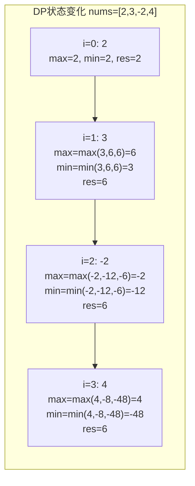
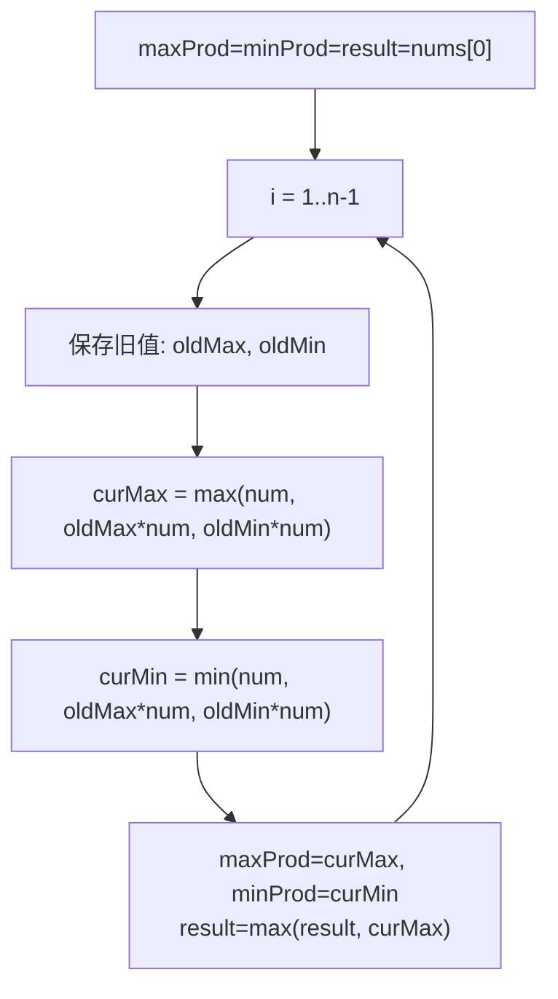

# LeetCode 152. Maximum Product Subarray（乘积最大子数组） — **中等**

## 考点
Array, Dynamic Programming

## 题目描述
给你一个整数数组 `nums` ，请你找出数组中乘积最大的非空连续子数组（该子数组中至少包含一个数字），并返回该子数组所对应的乘积。

测试用例的答案是一个 **32-位** 整数。

**示例 1：**

```
输入: nums = [2,3,-2,4]
输出: 6
解释: 子数组 [2,3] 有最大乘积 6。
```

**示例 2：**

```
输入: nums = [-2,0,-1]
输出: 0
解释: 结果不能为 2, 因为 [-2,-1] 不是子数组。
```

**提示：**
- `1 <= nums.length <= 2 * 10^4`
- `-10 <= nums[i] <= 10`
- `nums` 的任何子数组的乘积都 **保证** 是一个 **32-位** 整数

## 图解





## 解题思路

### 核心思路
求数组中的**最大乘积子数组**。与最大子数组和（Kadane 算法）不同，乘积有负数的问题：**负负得正**意味着当前的最小值（负数）可能在乘以下一个负数后变成最大值。因此需要同时维护以当前位置结尾的**最大乘积**和**最小乘积**。

### 关键洞察
- 当前位置的最大乘积可能来自：
  1. 前一个位置的最大乘积 × 当前数（正数延伸）
  2. 前一个位置的最小乘积 × 当前数（负负得正）
  3. 当前数本身（重新开始子数组）
  
- 同理，最小乘积也有三种来源

### 方法一：动态规划（双变量滚动）

#### 状态定义
- `maxProd`：以当前位置结尾的子数组的最大乘积
- `minProd`：以当前位置结尾的子数组的最小乘积
- `result`：全局最大乘积

#### 状态转移
```
curMax = max(nums[i], maxProd × nums[i], minProd × nums[i])
curMin = min(nums[i], maxProd × nums[i], minProd × nums[i])
result = max(result, curMax)
maxProd = curMax, minProd = curMin
```

注意：更新 `curMax` 和 `curMin` 时要用旧的 `maxProd` 和 `minProd` 值，所以需要临时变量。

#### 算法步骤
1. 初始化 `maxProd = minProd = result = nums[0]`
2. 遍历 `i` 从 1 到 n-1：
   - 用临时变量保存旧的 `maxProd` 和 `minProd`
   - 计算 `curMax` 和 `curMin`
   - 更新 `result`
3. 返回 `result`

#### 图解示例

```
nums = [2, 3, -2, 4]

逐位置追踪：

i=0, nums[0]=2:
  maxProd=2, minProd=2, result=2

i=1, nums[1]=3:
  candidates for max: max(3, 2×3=6, 2×3=6) = 6
  candidates for min: min(3, 2×3=6, 2×3=6) = 3
  maxProd=6, minProd=3, result=6

i=2, nums[2]=-2:
  candidates for max: max(-2, 6×(-2)=-12, 3×(-2)=-6) = -2
  candidates for min: min(-2, 6×(-2)=-12, 3×(-2)=-6) = -12
  maxProd=-2, minProd=-12, result=6

i=3, nums[3]=4:
  candidates for max: max(4, -2×4=-8, -12×4=-48) = 4
  candidates for min: min(4, -2×4=-8, -12×4=-48) = -48
  maxProd=4, minProd=-48, result=6

返回 6 (子数组 [2,3])


ASCII 状态变化：
         [2]      [3]      [-2]     [4]
maxProd:  2   →    6   →    -2  →    4
minProd:  2   →    3   →   -12  →  -48
result:   2   →    6   →     6  →    6

最优子数组: [2, 3] 乘积 = 6
```

#### 逐步追踪

| i | nums[i] | 旧 maxProd | 旧 minProd | 候选最大值 | 候选最小值 | 新 maxProd | 新 minProd | result |
|---|---------|-----------|-----------|-----------|-----------|-----------|-----------|--------|
| 0 | 2 | - | - | - | - | 2 | 2 | 2 |
| 1 | 3 | 2 | 2 | max(3,6,6)=6 | min(3,6,6)=3 | 6 | 3 | 6 |
| 2 | -2 | 6 | 3 | max(-2,-12,-6)=-2 | min(-2,-12,-6)=-12 | -2 | -12 | 6 |
| 3 | 4 | -2 | -12 | max(4,-8,-48)=4 | min(4,-8,-48)=-48 | 4 | -48 | 6 |

### 方法二：正反两次遍历

利用"负负得正"的特性，从左右两个方向各扫一遍：
1. 从左到右：遇到 0 重置乘积为 1，否则乘积累积，更新最大值
2. 从右到左：同样的操作

```
nums = [2, 3, -2, 4]

左到右: 2→6→-12→-48, max=6
        (遇到-2后变负，继续往后乘，在4处是-48)
        实际上遇到负数的极端情况，两遍遍历可以覆盖

右到左: 4→-8→-24→-48, max=6

原因: 如果负数个数为偶数，左到右可覆盖
     如果负数个数为奇数，需要排除最左或最右的负数
     两边各扫一遍自然覆盖了这两种情况
```

### 方法三：DP 数组（二维）

```
dp[i][0] = 以 i 结尾的最小乘积
dp[i][1] = 以 i 结尾的最大乘积
```

与方法一等价，但空间 O(n)，可优化为 O(1)。

### 边界情况
- 单元素：直接返回该元素（可能为负）
- 包含 0：遇到 0 时乘积归 0，子数组在此处断裂，下一个数重新开始
- 全部负数：返回绝对值最小的负数（或偶数个负数时返回正数乘积）
- 因为 `-10 ≤ nums[i] ≤ 10`，乘积范围有限

### 复杂度分析

| 方法 | 时间复杂度 | 空间复杂度 |
|------|-----------|-----------|
| DP 双变量 | O(n) | O(1) |
| 正反两次遍历 | O(n) | O(1) |
| DP 数组 | O(n) | O(n) |

推荐方法一的双变量滚动 DP，最直观且通用。
