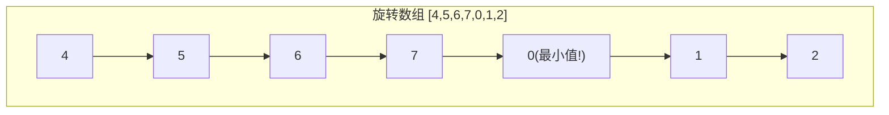
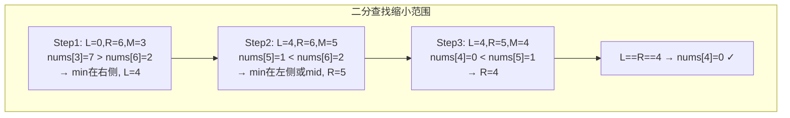
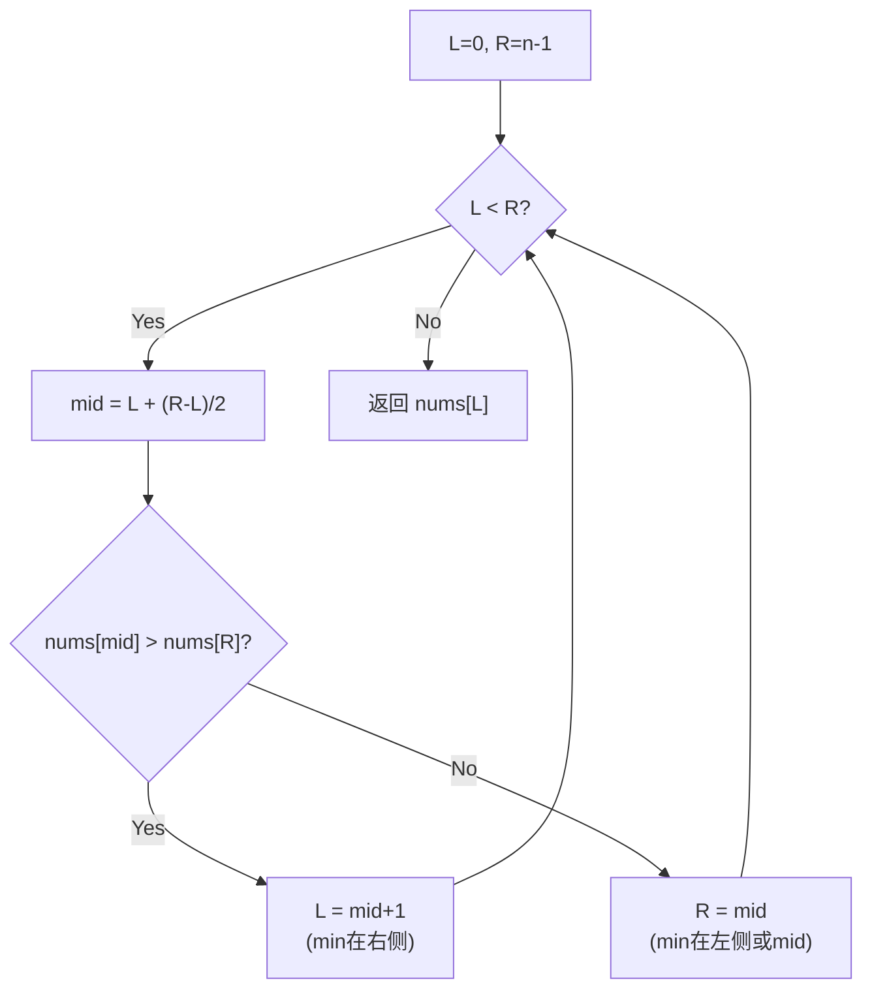

# LeetCode 153. Find Minimum in Rotated Sorted Array（寻找旋转排序数组中的最小值） — **中等**

## 考点
Array, Binary Search

## 题目描述
已知一个长度为 `n` 的数组，预先按照升序排列，经由 `1` 到 `n` 次 **旋转** 后，得到输入数组。例如，原数组 `nums = [0,1,2,4,5,6,7]` 在变化后可能得到：
- 若旋转 `4` 次，则可以得到 `[4,5,6,7,0,1,2]`
- 若旋转 `7` 次，则可以得到 `[0,1,2,4,5,6,7]`

注意，数组 `[a[0], a[1], a[2], ..., a[n-1]]` **旋转一次** 的结果为数组 `[a[n-1], a[0], a[1], a[2], ..., a[n-2]]` 。

给你一个元素值 **互不相同** 的数组 `nums` ，它原来是一个升序排列的数组，并按上述情形进行了多次旋转。请你找出并返回数组中的 **最小元素** 。

你必须设计一个时间复杂度为 `O(log n)` 的算法解决此问题。

**示例 1：**

```
输入：nums = [3,4,5,1,2]
输出：1
解释：原数组为 [1,2,3,4,5] ，旋转 3 次得到输入数组。
```

**示例 2：**

```
输入：nums = [4,5,6,7,0,1,2]
输出：0
解释：原数组为 [0,1,2,4,5,6,7] ，旋转 4 次得到输入数组。
```

**示例 3：**

```
输入：nums = [11,13,15,17]
输出：11
解释：原数组为 [11,13,15,17] ，旋转 4 次得到输入数组。
```

**提示：**
- `n == nums.length`
- `1 <= n <= 5000`
- `-5000 <= nums[i] <= 5000`
- `nums` 中的所有整数 **互不相同**
- `nums` 原来是一个升序排序的数组，并进行了 `1` 至 `n` 次旋转

## 图解







## 解题思路

### 核心思路

旋转排序数组由两段升序子数组组成。最小值即为第二段升序子数组的第一个元素（也是"旋转点"）。利用二分查找，每次比较 `nums[mid]` 与 `nums[right]` 来判断 mid 落在哪一段，进而缩小搜索范围。

### 算法步骤

1. 初始化 `left = 0`, `right = n - 1`
2. 当 `left < right` 时循环：
   - 计算 `mid = left + (right - left) / 2`
   - 若 `nums[mid] > nums[right]`：mid 落在左侧大值段，最小值在 mid 右侧 → `left = mid + 1`
   - 若 `nums[mid] < nums[right]`：mid 落在右侧小值段，最小值在 mid 或其左侧 → `right = mid`
3. 循环结束时 `left == right`，返回 `nums[left]`

### 图解示例

**示例**: `nums = [4, 5, 6, 7, 0, 1, 2]`

```
原始旋转数组示意（波浪形）：
  值
  7 |        ●
  6 |      ●
  5 |    ●
  4 |  ●
  3 |
  2 |              ●
  1 |            ●
  0 |          ●
    +---+---+---+---+---+---+---+
      0   1   2   3   4   5   6   索引

旋转点 ↑
左段 [4,5,6,7]（递增，较大值）
右段 [0,1,2]  （递增，较小值）
最小值 = 0（右段起点）
```

**二分查找逐步过程：**

```
Step 1: left=0, right=6, mid=3
        索引:  0  1  2  3  4  5  6
        nums: [4, 5, 6, 7, 0, 1, 2]
               L        M        R
        nums[mid]=7 > nums[right]=2
        → mid在左段，最小值在右侧 → left = mid+1 = 4

Step 2: left=4, right=6, mid=5
        索引:  0  1  2  3  4  5  6
        nums: [4, 5, 6, 7, 0, 1, 2]
                        L  M     R
        nums[mid]=1 < nums[right]=2
        → mid在右段，最小值在mid或左侧 → right = mid = 5

Step 3: left=4, right=5, mid=4
        索引:  0  1  2  3  4  5  6
        nums: [4, 5, 6, 7, 0, 1, 2]
                        L  R
                        M
        nums[mid]=0 < nums[right]=1
        → right = mid = 4

Step 4: left=4, right=4 → 循环结束
        nums[4] = 0 为最小值
```

### 逐步追踪表

| 步骤 | left | right | mid | nums[mid] | nums[right] | 判断 | 操作 |
|------|------|-------|-----|-----------|-------------|------|------|
| 1 | 0 | 6 | 3 | 7 | 2 | mid > right | left=4 |
| 2 | 4 | 6 | 5 | 1 | 2 | mid < right | right=5 |
| 3 | 4 | 5 | 4 | 0 | 1 | mid < right | right=4 |
| 4 | 4 | 4 | - | - | - | left==right | 返回4 |

### 边界情况

| 场景 | 输入 | 处理 |
|------|------|------|
| 旋转0次（已有序） | `[1,2,3,4,5]` | 每次 `mid < right`，right 逐步左移，最终得到 nums[0]=1 |
| 旋转n-1次 | `[2,3,4,5,1]` | 正常二分定位到最小值1 |
| 单元素数组 | `[1]` | left==right 直接返回 |
| 两元素旋转 | `[2,1]` | mid=0, nums[0]=2 > nums[1]=1, left=1, 返回 nums[1]=1 |

### 复杂度分析

| 指标 | 值 | 说明 |
|------|-----|------|
| 时间复杂度 | O(log n) | 每次迭代搜索空间减半 |
| 空间复杂度 | O(1) | 只使用常数个变量 |
