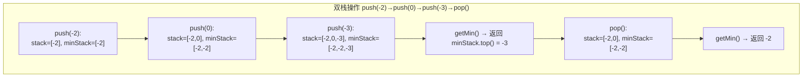
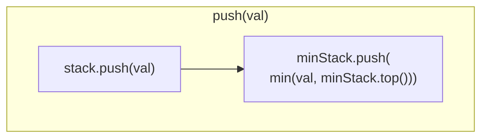
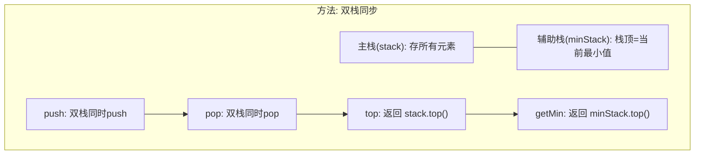

# LeetCode 155. Min Stack（最小栈） — **中等**

## 考点
Stack, Design

## 题目描述
设计一个支持 `push` ，`pop` ，`top` 操作，并能在常数时间内检索到最小元素的栈。

实现 `MinStack` 类:
- `MinStack()` 初始化堆栈对象。
- `void push(int val)` 将元素 val 推入堆栈。
- `void pop()` 删除堆栈顶部的元素。
- `int top()` 获取堆栈顶部的元素。
- `int getMin()` 获取堆栈中的最小元素。

**示例 1：**

```
输入：
["MinStack","push","push","push","getMin","pop","top","getMin"]
[[],[-2],[0],[-3],[],[],[],[]]

输出：
[null,null,null,null,-3,null,0,-2]

解释：
MinStack minStack = new MinStack();
minStack.push(-2);
minStack.push(0);
minStack.push(-3);
minStack.getMin();   --> 返回 -3.
minStack.pop();
minStack.top();      --> 返回 0.
minStack.getMin();   --> 返回 -2.
```

**提示：**
- `-2^31 <= val <= 2^31 - 1`
- `pop`、`top` 和 `getMin` 操作总是在 **非空栈** 上调用
- `push`, `pop`, `top`, and `getMin`最多被调用 `3 * 10^4` 次

## 图解







## 解题思路

### 核心思路

维护一个辅助栈 `minStack`，与主栈 `stack` 同步操作。`minStack` 的栈顶始终是当前主栈中所有元素的最小值。每次 push 时，向 `minStack` 压入 `min(val, minStack.top())`，这样 `getMin()` 只需返回 `minStack` 栈顶即可。

### 方法一：双栈法（辅助栈）

#### 算法步骤

1. `push(val)`: `stack.push(val)`, `minStack.push(min(val, minStack.top()))`
2. `pop()`: `stack.pop()`, `minStack.pop()`
3. `top()`: 返回 `stack.top()`
4. `getMin()`: 返回 `minStack.top()`

#### 图解示例

**操作序列**: `push(-2) → push(0) → push(-3) → getMin() → pop() → top() → getMin()`

```
Step 1: push(-2)
  ┌────┐  ┌────┐
  │    │  │    │
  │    │  │    │
  │ -2 │  │ -2 │
  └────┘  └────┘
  stack  minStack
  (主栈)  (辅助栈)
  min = -2

Step 2: push(0)
  ┌────┐  ┌────┐
  │  0 │  │ -2 │  ← min(-2, 0) = -2
  │ -2 │  │ -2 │
  └────┘  └────┘
  stack  minStack
  min = -2

Step 3: push(-3)
  ┌────┐  ┌────┐
  │ -3 │  │ -3 │  ← min(-2, -3) = -3
  │  0 │  │ -2 │
  │ -2 │  │ -2 │
  └────┘  └────┘
  stack  minStack
  min = -3  → getMin() 返回 -3

Step 4: pop()
  ┌────┐  ┌────┐
  │  0 │  │ -2 │  ← -3 被弹出，辅助栈顶恢复为 -2
  │ -2 │  │ -2 │
  └────┘  └────┘
  stack  minStack
  top() 返回 0, getMin() 返回 -2
```

#### 逐步追踪表

| 操作 | stack 状态 | minStack 状态 | top() | getMin() |
|------|-----------|---------------|-------|----------|
| push(-2) | [-2] | [-2] | -2 | -2 |
| push(0) | [-2, 0] | [-2, -2] | 0 | -2 |
| push(-3) | [-2, 0, -3] | [-2, -2, -3] | -3 | -3 |
| getMin() | [-2, 0, -3] | [-2, -2, -3] | -3 | **-3** |
| pop() | [-2, 0] | [-2, -2] | 0 | -2 |
| top() | [-2, 0] | [-2, -2] | **0** | -2 |
| getMin() | [-2, 0] | [-2, -2] | 0 | **-2** |

### 方法二：单栈存差值法

将元素与当前最小值的差值存入栈。栈中存储 `val - min`，而非原始值。若栈顶为负数，说明最小值被更新。

### 边界情况

| 场景 | 处理 |
|------|------|
| 连续push相同最小值 | minStack 继续压入相同值 |
| push 递减序列 | minStack 每个元素都更新为新最小值 |
| push 递增序列 | minStack 一直压入第一个最小值 |
| pop 到空 | 题目保证不在空栈上调用 pop/top/getMin |

### 复杂度分析

| 操作 | 时间复杂度 | 空间复杂度 |
|------|-----------|-----------|
| push | O(1) | O(n) |
| pop | O(1) | — |
| top | O(1) | — |
| getMin | O(1) | — |
