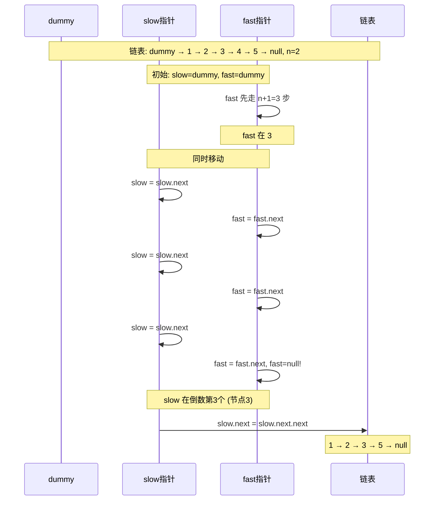

# LeetCode 19. Remove Nth Node From End of List（删除链表的倒数第 N 个结点） — **中等**

## 考点
Linked List, Two Pointers

## 题目描述
给你一个链表，删除链表的倒数第 `n` 个结点，并且返回链表的头结点。

**示例 1：**
```
输入：head = [1,2,3,4,5], n = 2
输出：[1,2,3,5]
```

**示例 2：**
```
输入：head = [1], n = 1
输出：[]
```

**示例 3：**
```
输入：head = [1,2], n = 1
输出：[1]
```

**提示：**
- 链表中结点的数目为 `sz`
- `1 <= sz <= 30`
- `0 <= Node.val <= 100`
- `1 <= n <= sz`

## 图解



## 解题思路

### 核心思路
使用快慢指针（双指针），让快指针先走 n 步，然后两个指针一起移动。当快指针到达链表末尾时，慢指针正好指向**倒数第 n 个节点的前一个节点**，这样就可以轻松删除目标节点。

### 算法步骤

**方法一：两次遍历**

1. 第一次遍历计算链表长度 L
2. 第二次遍历到第 L - n 个节点，删除其下一个节点
3. 注意处理删除头节点的情况（n == L）

**方法二：快慢指针（最优解，一次遍历）**

1. 创建一个哑节点 `dummy`，让 `dummy.next = head`（方便处理删除头节点的情况）
2. 初始化快指针 `fast = dummy`，慢指针 `slow = dummy`
3. 快指针先走 `n + 1` 步（注意：是 n+1 不是 n，这样慢指针才能指向要删除节点的前驱）
4. 快慢指针同时移动，直到 `fast == null`：
   - `fast = fast.next`
   - `slow = slow.next`
5. 此时 `slow` 指向要删除节点的前一个节点
6. 执行删除：`slow.next = slow.next.next`
7. 返回 `dummy.next`

### 图解示例

以输入 `head = [1, 2, 3, 4, 5], n = 2` 为例（删除倒数第 2 个节点，即值为 4 的节点）：

```
初始链表：
  1 → 2 → 3 → 4 → 5 → null

创建哑节点：
  dummy → 1 → 2 → 3 → 4 → 5 → null
    ↑
  slow, fast (初始位置)

═══════════════════════════════════════
阶段 1：fast 先走 n+1 = 3 步

第 1 步: fast = fast.next
  dummy → 1 → 2 → 3 → 4 → 5 → null
    ↑     ↑
   slow  fast

第 2 步: fast = fast.next
  dummy → 1 → 2 → 3 → 4 → 5 → null
    ↑         ↑
   slow      fast

第 3 步: fast = fast.next
  dummy → 1 → 2 → 3 → 4 → 5 → null
    ↑             ↑
   slow          fast

═══════════════════════════════════════
阶段 2：fast 和 slow 同时移动

第 4 步: fast 和 slow 同时移动
  dummy → 1 → 2 → 3 → 4 → 5 → null
            ↑         ↑
           slow      fast

第 5 步: 同时移动
  dummy → 1 → 2 → 3 → 4 → 5 → null
                ↑         ↑
               slow      fast

第 6 步: 同时移动
  dummy → 1 → 2 → 3 → 4 → 5 → null
                    ↑         ↑
                   slow      fast

第 7 步: 同时移动
  dummy → 1 → 2 → 3 → 4 → 5 → null
                        ↑         ↑
                       slow      fast

fast == null, 停止

═══════════════════════════════════════
阶段 3：删除节点

  slow 指向节点 3（值为 3）
  slow.next 指向节点 4（要删除的节点）
  slow.next.next 指向节点 5

  执行: slow.next = slow.next.next
  即: 节点 3 的 next 直接指向节点 5

  结果链表:
  1 → 2 → 3 → 5 → null

  返回 dummy.next → [1, 2, 3, 5] ✓
```

### 逐步追踪

以输入 `head = [1], n = 1` 为例（删除唯一的节点）：

| 步骤 | fast 位置 | slow 位置 | 说明 |
|------|----------|----------|------|
| 初态 | dummy(0) | dummy(0) | dummy → 1 → null |
| fast 走 2 步(1) | 1 | dummy(0) | fast = fast.next |
| fast 走 2 步(2) | null | dummy(0) | fast = fast.next, fast=null |
| 同时移动 | 停止 | — | fast 已为 null |
| 删除 | — | slow.next = slow.next.next | 1.next = null |
| 结果 | — | — | dummy.next = null → 返回 [] |

以输入 `head = [1, 2], n = 1` 为例（删除倒数第 1 个节点）：

| 步骤 | fast 位置 | slow 位置 | 说明 |
|------|----------|----------|------|
| 初态 | dummy | dummy | dummy → 1 → 2 → null |
| fast 走 2 步 (n+1=2) | 1→2 | dummy | fast 经过两次移动 |
| 同时移动(第 1 次) | null | 1 | fast=null, 停止 |
| 删除 | — | slow 在节点 1 | 1.next = 2.next = null |
| 结果 | — | — | dummy.next = 1 → null → [1] |

### 边界情况

1. **删除头节点**（n 等于链表长度）：哑节点确保 `slow` 在 `dummy`，`slow.next = slow.next.next` 正确删除头节点
2. **链表只有一个节点**：同删除头节点的情况
3. **n = 1（删除最后一个节点）**：fast 先走 2 步，slow 指向倒数第二个，删除最后一个
4. **链表长度恰好为 n**：同情况 1

### 复杂度分析

时间复杂度：O(L) — L 为链表长度，只遍历一次
空间复杂度：O(1) — 只使用常数个指针

### 为什么 fast 要走 n+1 步而不是 n 步？

```
如果 fast 只走 n 步：
  slow 在 dummy, fast 在第 n 个节点
  当 fast 到达最后一个节点（非 null）时停止
  slow 指向倒数第 n+1 个节点
  → 不直观，且需要特殊处理

如果 fast 走 n+1 步：
  slow 在 dummy, fast 在第 n+1 个节点
  当 fast 为 null 时停止
  slow 正好指向倒数第 n 个节点的前驱
  → 可以直接删除 slow.next，最自然
```

### 方法对比

| 方法 | 时间复杂度 | 空间复杂度 | 说明 |
|------|-----------|-----------|------|
| 两次遍历 | O(2L)=O(L) | O(1) | 简单但多一次遍历 |
| 快慢指针 | O(L) | O(1) | 最优解，一次遍历 ✓ |
