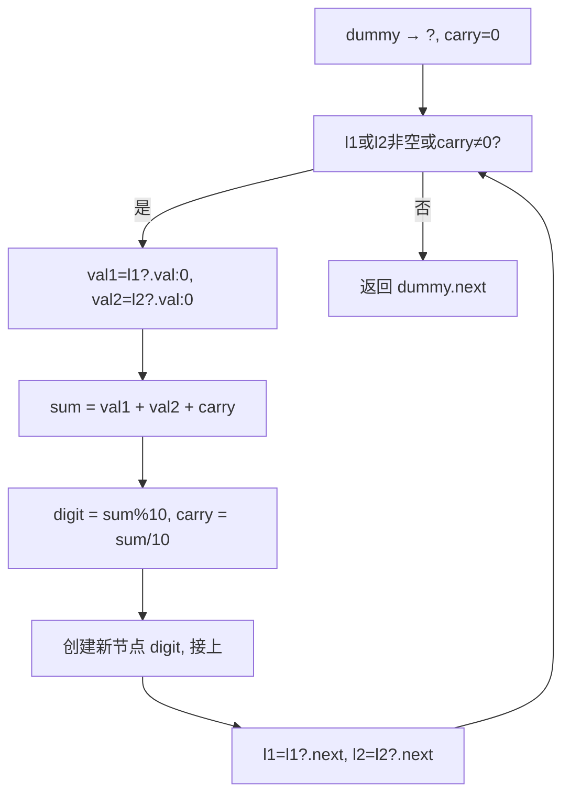

# LeetCode 2. Add Two Numbers（两数相加） — **中等**

## 考点
Linked List, Math

## 题目描述
给你两个 **非空** 的链表，表示两个非负的整数。它们每位数字都是按照 **逆序** 的方式存储的，并且每个节点只能存储 **一位** 数字。

请你将两个数相加，并以相同形式返回一个表示和的链表。

你可以假设除了数字 0 之外，这两个数都不会以 0 开头。

**示例 1：**
```
输入：l1 = [2,4,3], l2 = [5,6,4]
输出：[7,0,8]
解释：342 + 465 = 807.
```

**示例 2：**
```
输入：l1 = [0], l2 = [0]
输出：[0]
```

**示例 3：**
```
输入：l1 = [9,9,9,9,9,9,9], l2 = [9,9,9,9]
输出：[8,9,9,9,0,0,0,1]
```

**提示：**
- 每个链表中的节点数在范围 `[1, 100]` 内
- `0 <= Node.val <= 9`
- 题目数据保证列表表示的数字不含前导零

## 图解



## 解题思路

### 核心思路
模拟小学数学竖式加法。由于链表已经是逆序存储（个位在头节点），可以直接从链表头开始逐位相加，同时维护进位 `carry`。

### 算法步骤

1. 创建一个哑节点 `dummy`，用指针 `curr` 指向它，用于构建结果链表
2. 初始化进位 `carry = 0`
3. 同时遍历两个链表，循环条件：`l1 != null || l2 != null || carry != 0`：
   - 取当前位的值：`val1 = (l1 != null) ? l1.val : 0`
   - 取当前位的值：`val2 = (l2 != null) ? l2.val : 0`
   - 计算和：`sum = val1 + val2 + carry`
   - 当前位结果：`digit = sum % 10`（取个位）
   - 新的进位：`carry = Math.floor(sum / 10)`（取十位，0 或 1）
   - 创建新节点 `new ListNode(digit)`，接到 `curr.next`
   - 移动 `curr = curr.next`
   - 如果 `l1 != null`，`l1 = l1.next`
   - 如果 `l2 != null`，`l2 = l2.next`
4. 返回 `dummy.next`

### 图解示例

以输入 `l1 = [2,4,3] (表示 342), l2 = [5,6,4] (表示 465)` 为例，期望输出 `[7,0,8] (表示 807)`。

```
原始链表：
  l1:  2 → 4 → 3 → null     (表示数字 342)
  l2:  5 → 6 → 4 → null     (表示数字 465)

初始化：
  dummy → ?
  carry = 0

═══════════════════════════════════════════
第 1 轮迭代（个位相加）：
  val1=2, val2=5, carry=0
  sum = 2 + 5 + 0 = 7
  digit = 7 % 10 = 7, carry = 0
  结果节点: 7

  结果链表:  dummy → 7

  l1 移动到 → 4
  l2 移动到 → 6

═══════════════════════════════════════════
第 2 轮迭代（十位相加）：
  val1=4, val2=6, carry=0
  sum = 4 + 6 + 0 = 10
  digit = 10 % 10 = 0, carry = 1
  结果节点: 0

  结果链表:  dummy → 7 → 0

  l1 移动到 → 3
  l2 移动到 → 4

═══════════════════════════════════════════
第 3 轮迭代（百位相加）：
  val1=3, val2=4, carry=1
  sum = 3 + 4 + 1 = 8
  digit = 8 % 10 = 8, carry = 0
  结果节点: 8

  结果链表:  dummy → 7 → 0 → 8

  l1 移动到 → null
  l2 移动到 → null

═══════════════════════════════════════════
循环结束（l1=null, l2=null, carry=0）
  返回 dummy.next → 7 → 0 → 8

验证：342 + 465 = 807 ✓ (7→0→8 表示 807)
```

### 逐步追踪

以输入 `l1 = [9,9,9,9,9,9,9], l2 = [9,9,9,9]` 为例：

| 步骤 | l1 位置(val) | l2 位置(val) | carry(入) | val1+val2+carry | digit | carry(出) | 结果链表尾部 |
|------|-------------|-------------|-----------|-----------------|-------|-----------|------------|
| 1    | 9           | 9           | 0         | 18              | 8     | 1         | 8          |
| 2    | 9           | 9           | 1         | 19              | 9     | 1         | 8→9        |
| 3    | 9           | 9           | 1         | 19              | 9     | 1         | 8→9→9      |
| 4    | 9           | 9           | 1         | 19              | 9     | 1         | 8→9→9→9    |
| 5    | 9           | 0(null)     | 1         | 10              | 0     | 1         | 8→9→9→9→0  |
| 6    | 9           | 0(null)     | 1         | 10              | 0     | 1         | 8→9→9→9→0→0|
| 7    | 9           | 0(null)     | 1         | 10              | 0     | 1         | 8→9→9→9→0→0→0|
| 8    | 0(null)     | 0(null)     | 1         | 1               | 1     | 0         | 8→9→9→9→0→0→0→1|

最终结果：[8,9,9,9,0,0,0,1]，对应数字 10009998，即 9999999 + 9999 = 10009998 ✓

### 边界情况

1. **两个链表长度不等**（如 l1=[1,2], l2=[3]）：较短的链表按 0 处理，正确计算
2. **最终有进位**（如 5 + 5 = 10）：循环条件包含 `carry != 0`，会创建额外的进位节点
3. **链表长度只有 1**：正常模拟一位数加法即可
4. **其中一个链表为 0**（如 l1=[0], l2=[0]）：直接返回 [0]，哑节点+进位机制自然处理

### 复杂度分析

时间复杂度：O(max(m, n)) — 需要遍历两个链表中较长的那个，m 和 n 分别是两个链表的长度
空间复杂度：O(1) — 不计结果链表，只使用常数个额外变量（dummy, curr, carry）
