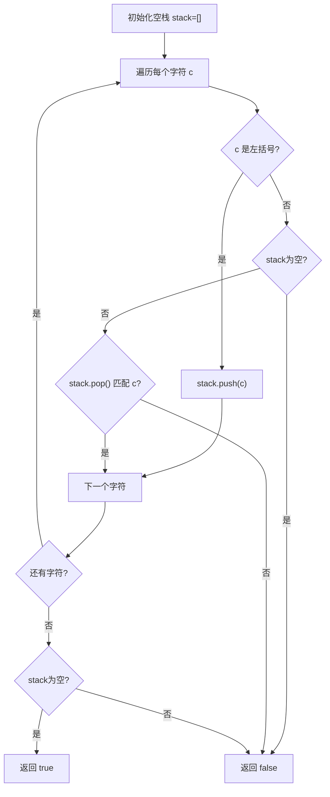

# LeetCode 20. Valid Parentheses（有效的括号） — **简单**

## 考点
String, Stack

## 题目描述
给定一个只包括 `'('`，`')'`，`'{'`，`'}'`，`'['`，`']'` 的字符串 `s`，判断字符串是否有效。

有效字符串需满足：
1. 左括号必须用相同类型的右括号闭合。
2. 左括号必须以正确的顺序闭合。
3. 每个右括号都有一个对应的相同类型的左括号。

**示例 1：**
```
输入：s = "()"
输出：true
```

**示例 2：**
```
输入：s = "()[]{}"
输出：true
```

**示例 3：**
```
输入：s = "(]"
输出：false
```

**示例 4：**
```
输入：s = "([])"
输出：true
```

**提示：**
- `1 <= s.length <= 10^4`
- `s` 仅由括号 `'()[]{}'` 组成

## 图解



## 解题思路

### 核心思路
括号匹配问题天然适合栈（Stack）：遇到左括号入栈，遇到右括号检查是否与栈顶匹配。这类似于"后来者先匹配"（LIFO），即最内层的括号最先闭合。

### 算法步骤

1. 创建哈希表 `pairs` 存储右括号到左括号的映射：
   - `')'→'(', ']'→'[', '}'→'{'`
2. 创建一个空栈
3. 遍历字符串中的每个字符 `c`：
   - 如果 `c` 是左括号（`(`, `[`, `{`）：
     - 将 `c` 压入栈中
   - 如果 `c` 是右括号（`)`, `]`, `}`）：
     - 检查栈是否为空 → 如果为空，说明没有匹配的左括号，返回 `false`
     - 弹出栈顶元素，检查是否匹配 → 如果不匹配，返回 `false`
4. 遍历结束后，检查栈是否为空：
   - 如果栈非空，说明有未闭合的左括号，返回 `false`
   - 如果栈为空，返回 `true`

### 图解示例

以输入 `s = "([])"` 为例：

```
初始：栈 []

Step 1: c = '('
  是左括号 → 压入栈
  栈: ['(']

  括号: ( [ ] )
        ↑

Step 2: c = '['
  是左括号 → 压入栈
  栈: ['(', '[']

  括号: ( [ ] )
          ↑

Step 3: c = ']'
  是右括号 → 检查栈顶
  栈顶 = '[' (弹出)
  映射: ']'→'[' → 匹配！✓
  栈: ['(']

  括号: ( [ ] )
            ↑
  匹配的括号对:  [...]  (内层闭合)

Step 4: c = ')'
  是右括号 → 检查栈顶
  栈顶 = '(' (弹出)
  映射: ')'→'(' → 匹配！✓
  栈: []

  括号: ( [ ] )
              ↑
  匹配的括号对:  (..[...]..)  (外层闭合)

遍历结束，栈为空 → 返回 true ✓
```

以输入 `s = "(]"` 为例：

```
Step 1: c = '(' → 压栈 → 栈: ['(']
Step 2: c = ']' → 右括号
  栈顶 = '(' (弹出)
  ']' 对应的左括号应该是 '['
  '(' != '[' → 不匹配！
  返回 false ✗
```

### 逐步追踪

以输入 `s = "()[]{}"` 为例：

| 步骤 | 字符 | 类型 | 栈(操作前) | 操作 | 栈(操作后) | 结果 |
|------|------|------|-----------|------|-----------|------|
| 1    | '('  | 左   | []        | 压入 | ['(']     | —    |
| 2    | ')'  | 右   | ['(']     | 弹出'('匹配✓ | []     | —    |
| 3    | '['  | 左   | []        | 压入 | ['[']     | —    |
| 4    | ']'  | 右   | ['[']     | 弹出'['匹配✓ | []     | —    |
| 5    | '{'  | 左   | []        | 压入 | ['{']     | —    |
| 6    | '}'  | 右   | ['{']     | 弹出'{'匹配✓ | []     | true |

### 边界情况

1. **空字符串**：遍历结束，栈为空 → 返回 true（虽然题目保证长度 >= 1）
2. **只有左括号**（如 "((("）：遍历结束栈非空 → 返回 false
3. **只有右括号**（如 ")))"）：第一步就发现栈为空 → 返回 false
4. **嵌套 + 交错**（如 "([)]"）：不匹配！[]
  - '(' 入栈, '[' 入栈, ')' 出现 → 栈顶是 '[' → 不匹配 → false
  这实际上是非法的括号序列
5. **多层嵌套**（如 "((()))"）：每层都正确匹配，最终栈为空
6. **大量括号**（如 10^4 个 '(' 接着 10^4 个 ')'）：栈会增长到 10^4，但算法仍然 O(n)

### 为什么栈是正确的？

括号匹配需要遵循"嵌套结构"——最先需要闭合的是最后出现的左括号。这正好是 LIFO（后进先出）的语义。

```
正确序列:    ( { [ ] } )
嵌套关系:    └───────┘
               └───┘
                 └─┘   最内层先闭合
```

### 复杂度分析

时间复杂度：O(n) — 每个字符被处理一次，入栈/出栈各 O(1)
空间复杂度：O(n) — 最坏情况下所有字符都是左括号，栈大小为 n

### 扩展：只使用一个映射表的方向技巧

可以使用只存 **右括号 → 左括号** 的映射表：
- 遇到左括号（不在映射表中）：入栈
- 遇到右括号（在映射表中）：检查栈顶是否匹配

这样不需要单独判断是左括号还是右括号。

### 方法对比

| 方法 | 时间复杂度 | 空间复杂度 | 说明 |
|------|-----------|-----------|------|
| 栈 | O(n) | O(n) | 标准解法，最直观 ✓ |
| 字符串替换 | O(n²) | O(1) | 不断移除 "()""[]""{}"，直到为空或不再变化；效率低 |
