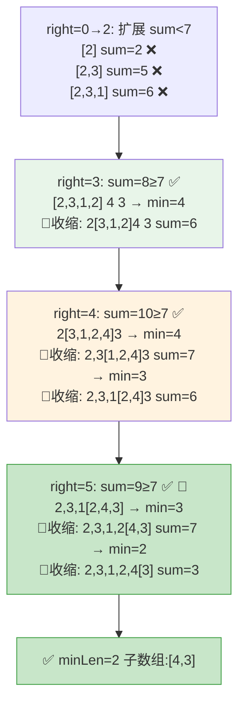

# LeetCode 209. Minimum Size Subarray Sum（长度最小的子数组） — **中等**

## 考点
数组、二分查找、前缀和、滑动窗口

## 题目描述
给定一个含有 `n` 个正整数的数组和一个正整数 `target`。

找出该数组中满足其总和大于等于 `target` 的长度最小的**连续子数组** `[nums_l, nums_{l+1}, ..., nums_{r-1}, nums_r]`，并返回其长度。如果不存在符合条件的子数组，返回 `0`。

**示例 1：**
```
输入：target = 7, nums = [2,3,1,2,4,3]
输出：2
解释：子数组 [4,3] 是该条件下的长度最小的子数组。
```

**示例 2：**
```
输入：target = 4, nums = [1,4,4]
输出：1
```

**示例 3：**
```
输入：target = 11, nums = [1,1,1,1,1,1,1,1]
输出：0
```

**提示：**
- `1 <= target <= 10^9`
- `1 <= nums.length <= 10^5`
- `1 <= nums[i] <= 10^5`

**进阶：**
- 如果你已经实现 `O(n)` 时间复杂度的解法，请尝试设计一个 `O(n log n)` 时间复杂度的解法。

## 滑动窗口指针移动图解

以 target=7, nums=[2,3,1,2,4,3] 演示窗口扩展与收缩：



## 解题思路

### 核心思路

使用滑动窗口（双指针）维护一个和 ≥ target 的最短连续子数组。右指针扩展窗口增加和，左指针收缩窗口减短长度。因为所有元素均为正整数，窗口和具有单调性，滑动窗口正确性得证。

### 方法一：滑动窗口

#### 算法步骤

1. 初始化 `left = 0`, `sum = 0`, `minLen = Infinity`
2. 遍历 `right = 0` 到 `n-1`：
   - `sum += nums[right]` — 扩展窗口
   - 当 `sum >= target` 时：
     - `minLen = min(minLen, right - left + 1)`
     - `sum -= nums[left]`, `left++` — 收缩窗口
3. 返回 `minLen == Infinity ? 0 : minLen`

#### 图解示例

**示例**: `target = 7, nums = [2, 3, 1, 2, 4, 3]`

```
数组: [2, 3, 1, 2, 4, 3]
       0  1  2  3  4  5

─────────────────────────────────────

Step 1: right=0
  [2] 3  1  2  4  3
   L,R
  sum=2 < 7 → 继续扩展

Step 2: right=1
  [2, 3] 1  2  4  3
   L    R
  sum=5 < 7 → 继续扩展

Step 3: right=2
  [2, 3, 1] 2  4  3
   L       R
  sum=6 < 7 → 继续扩展

Step 4: right=3
  [2, 3, 1, 2] 4  3
   L          R
  sum=8 >= 7! → 记录 minLen=4 → 收缩 left
  sum-=2, left++

Step 5: right=3 (收缩后)
  2 [3, 1, 2] 4  3
       L     R
  sum=6 < 7 → 继续扩展

Step 6: right=4
  2 [3, 1, 2, 4] 3
       L        R
  sum=10 >= 7! → 记录 minLen=min(4,4)=4 → 收缩:
  sum-=3, 2 [1, 2, 4] 3 → sum=7 >= 7 → minLen=3 → 收缩:
  sum-=1, 2  3 [2, 4] 3 → sum=6 < 7

Step 7: right=5
  2  3 [2, 4, 3]
          L     R
  sum=9 >= 7 → minLen=min(3,3)=3 → 收缩:
  sum-=2, 2  3  4 [4, 3] → sum=7 >= 7 → minLen=min(3,2)=2 → 收缩:
  sum-=4, 2  3  4  2 [3] → sum=3 < 7

最终: minLen = 2，子数组 [4, 3] 或后半部分的 [4, 3]
```

**窗口滑动全过程可视化：**

```
right →
  [2  3  1  2  4  3]
  ┌──────────────────────────────┐
  │ r=0  [2]                     │ sum=2
  │ r=1  [2,3]                   │ sum=5
  │ r=2  [2,3,1]                 │ sum=6
  │ r=3  [2,3,1,2]               │ sum=8 ✓ len=4 → shrink
  │      [3,1,2]                 │ sum=6
  │ r=4  [3,1,2,4]               │ sum=10 ✓ len=4 → shrink x2
  │      [2,4]                   │ sum=6
  │ r=5  [2,4,3]                 │ sum=9 ✓ len=3 → shrink
  │      [4,3]                   │ sum=7 ✓ len=2 → shrink
  │      [3]                     │ sum=3
  └──────────────────────────────┘

最佳窗口: [4, 3] 长度为2
```

### 逐步追踪表

| right | nums[right] | 加前sum | 加后sum | ≥target? | 收缩过程 | 收缩后sum | 当前窗口 | minLen |
|-------|------------|---------|---------|----------|---------|----------|---------|--------|
| 0 | 2 | 0 | 2 | No | — | 2 | [0,0] | ∞ |
| 1 | 3 | 2 | 5 | No | — | 5 | [0,1] | ∞ |
| 2 | 1 | 5 | 6 | No | — | 6 | [0,2] | ∞ |
| 3 | 2 | 6 | 8 | Yes | left=0减2 | 6 | [1,3] | 4 |
| 4 | 4 | 6 | 10 | Yes | left=1减3→left=2减1 | 6 | [3,4] | 3 |
| 5 | 3 | 6 | 9 | Yes | left=3减2, left=4减4 | 3 | [5,5] | **2** |

### 方法二：前缀和 + 二分查找

构建前缀和数组 `prefix[i]`，对每个起始位置 i，用二分查找找到最小的 j 使得 `prefix[j] - prefix[i] >= target`。复杂度 O(n log n)。

| 方法 | 时间复杂度 | 空间复杂度 |
|------|-----------|-----------|
| 滑动窗口 | O(n) | O(1) |
| 前缀和+二分 | O(n log n) | O(n) |

### 边界情况

| 场景 | 输入 | 处理 |
|------|------|------|
| 不存在满足条件的子数组 | `target=11, nums=[1,1,1,1]` | minLen 保持 ∞，返回 0 |
| 单个元素恰好满足 | `target=4, nums=[4]` | len=1 |
| target 为 1 | `target=1, nums=[5,2,3]` | 第一个元素就满足，len=1 |
| 全部元素加起来才够 | `target=10, nums=[2,3,1,4]` | 整个数组，len=4 |

### 复杂度分析

| 指标 | 值 | 说明 |
|------|-----|------|
| 时间复杂度 | O(n) | 每个元素最多被加入和移除各一次 |
| 空间复杂度 | O(1) | 只使用常数个变量 |
