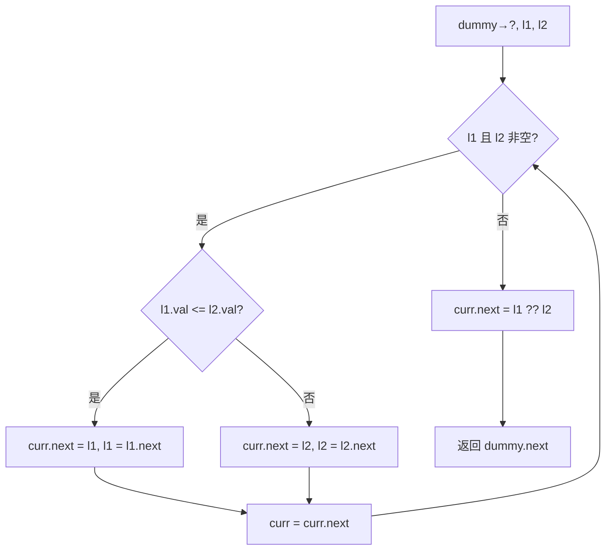

# LeetCode 21. Merge Two Sorted Lists（合并两个有序链表） — **简单**

## 考点
Linked List, Recursion

## 题目描述
将两个升序链表合并为一个新的 **升序** 链表并返回。新链表是通过拼接给定的两个链表的所有节点组成的。

**示例 1：**
```
输入：l1 = [1,2,4], l2 = [1,3,4]
输出：[1,1,2,3,4,4]
```

**示例 2：**
```
输入：l1 = [], l2 = []
输出：[]
```

**示例 3：**
```
输入：l1 = [], l2 = [0]
输出：[0]
```

**提示：**
- 两个链表的节点数目范围是 `[0, 50]`
- `-100 <= Node.val <= 100`
- `l1` 和 `l2` 均按 **非递减顺序** 排列

## 图解



## 解题思路

### 核心思路
两个有序链表合并，类似于归并排序中的 merge 操作。每次比较两个链表当前节点的值，将较小的那个接到结果链表中。递归或迭代都可以实现。

### 算法步骤

**方法一：迭代法**

1. 创建哑节点 `dummy`，用指针 `curr` 指向它，用于构建结果链表
2. 同时遍历 `l1` 和 `l2`，直到其中一个为 null：
   - 比较 `l1.val` 和 `l2.val`：
     - 如果 `l1.val <= l2.val`：`curr.next = l1`，`l1 = l1.next`
     - 否则：`curr.next = l2`，`l2 = l2.next`
   - `curr = curr.next`
3. 将剩余的非空链表直接接到末尾：`curr.next = (l1 != null) ? l1 : l2`
4. 返回 `dummy.next`

**方法二：递归法**

1. 递归终止条件：
   - 如果 `l1 == null`，返回 `l2`
   - 如果 `l2 == null`，返回 `l1`
2. 比较 `l1.val` 和 `l2.val`：
   - 如果 `l1.val <= l2.val`：`l1.next = mergeTwoLists(l1.next, l2)`，返回 `l1`
   - 否则：`l2.next = mergeTwoLists(l1, l2.next)`，返回 `l2`

### 图解示例

以输入 `l1 = [1, 2, 4], l2 = [1, 3, 4]` 为例：

```
初始状态：
  l1:  1 → 2 → 4 → null
  l2:  1 → 3 → 4 → null
  dummy → ?

═══════════════════════════════════════
Step 1: l1.val(1) <= l2.val(1) → 选 l1
  curr → 1
  l1 移动到 2
  l2 保持 1

  l1:            2 → 4 → null
  l2:  1 → 3 → 4 → null
  结果: dummy → 1

═══════════════════════════════════════
Step 2: l1.val(2) > l2.val(1) → 选 l2
  curr → 1
  l1 保持 2
  l2 移动到 3

  l1:       2 → 4 → null
  l2:            3 → 4 → null
  结果: dummy → 1 → 1

═══════════════════════════════════════
Step 3: l1.val(2) <= l2.val(3) → 选 l1
  curr → 2
  l1 移动到 4

  l1:                 4 → null
  l2:            3 → 4 → null
  结果: dummy → 1 → 1 → 2

═══════════════════════════════════════
Step 4: l1.val(4) > l2.val(3) → 选 l2
  curr → 3
  l2 移动到 4

  l1:            4 → null
  l2:                 4 → null
  结果: dummy → 1 → 1 → 2 → 3

═══════════════════════════════════════
Step 5: l1.val(4) <= l2.val(4) → 选 l1
  curr → 4
  l1 移动到 null

  l1: null
  l2:            4 → null
  结果: dummy → 1 → 1 → 2 → 3 → 4

═══════════════════════════════════════
l1 == null，循环结束
将剩余链表接上: curr.next = l2 (4 → null)
  结果: dummy → 1 → 1 → 2 → 3 → 4 → 4 → null

返回 dummy.next → [1, 1, 2, 3, 4, 4] ✓
```

### 逐步追踪（递归版）

以相同输入为例，展示递归调用栈：

```
调用 merge(l1, l2) 其中 l1=1→2→4, l2=1→3→4

merge(1→2→4, 1→3→4):
  1 <= 1 → l1.next = merge(2→4, 1→3→4)
    2 > 1 → l2.next = merge(2→4, 3→4)
      2 <= 3 → l1.next = merge(4→null, 3→4)
        4 > 3 → l2.next = merge(4→null, 4→null)
          4 <= 4 → l1.next = merge(null, 4→null)
            l1==null → return 4→null
          l1.next=4→null, return 4→4→null
        l2.next=4→4→null, return 3→4→4→null
      l1.next=3→4→4→null, return 2→3→4→4→null
    l2.next=2→3→4→4→null, return 1→2→3→4→4→null
  l1.next=1→2→3→4→4→null, return 1→1→2→3→4→4→null

最终结果: 1→1→2→3→4→4→null ✓
```

### 边界情况

1. **两个链表都为空**：直接返回 null
2. **一个链表为空**（如 l1=[], l2=[0]）：迭代法在循环后直接接上非空链表，递归法在终止条件返回另一个
3. **两个链表长度相差大**（如 l1=[1], l2=[2,3,4,5,6]）：较短的链表先走完，剩余直接接上
4. **有重复值**（如例子中的 1 和 4）：比较时使用 `<=` 确保稳定性

### 复杂度分析

**迭代法：**
- 时间复杂度：O(m + n) — 每个节点被访问一次，m 和 n 分别为两个链表的长度
- 空间复杂度：O(1) — 只使用几个指针，没有额外存储

**递归法：**
- 时间复杂度：O(m + n)
- 空间复杂度：O(m + n) — 递归调用栈深度

### 方法对比

| 方法 | 时间复杂度 | 空间复杂度 | 优点 | 缺点 |
|------|-----------|-----------|------|------|
| 迭代法 | O(m+n) | O(1) | 空间最优 | 代码稍长 |
| 递归法 | O(m+n) | O(m+n) | 代码极简洁 | 递归栈可能溢出（但 LeetCode 链表长度有限） |
