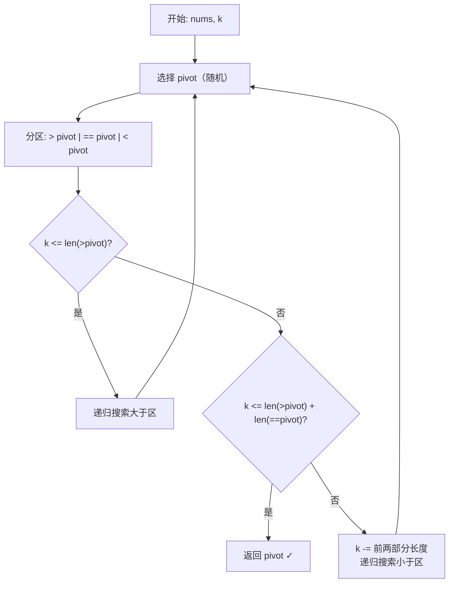

# LeetCode 215. Kth Largest Element in an Array（数组中的第 K 个最大元素） — **中等**

## 考点
数组、分治、快速选择（Quickselect）、排序、堆（优先队列）

## 题目描述
给定整数数组 `nums` 和整数 `k`，请返回数组中第 `k` 个最大的元素。

请注意，你需要找的是数组排序后的第 `k` 个最大的元素，而不是第 `k` 个不同的元素。

你必须设计并实现时间复杂度为 `O(n)` 的算法解决此问题。

**示例 1：**
```
输入：[3,2,1,5,6,4], k = 2
输出：5
```

**示例 2：**
```
输入：[3,2,3,1,2,4,5,5,6], k = 4
输出：4
```

**提示：**
- `1 <= k <= nums.length <= 10^5`
- `-10^4 <= nums[i] <= 10^4`

## 图解



## 解题思路

### 核心思路

第 k 个最大元素 = 排序后倒数第 k 个 = 第 (n - k + 1) 个最小元素（1-indexed）。关键在于不需要完整排序，只需确定第 k 大元素的位置。

### 方法一：快速选择（Quickselect）—— 推荐

快速排序的变体。每次分区确定 pivot 的最终位置，根据 pivot 与目标位置的关系决定递归方向，只处理一侧。

**算法步骤：**

1. 选择 pivot（随机选择可避免最坏情况）。
2. 分区：将数组分为 `> pivot`、`== pivot`、`< pivot` 三部分（荷兰国旗问题）。
3. 判断第 k 大在哪部分：
   - 若 `k <= len(> pivot)`：在大于部分递归。
   - 若 `k <= len(> pivot) + len(== pivot)`：pivot 即为答案。
   - 否则在小于部分递归，k 减去前两部分长度。
4. 重复直到找到答案。

**图解示例：**

```
nums = [3, 2, 1, 5, 6, 4], k = 2 (找第 2 大)

选择 pivot = 4，分区：

    > 4:   [5, 6]           ← 2 个
    == 4:  [4]              ← 1 个
    < 4:   [3, 2, 1]        ← 3 个

k=2 <= len(>4)=2 → 在 [5, 6] 中找第 2 大

    选择 pivot = 5，分区：

    > 5:   [6]
    == 5:  [5]
    < 5:   []

    k=2 <= 1? 否
    k=2 <= 1+1=2? 是 → 答案为 5 ✓
```

**逐步追踪（nums=[3,2,1,5,6,4], k=2）：**

```
Round  | 区间           | pivot | 大于   | 等于  | 小于      | 决策
-------|---------------|-------|--------|------|----------|------
1      | [3,2,1,5,6,4] | 4     | [5,6]  | [4]  | [3,2,1]  | k=2 ≤ 2 → 进入 >
2      | [5,6]         | 5     | [6]    | [5]  | []       | k=2 ≤ 1?N, ≤2?Y → 答案=5
```

### 方法二：最小堆

维护大小为 k 的最小堆，遍历数组：
- 元素入堆。
- 若堆大小 > k，弹出堆顶。
- 遍历结束，堆顶即为第 k 大元素。时间复杂度 O(n log k)，空间 O(k)。

**对比：**

| 方法       | 平均时间    | 最坏时间    | 空间   | 适用场景                     |
|----------|---------|--------|------|--------------------------|
| 快速选择   | O(n)    | O(n²)  | O(1) | 一次查询，可修改原数组             |
| 最小堆     | O(n log k) | O(n log k) | O(k) | 数据流场景，海量数据              |
| 全排序     | O(n log n) | O(n log n) | O(1) | 最简单，但题目要求 O(n)           |

### 边界情况

- **k = 1**：找最大值，一次分区即可。
- **k = n**：找最小值。
- **数组元素全部相同**：分区后所有元素在等于部分，直接返回 pivot。
- **n = 1**：直接返回该元素。

### 复杂度分析

| 复杂度 | 快速选择           | 最小堆              |
|-----|----------------|-------------------|
| 时间  | 平均 O(n)，最坏 O(n²) | O(n log k)        |
| 空间  | O(1)           | O(k)              |

**优化：** pivot 随机选择可将最坏情况概率降至极低；或使用 "median of medians" 保证 O(n) 最坏时间。
