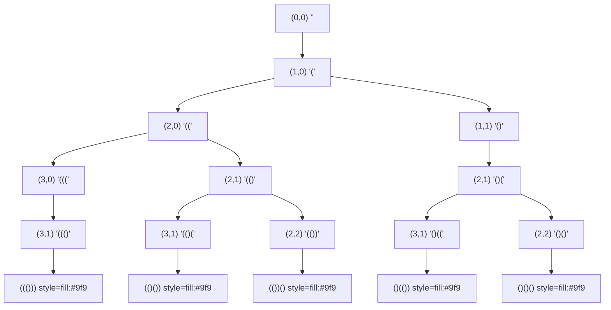

# LeetCode 22. Generate Parentheses（括号生成） — **中等**

## 考点
String, Dynamic Programming, Backtracking

## 题目描述
数字 `n` 代表生成括号的对数，请你设计一个函数，用于能够生成所有可能的并且 **有效的** 括号组合。

**示例 1：**
```
输入：n = 3
输出：["((()))","(()())","(())()","()(())","()()()"]
```

**示例 2：**
```
输入：n = 1
输出：["()"]
```

**提示：**
- `1 <= n <= 8`

## 图解



## 解题思路

### 核心思路
回溯法生成所有有效的括号组合。关键在于约束条件：任何时候右括号数量不能超过左括号数量，且最终左右括号数各为 n。这保证生成的括号序列始终有效。

### 算法步骤

**方法一：回溯法（DFS）**

1. 定义回溯函数 `backtrack(open, close, path)`：
   - `open`：已使用的左括号数量
   - `close`：已使用的右括号数量
   - `path`：当前构建的括号字符串
2. **终止条件**：`path.length == 2 * n`，将 `path` 加入结果，返回
3. **选择一：添加左括号 `(`**
   - 条件：`open < n`（还可以放左括号）
   - 操作：`backtrack(open + 1, close, path + "(")`
4. **选择二：添加右括号 `)`**
   - 条件：`close < open`（右括号不能超过左括号，否则无效）
   - 操作：`backtrack(open, close + 1, path + ")")`
5. 调用 `backtrack(0, 0, "")`，返回结果

**方法二：动态规划**

1. 定义 `dp[i]` 为 n=i 时的所有有效括号组合
2. 递推关系：`dp[i] = { "(" + a + ")" + b | a ∈ dp[j], b ∈ dp[i-1-j], 0 <= j < i }`
3. 初始条件：`dp[0] = [""]`
4. 按 i 从 1 到 n 递推

### 图解示例（决策树）

以输入 `n = 3` 为例：

```
约束：open <= 3, close <= open (始终)

回溯决策树（括号内为 open,close 状态）：

                        "" (0,0)
                         │
                    添加 '('
                         │
                       "(" (1,0)
                    ┌──────┴──────┐
               添加 '('         添加 ')'
                    │               │
                  "(("(2,0)       "()"(1,1)
               ┌────┴────┐      ┌────┴────┐
           添加'('  添加')'  添加'('  添加')'
               │        │        │        │
           "((("(3,0) "(()"(2,1)"()("(2,1) X (close>=open)
          ┌──┴──┐      │        │
      添加')'  添加'('   ...    ...
          │    (X:open>=n)
      "((()"(3,1)
         │
     添加')'
         │
   "((()))"(3,2) → 达到 3,3 → 加入结果!
```

完整的合法路径（n=3）：

```
(0,0)
├─ (1,0) "("
│  ├─ (2,0) "(("
│  │  ├─ (3,0) "((("
│  │  │  ├─ (3,1) "((()"
│  │  │  │  ├─ (3,2) "((())"
│  │  │  │  │  └─ (3,3) "((()))" ✓ 结果1
│  │  ├─ (2,1) "(()"
│  │  │  ├─ (3,1) "(()("
│  │  │  │  ├─ (3,2) "(()()"
│  │  │  │  │  └─ (3,3) "(()())" ✓ 结果2
│  │  │  ├─ (2,2) "(())"
│  │  │  │  ├─ (3,2) "(())("
│  │  │  │  │  └─ (3,3) "(())()" ✓ 结果3
├─ (1,1) "()"
│  ├─ (2,1) "()("
│  │  ├─ (3,1) "()(("
│  │  │  ├─ (3,2) "()(()"
│  │  │  │  └─ (3,3) "()(())" ✓ 结果4
│  │  ├─ (2,2) "()()"
│  │  │  ├─ (3,2) "()()("
│  │  │  │  └─ (3,3) "()()()" ✓ 结果5

结果: ["((()))", "(()())", "(())()", "()(())", "()()()"] ✓
```

### 逐步追踪

以输入 `n = 2` 为例，完整回溯过程：

| 步骤 | open | close | path | 操作 | 状态 |
|------|------|-------|------|------|------|
| 1    | 0    | 0     | ""   | 加 '(' | open<2 ✓ |
| 2    | 1    | 0     | "("  | 加 '(' | open<2 ✓ |
| 3    | 2    | 0     | "((" | 加 ')' | close<open=2 ✓ |
| 4    | 2    | 1     | "(()" | 加 ')' | close<open=2 ✓ |
| 5    | 2    | 2     | "(())" | 加入结果! | open=2,close=2 → 回溯 |
| —    | —    | —     | —    | 回溯到步骤 2 | path="(" |
| 6    | 1    | 0     | "("  | 加 ')' | close<open=1 ✓ |
| 7    | 1    | 1     | "()" | 加 '(' | open<2 ✓ |
| 8    | 2    | 1     | "()(" | 加 ')' | close<open=2 ✓ |
| 9    | 2    | 2     | "()()" | 加入结果! | open=2,close=2 |

结果：["(())", "()()"] ✓

### 边界情况

1. **n = 1**：只有一种组合 "()"
2. **n = 0**：按照题目约束不存在（n >= 1）
3. **n = 8**（最大值）：结果数为 Catalan 数 C₈ = 1430 种，算法可以处理

### 复杂度分析

时间复杂度：O(4^n / √n) — 即第 n 个卡特兰数，约为结果数量的量级。这是生成所有有效组合的理论下限（必须输出所有结果）

空间复杂度：O(n) — 递归栈深度最多为 2n，不计结果存储空间

### 卡特兰数

这题的答案数量恰好是卡特兰数：

```
C_n = (1 / (n+1)) * C(2n, n)

n=1: 1  种
n=2: 2  种
n=3: 5  种
n=4: 14 种
n=5: 42 种
n=8: 1430 种 ← LeetCode 的最大输入
```

### 方法对比

| 方法 | 时间复杂度 | 空间复杂度 | 说明 |
|------|-----------|-----------|------|
| 回溯法（DFS） | O(4^n/√n) | O(n) | 最直观，面试推荐 ✓ |
| 动态规划 | O(4^n/√n) | O(n × C_n) | 需要存储大量中间结果 |
| BFS | O(4^n/√n) | O(C_n) | 同样可行 |
